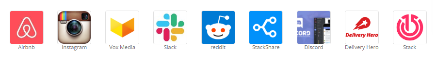

## Introducción

### ¿Para quién va dirigido este curso?
Este curso está diseñado como una introducción al lenguaje de programación JavaScript, enfocado al uso del framework "Leaflet" para el desarrollo de mapas web interactivos.  

En este curso se cubrirán todos los conceptos básicos del lenguaje, además de una breve introducción al lenguaje de marcado HTML y al lenguaje de estilos CSS, que, acompañados de JavaScript son los 3 lenguajes principalmente utilizados en el diseño **frontend** de sitios web en la actualidad. Esto es, la parte que el usuario ve y con la que puede interactuar directamente.  

### ¿Qué es JavaScript?

 

  

JavaScript es un lenguaje orientado a objetos, interpretado que se usa en el deiseño de sitios web interactivos. Entre sus principales componentes, destaca por mucho el manejo de eventos o programación basada en eventos, un evento es una acción que en general es mandada por el usuario y JS al recibirlo ejecuta otro cierto comportamiendo que ya está previamente definido por el programador o es inherente al lenguaje.  

### ¿Dónde podemos encontrar el lenguaje JavaScript?  

Realmente éste lenguaje hoy es parte escencial de muchos programas, los programas en la actualidad ya no se limitan a usar un único lenguaje, incluso ahora existen frameworks especiales para lograr entablar una comunicación entre múltiples lenguajes.   
Javascript ha evolucionado como cualquier otro lenguaje para cubrir las necesidades de sus nuevos usuarios.

 

  

Hoy en día múltiples empresas y programas usan éste lenguaje que cuenta con múltiples extensiones para tareas determinadas, siendo uno de los más completos de nuestros tiempos.  

[<- Volver](README.md)

[Primeros pasos ->](02-Primeros%20pasos.md)
