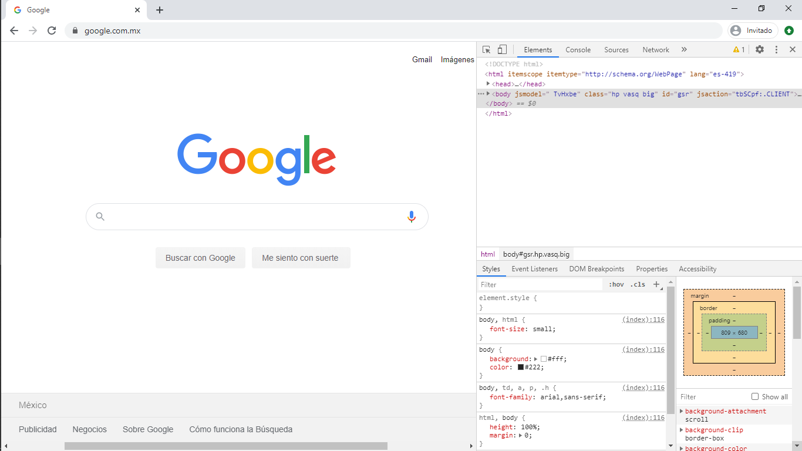
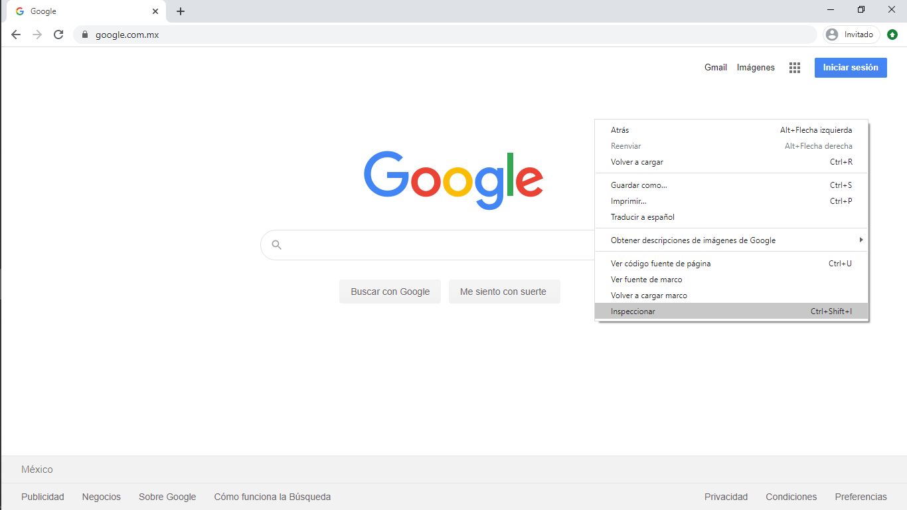

# Primeros pasos en JS  

## Editores de texto
Hoy en día existen infinidades de posibles editores de textos con los que podemos trabajar; JavaScript al ser un lenguaje de **scripting** (se ejecuta sin necesidad de compilarse) debemos solo guardar las instrucciones en un archivo con extensión `.js` y llamarlo desde nuestro archivo html, así como también podemos trabajar directamente con la consola del navegador (pero solo con fines teóricos), en la práctica necesitamos más allá de solo la consola del navegador para hacer funcionar de forma correcta nuestros programas.

Algunos de los editores más utilizados son:

1. Sublime Text
2. Visual Studio Code  
3. Atom  
4. Emacs    
5. Bloc de notas  
6. Notepad++  
7. Brackets  
8. Vim  
9. Netbeans

    

   

## La consola web  
Hoy en día, los navegadores cuentan con un conjunto de herramientas útiles para los desarrolladores a través de las cuales pueden editar de forma permanente o temporal partes del código del sitio web, además de inspeccionar el tráfico de la red entre el servidor y el usuario, acceder a los archivos con el código fuente, obtener los tokens cifrados de las peticiones, etc.

  

### ¿Cómo accedemos a la consola en nuestro navegador?
En sistemas operativos **Windows** y **Linux** estando dentro de nuestro navegador haremos la siguiente combinación de teclas:  

`ctrl + shift + I`

   

De igual forma podemos hacer click derecho y seleccionar inspeccionar:  

  

En macOS tenemos que hacer:     

`Comando + Opcion + J`

**Algunas veces los desarrolladores por cuestiones de seguridad bloquean éstas opciones para evitar que las personas accedan o vean información sensible de la página,
por ello puede que no siempre funcione, para solucionar eso hay otras formas pero no están en el alcance del presente curso.**  

Por último podemos encontrar opciones prácticas de consola como la siguiente: [jsconsole](https://jsconsole.com/)

