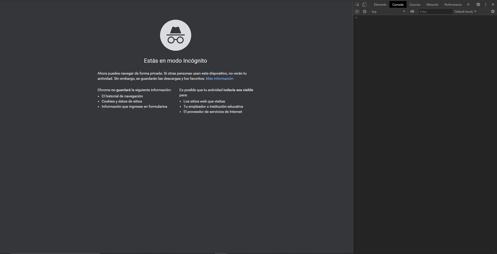
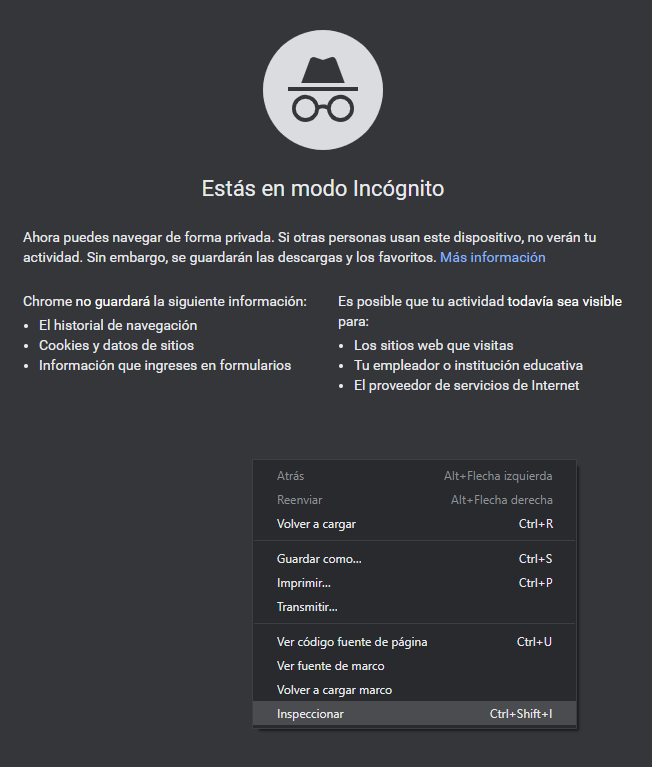

# Primeros pasos en JS  

## La consola web  

Hoy en día, los navegadores cuentan con un conjunto de herramientas para desarrolladores a través de las cuales pueden editar de forma permanente o temporal cosas sobre el sitio web, además inspeccionar el tráfico de la red entre el servidor y el usuario, acceder a los archivos con el código fuente, obtener los tokens cifrados de las peticiones.  
Nos es útil como desarrolladores para hacer inspecciones rápidas del estado de la página (código, estilos, peticiones, etc.).  

 

  

### ¿Cómo accedemos a la consola en nuestro navegador?
  En sistemas operativos **Windows** y **Linux** estando dentro de nuestro navegador haremos la siguiente combinación de teclas:  
  
    1. ctrl + shift + I 
    

 

   

De igual forma podemos hacer click derecho y seleccionar inspeccionar:  

 

  

  En macOS tenemos que hacer:     
    
    2. Comando + Opcion + J
