# Conceptos básicos de HTML y CSS

## HTML
HTML es un lenguaje de marcado que sirve para crear el esqueleto de cualquier página web. Se trata de un conjunto de etiquetas que definen el contenido que vemos en un página web, como texto, imágenes, tablas y listas, vídeos, etc.

    

HTML es un lenguaje de etiquetas que nos permite definir la estructura de nuestra página, en la cual podemos implementarle funcionalidades dinámicas a través del lenguaje CSS y JS como se verá más adelante en el curso.  

### Sintaxis

Para comenzar, tenemos la estructura base de nuestro documento.

    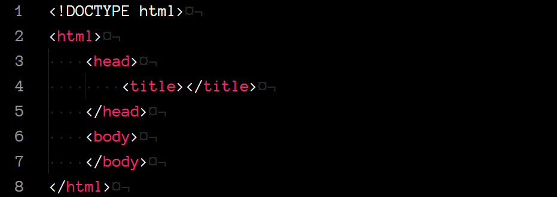

* `DOCTYPE` define la versión de HTML, en este caso, HTML5.
* `<html>` determina el comienzo y final del documento html.
* `<head>` contiene información (metadatos) sobre la página que no se le muestra al usuario, pero que es utilizada por el navegador para desplegar el sitio web.
* `<title>` especifica el título de la página, el que podemos ver en la pestaña de nuestro navegador.
* `<body>` define el cuerpo del documento, es aquí donde pondremos todo el contenido visible para el usuario.

Nuestra primer página web se vería así:

    

### Elementos
HTML se compone de elementos que son los que nos permiten estructurar y dar significado al documento.

Con estos elementos podemos crear:
* Encabezados
* Párrafos
* Listas de elemtos.
* Tablas
* Imágenes
* Videos
* Formularios
* Y muchas cosas más...

Estos elementos a su vez se componen de etiquetas, contenido y atributos.

    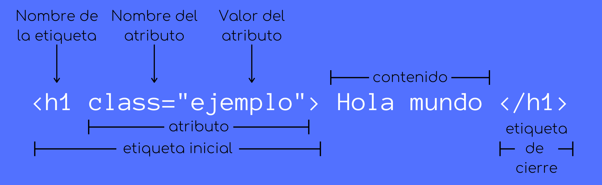

Con las etiquetas definimos el inicio y fin de un elemento. Existen algunos elementos que no tienen etiqueta de cierre, como por ejemplo ``.

El contenido es la información que se mostrará; en el ejemplo tenemos el texto *Hola mundo*, pero también pueden ser imágenes, videos, entre otras cosas.

Los atributos se utilizan para dar un comportamiento a los elementos.

### Etiquetas
Como mencionamos arriba, utilizamos elementos para crear todo lo que desplegaremos en la página web. Y para definir estos elementos utilizamos etiquetas.

#### Encabezados
Son definidos utilizando las etiquetas `<h1>`, `<h2>`, hasta `<h6>`.

    

    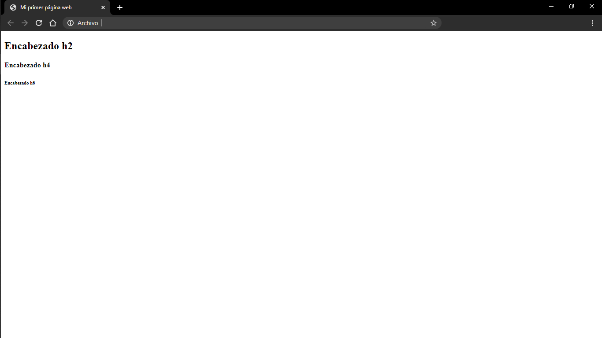

#### Párrafos
Se definen con la etiqueta `
`

    

    

#### Imágenes
Se definen con la etiqueta ``.
Para este elemento debemos definir además atributos.
* `src`: debemos indicar donde se encuentra la imagen que deseamos mostrar.
* `alt`: define un texto alternativo que se mostrará si la imagén no puede ser mostrada.
* `width` y `height`: determina las dimensiones (ancho y alto) de la imagen.

Es importante mencionar que el único atributo obligatorio para poder desplegar una imagen es `src`.

    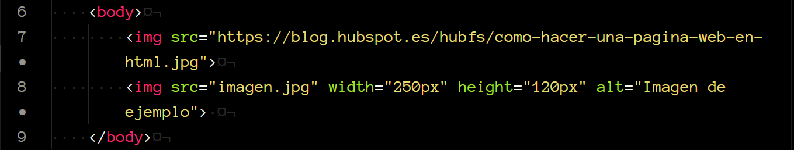

    

#### Links
Se definen con la etiqueta `<a>`.

    

    

El atributo `href` especifica la dirección del link. Y el texto que colocamos después de la etiqueta inicial, es el texto que se despliega en la página web.

#### Divisiones
Se definen con la etiqueta `div` y son de los elementos más útiles pues te permiten dividir el contenido de tu página web en secciones, mejor conocidas como contenedores.

    

    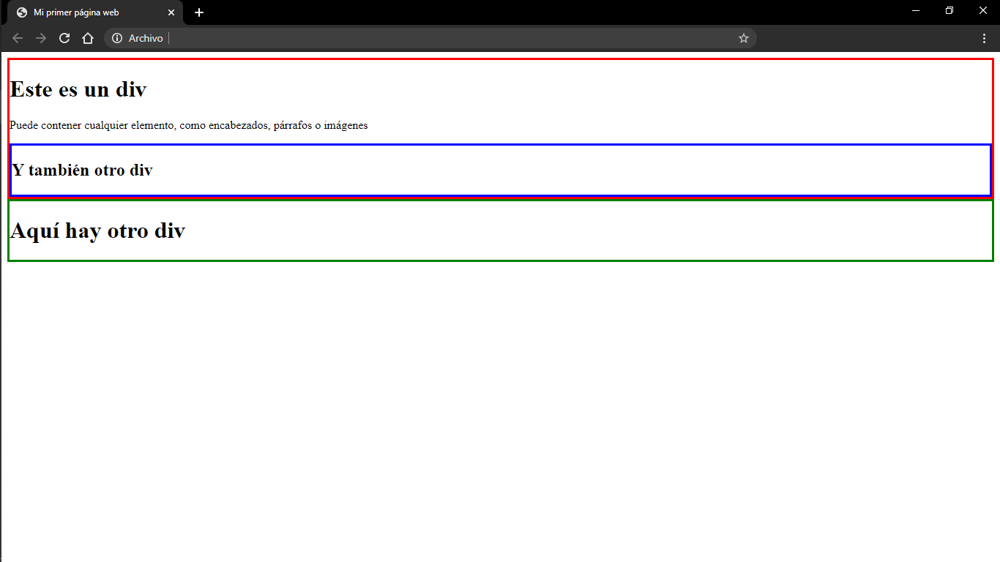

#### Listas
###### Listas ordenadas
Se crean con la etiqueta `<ol>`. Cada elemento se crea con la etiqueta `<li>`.

    

    

###### Listas no ordenadas
Se crean con la etiqueta `<ul>`. Cada elemento se crea con la etiqueta `<li>`.

    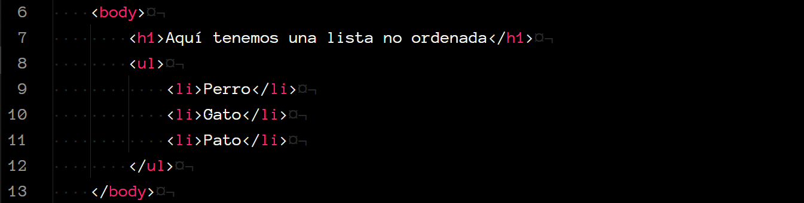

    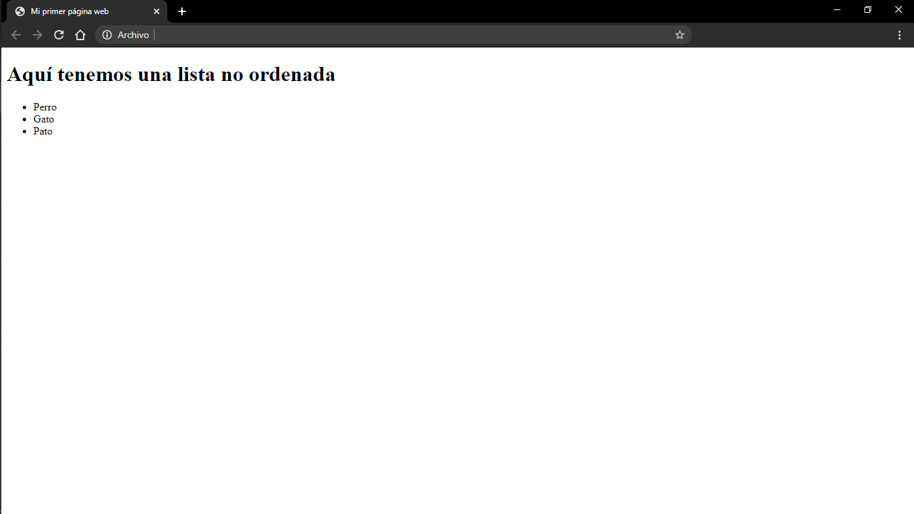

#### Tablas
Para crear una tabla utilizamos las siguientes etiquetas:
* `<table>`: define la tabla.
* `<tr>`: define una nueva fila.
* `<th>`: define un encabezado, esto es, la primer celda de cada columna. Por defecto su contenido aparece en negritas y centrado.
* `<td>`: define el contenido del resto de las celdas en cada fila.

    

    

Como podemos ver en el ejemplo, el número de etiquetas `<th>` que definamos en la primer fila, determina la cantidad de columnas que tendrá nuestra tabla.

 

Existen muchas más etiquetas que podemos utilizar, aquí, puedes consultarlas todas: [HTML etiquetas](https://www.w3schools.com/TAGS/default.ASP)

## CSS
CSS es un lenguaje de hojas de estilo que podemos utilizar para estilizar elementos escrtios en HTML.

    

Es sencillo ver la relación entre HTML y CSS, ya que mientras HTML se encarga del formato del sitio, utilizando texto plano, CSS es el que se encargará de darle una presentación más atractiva para los usuarios de la página web.

### Implementación

Para comenzar, existen 3 formas en que podemos implementar el lenguaje de estilos con HTML.

#### Inline
Se utiliza para aplicar el estilo únicamente a un elemento.
Se inserta con el atributo `style` en la etiqueta del elemento al que le asignaras el estilo.

    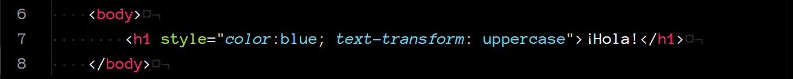

    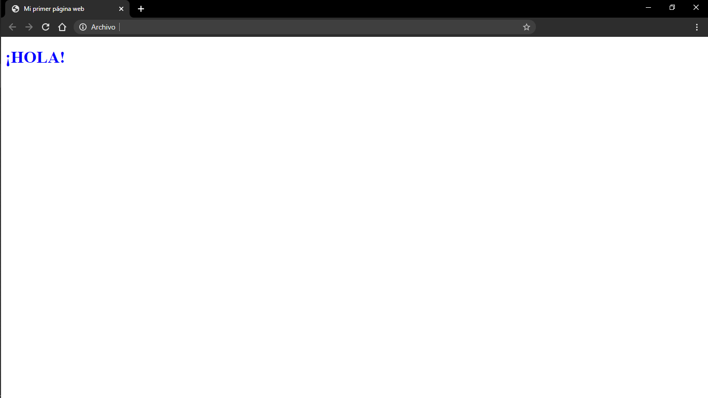

Se le pueden asignar múltiples propiedades a un mismo elemento, dentro del atributo `style`, separadas cada una por un `;`.

#### Interno
La *hoja de estilo interna* se inserta utilizando la etiqueta `<style>` dentro del elemento `head` en el documento HTML. En este caso, podemos asignar estilos a múltiples elementos utilizando selectores, los cuales veremos más adelante.

    

    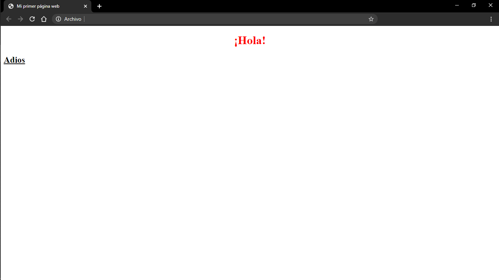

#### Externo
La *hoja de estilo externa* es la forma más recomendable de agregar estilos a tu documento, pues te permite mantener en archivos separados todo lo relacionado con HTML y todo lo relacionado con CSS.

Para insertarla, utilizamos la etiqueta `<link>`, dentro del elemento `head`.
En el atributo `href` especificamos la dirección en donde se encuentra la hoja de estilos.

    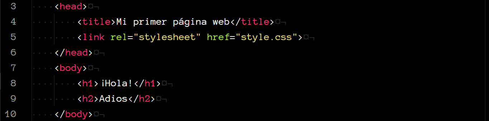

    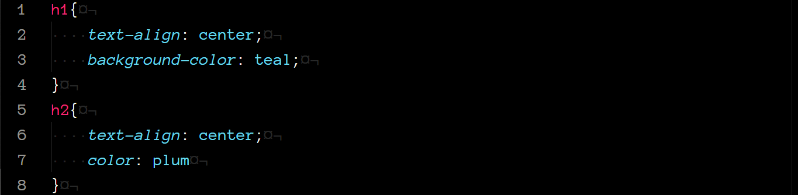

    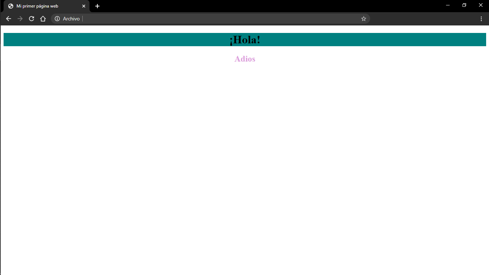

### Selectores
#### Etiquetas
CSS puede seleccionar un elemento de HTML al cual darle estilo utilizando el *nombre de su etiqueta*.

    

Volviendo al ejemplo de arriba, utilizamos el selector `h1` para asignarle un estilo a dicha etiqueta, en este caso, para centrar el texto y cambiarle el color de fondo.

Si agregáramos un nuevo elemento `h1` al documento HTML, ese elemento también se vería afectado por el estilo que le asignamos previamente, pues en la hoja de estilos estamos seleccionando a todos los elementos `h1` de nuestra página web.

    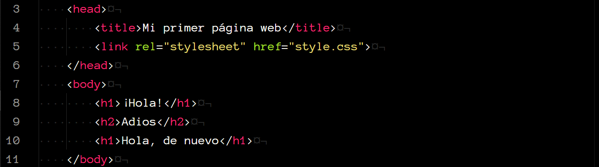

    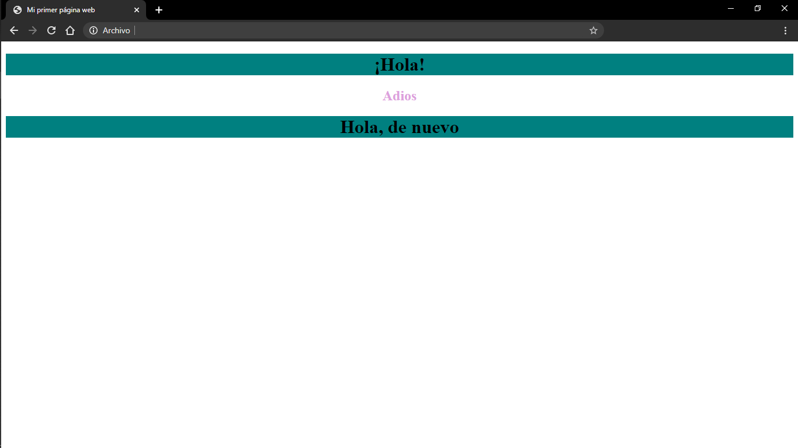

#### Clases

#### Id's
