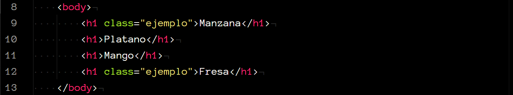
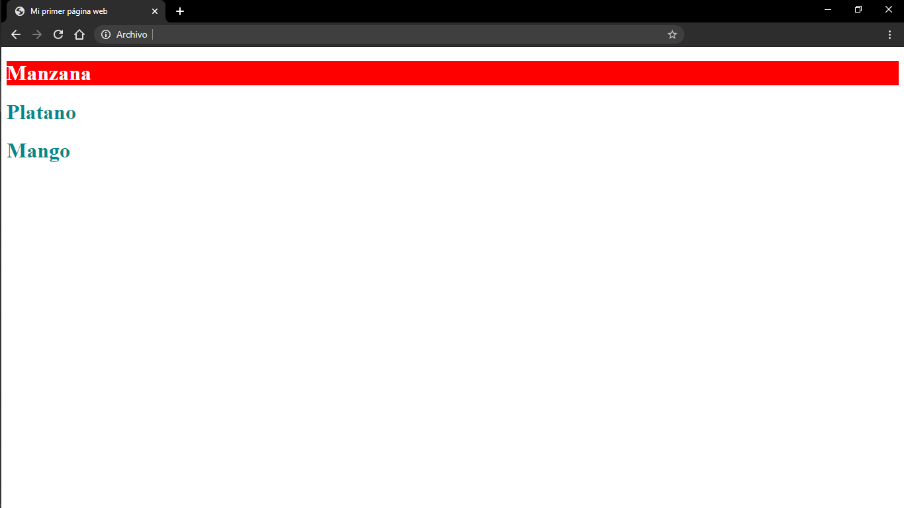

# Conceptos básicos de CSS

CSS es el lenguaje de *Hojas de estilo en cascada* que podemos utilizar para estilizar elementos escrtios en HTML.

    

Es sencillo ver la relación entre HTML y CSS, ya que mientras HTML se encarga del formato del sitio, utilizando texto plano, CSS es el que se encargará de darle una presentación más atractiva para los usuarios de la página web.

### Implementación

Para comenzar, existen 3 formas en que podemos implementar el lenguaje de estilos con HTML.

#### Inline
Se utiliza para aplicar el estilo únicamente a un elemento.
Se inserta con el atributo `style` en la etiqueta del elemento al que le asignaras el estilo.

    

    

Se le pueden asignar múltiples propiedades a un mismo elemento, dentro del atributo `style`, separadas cada una por un `;`.

#### Interno
La *hoja de estilo interna* se inserta utilizando la etiqueta `<style>` dentro del elemento `head` en el documento HTML. En este caso, podemos asignar estilos a múltiples elementos utilizando selectores, los cuales veremos más adelante.

    

    

#### Externo
La *hoja de estilo externa* es la forma más recomendable de agregar estilos a tu documento, pues te permite mantener en archivos separados todo lo relacionado con HTML y todo lo relacionado con CSS.

Para insertarla, utilizamos la etiqueta `<link>`, dentro del elemento `head`.
En el atributo `href` especificamos la dirección en donde se encuentra la hoja de estilos.

    

    

    

### Selectores
#### Etiquetas
CSS puede seleccionar un elemento de HTML al cual darle estilo utilizando el *nombre de su etiqueta*.

    

Volviendo al ejemplo de arriba, utilizamos el selector `h1` para asignarle un estilo a dicha etiqueta, en este caso, para centrar el texto y cambiarle el color de fondo.

Si agregáramos un nuevo elemento `h1` al documento HTML, ese elemento también se vería afectado por el estilo que le asignamos previamente, pues en la hoja de estilos estamos seleccionando a todos los elementos `h1` de nuestra página web.

    

    

#### Clases
Además del nombre de las etiquetas, podemos utilizar los atributos de los elementos para seleccionarlos.

Con el atributo `class` podemos asignar un nombre a un elemento, y así, seleccionarlo en la hoja de estilos con ese nombre. Además, podemos asignar la misma clase (el mismo nombre), a más de un elemento, lo que nos permite dar el mismo estilo a un grupo de elementos, en lugar de seleccionar cada uno.

    

Para seleccionar el *nombre de la clase* en la hoja de estilos, utilizamos la sintaxis `.<nombre>`.

    

    

En el ejemplo podemos ver que tenemos tres elementos `h1`, pero uno de ellos tiene además, el atributo `class="ejemplo"`.

En la hoja de estilos, primero, asignamos el color de texto `darkcyan` a todos los elementos `h1`, pero en el siguiente selector, donde seleccionamos únicamente a los elementos con la clase `ejemplo`, asignamos un color de texto distinto (además de un color de fondo), esto es importante tenerlo en cuenta, pues la especificación de CSS tiene un esquema prioritario para aquellas reglas que coinciden para más de un elemento, conocido como **especificidad**.

#### Id's
