# Conceptos básicos de CSS (Parte 2)

### Texto
#### Font Family
Para cambiar la fuente del texto, utilizamos la propiedad `font-family`.

    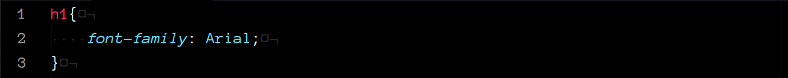

En este ejemplo, el tipo de fuente de todos los encabezados `h1` será `Arial`.

Para desplegar un tipo de fuente en la página web hay que tener en cuenta que esta debe estar instalada en la computadora del usuario.

[Aquí](https://www.cssfontstack.com/) puedes consultar una lista de fuentes seguras para utilizar en tu sitio web.

##### Google fonts
Una herramienta que podemos utilizar para cambiar el tipo de fuente y donde tenemos muchas más opciones disponibles es la página web [Google fonts](https://fonts.google.com/).

    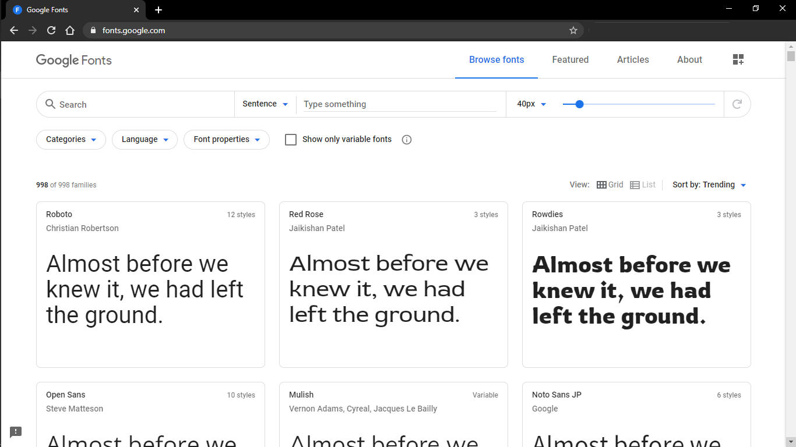

Para agregar una fuente a nuestra página solamente debemos seleccionarla en la página web. Después, seleccionamos el estilo que deseemos.

    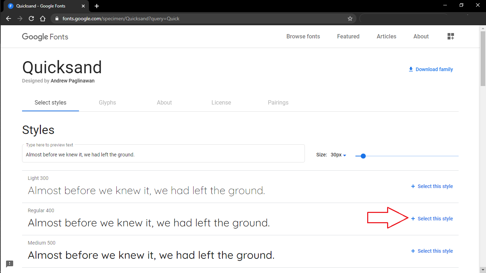

    

En el panel lateral seleccionamos la pestaña `Embed`. Copiamos el texto de la etiqueta `link` y lo pegamos en nuestro documento html dentro del elemento `head`.

    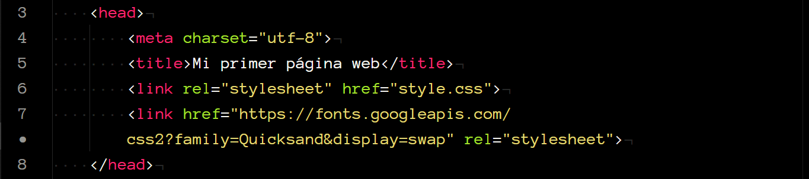

Para terminar, en nuestro documento css, utilizamos la propiedad `font-family` como viene especificada en la página web ("CSS rules to specify families").

    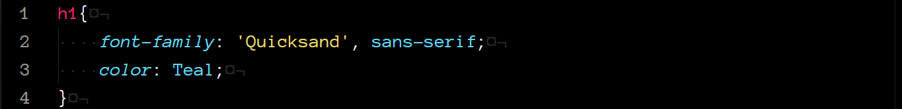

    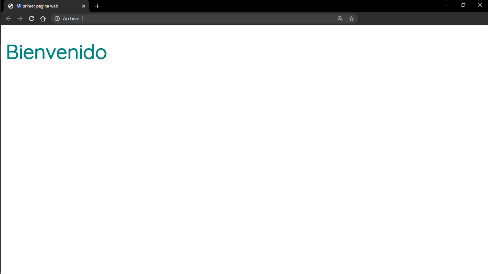

#### Font size
Para cambiar el tamaño de fuente utilizamos la propiedad `font-size`. Esta propiedad recibe como valor un tamaño que podemos especificar con diferentes medidas, la cuales veremos más adelante.

    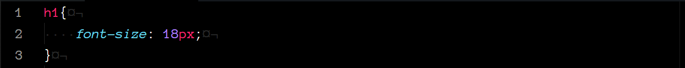

Aquí, definimos el tamaño de fuente para todos los encabezados `h1`, como 18 pixeles.

#### Font weight
Con la propiedad `font-weight` podemos definir que tan gruesa o delgada será nuestra fuente.

    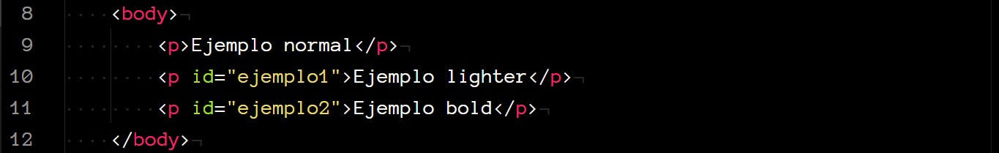

    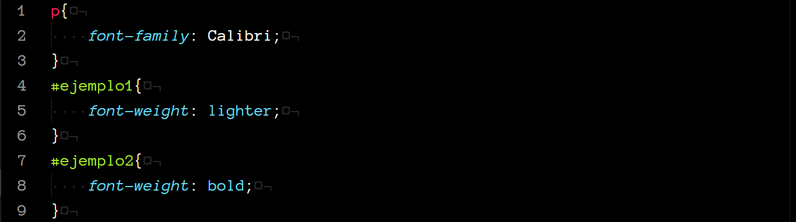

    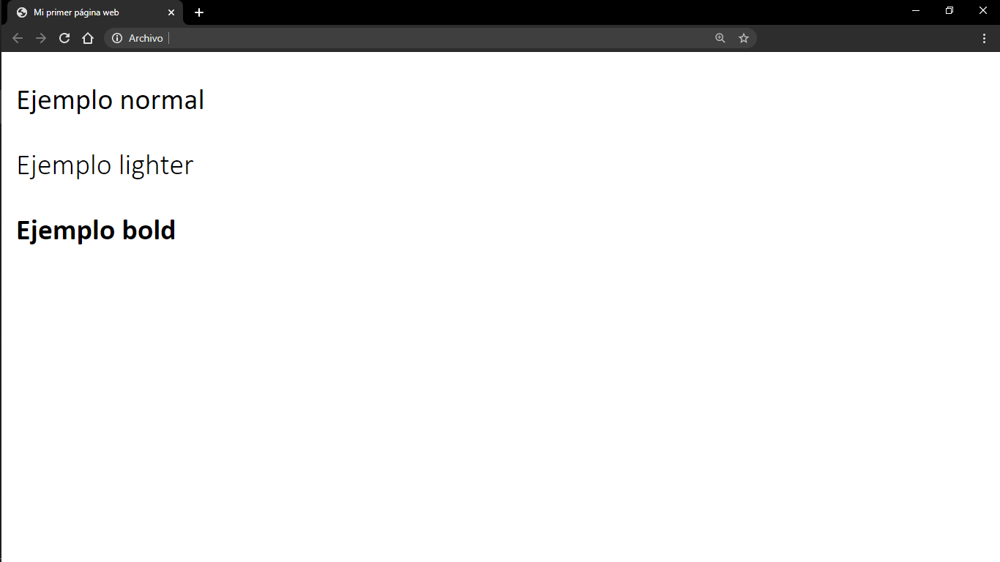

Los valores que `font-weight` puede recibir son:
* `normal`
* `bold`
* `lighter`
* `bolder`
* Además de los valores numéricos 100, 200, ..., 900.

Sin embargo, algunas fuentes solo están disponibles en `normal` y `bold`.

#### Text align
Por default, el texto en nuestra página siempre aparecerá alineado al lado izquierdo. Para cambiar eso, utilizamos la propiedad `text-align`.

    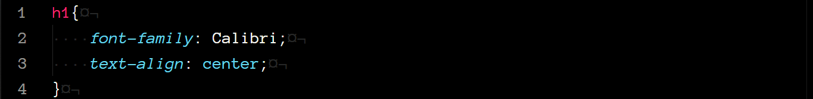

    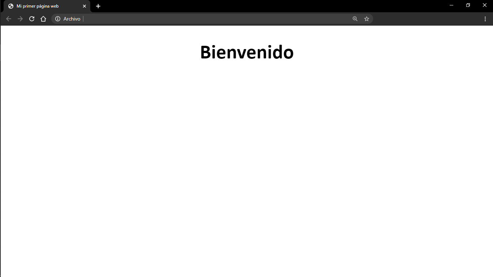

Los valores que `text-align` puede recibir son:
* `start`
* `end`
* `left`
* `right`
* `center`
* `justify`

#### Color
Para cambiar el color del texto utilizamos la propiedad `color`.

    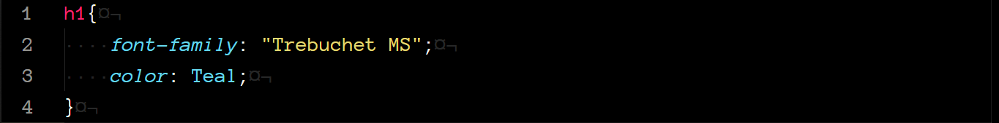

    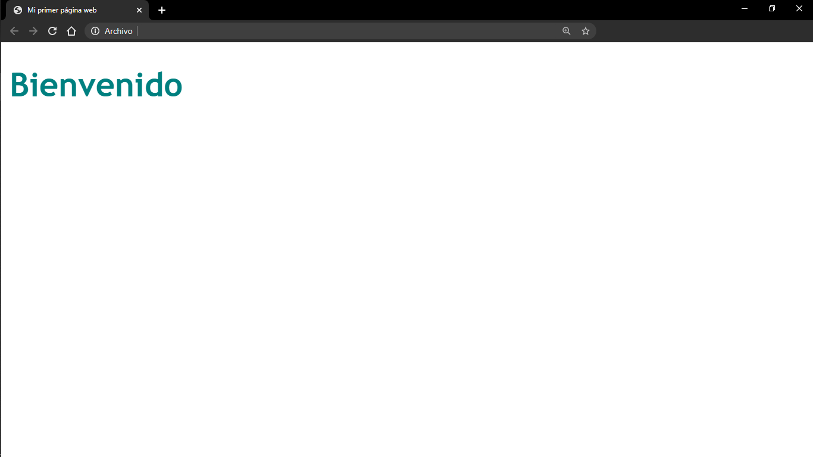

### Colores
Existen múltiples formas en que podemos especificar los colores que usaremos en nuestra página.

##### Nombres
Los navegadores modernos soportan un total de 140 colores con nombre.

    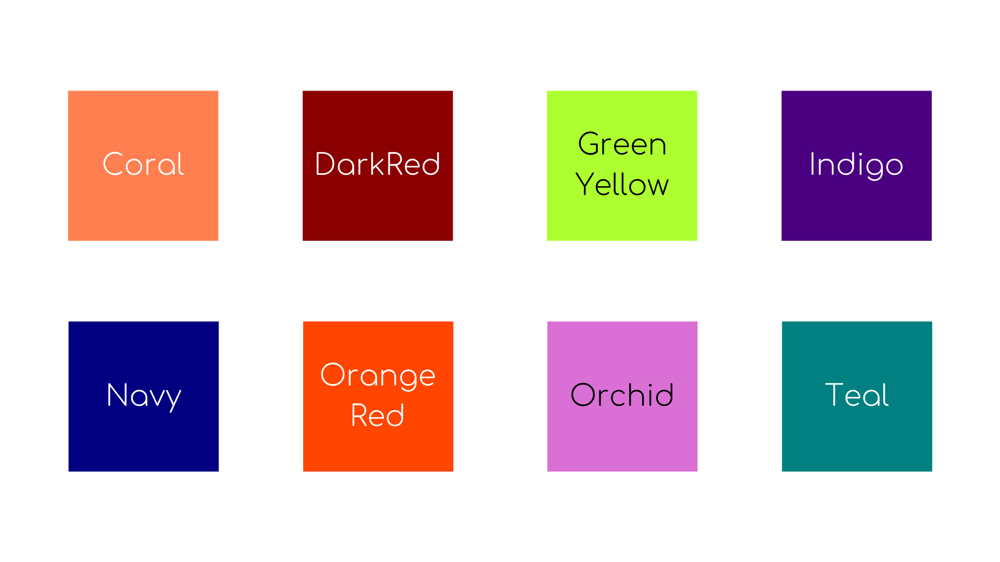

Aquí puedes consultarlos todos: [Colores Standard](https://www.w3schools.com/colors/colors_names.asp)

#### RGB y Hexadecimal
La gama de colores que podemos seleccionar utilizando RGB o Hexadecimal es mucho más amplia.

* RGB

    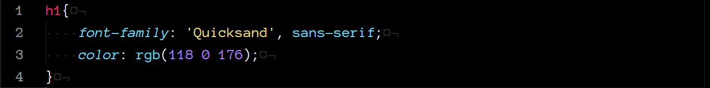

* Hexadecimal

    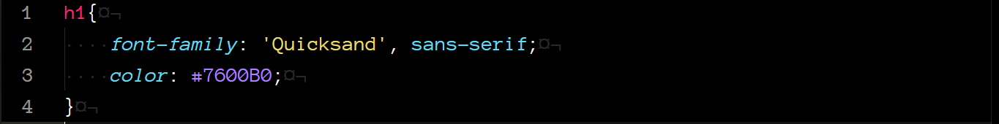

Utilizando cualquiera de las dos opciones obtenemos el mismo resultado.

    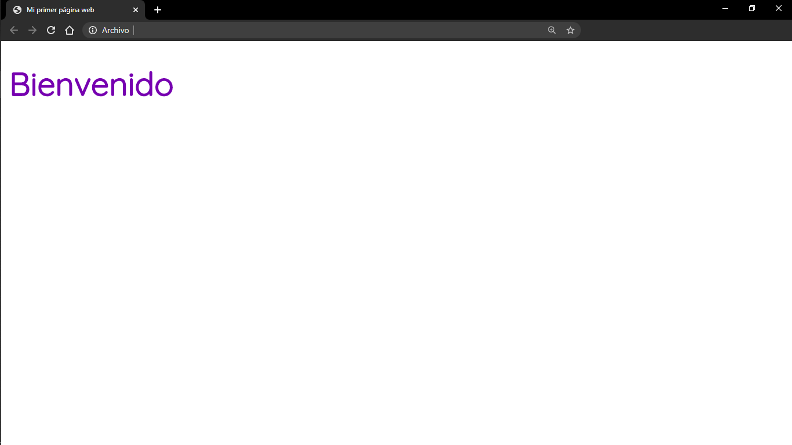

[Aquí](https://htmlcolorcodes.com/es/) puedes consultar los códigos de colores para RGB y Hexadecimal.

#### Opacity
Además de cambiar el color de los elementos, podemos cambiar su opacidad. Esto es, que tan transparente es el objeto.

Para esto, utilizamos la propiedad `opacity` que recibe como valor un número entre 0 y 1, donde 1 representa un color %100 solido y 0 vuelve el objeto invisible.

    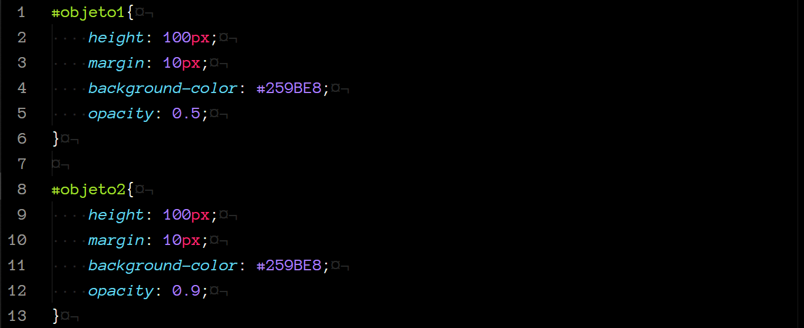

    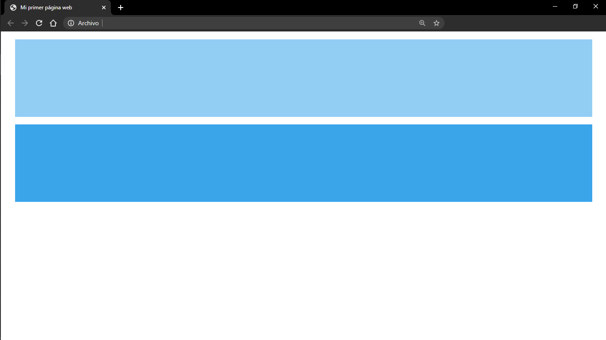

En el ejemplo podemos ver la diferencia entre dos objetos del mismo color pero con una opacidad diferente.

#### Background color
Para cambiar el color de fondo de nuestra página web utilizamos la propiedad `background-color`.

Podemos definir el color de fondo de toda la página web son el selector `html` o `body`. Sin embargo, podemos definir el color de fondo de muchas cosas más, como párrafos, encabezados, contenedores, etc.

    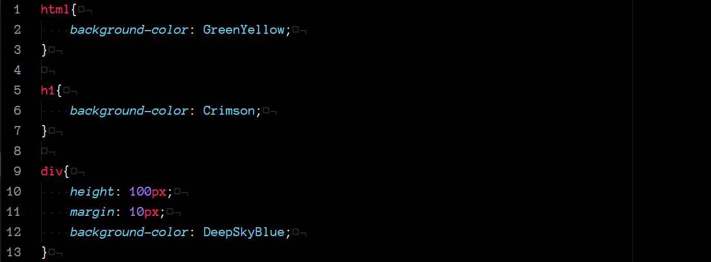

    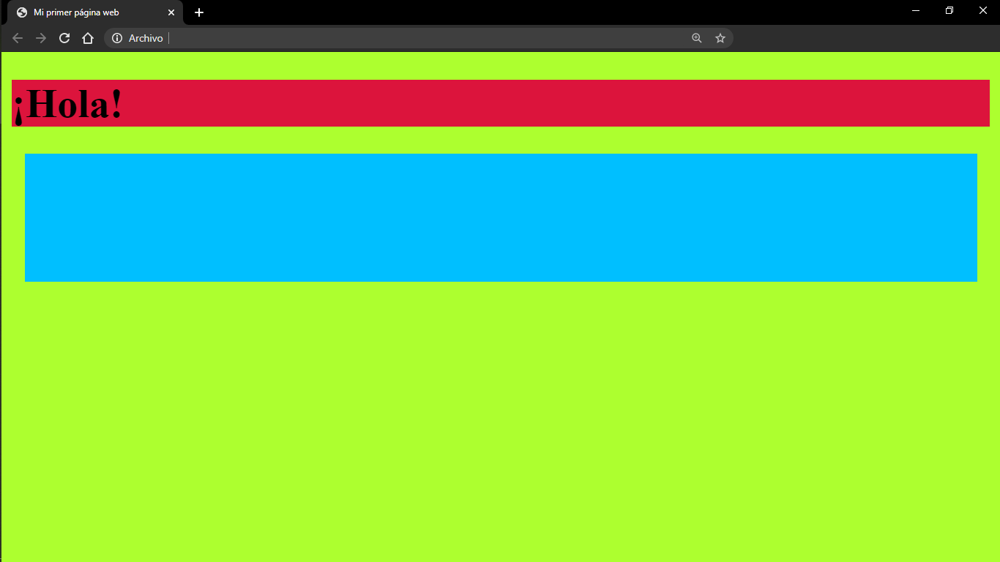

### Unidades
En la hoja de estilos existen múltiples propiedades que reciben como valor una medida o tamaño que debe ser especificado en ciertas unidades. Por ejemplo la altura (height) o ancho (width) de un elemento, el tamaño del texto, etc.

Hasta ahora, solo hemos utilizado pixeles para especificar estas medidas, pero existen otras unidades que podemos utilizar.

#### Unidades de longitud absoluta
Se refiere a que no dependen ni son relativas a ningún otro objeto en la página web y en general, se considera que siempre tienen el mismo tamaño.

|Unidad | Nombre|
|--- | ---|
|`mm` | milímetros|
|`cm` | centímetros|
|`in` | pulgadas|
|`pt` | puntos|
|`px` | pixeles|

#### Unidades de longitud relativa
Son relativas a algún otro objeto en la página web, por ejemplo, el tamaño de la ventana. Esto es una gran ventaja, pues puede permitirnos que, si el tamaño del dispositivo o la ventana donde se despliega nuestra página web cambia, los elementos se mostraran en una escala correspondiente.

|Unidad | Relativa a...|
|--- | ---|
|`em`| tamaño de letra del elemento padre|
|`rem`| tamaño de letra del elemento raíz|
|`vw`| 1% del ancho de la ventana|
|`vh`| 1% del alto de la ventana|

Veamos un ejemplo.

    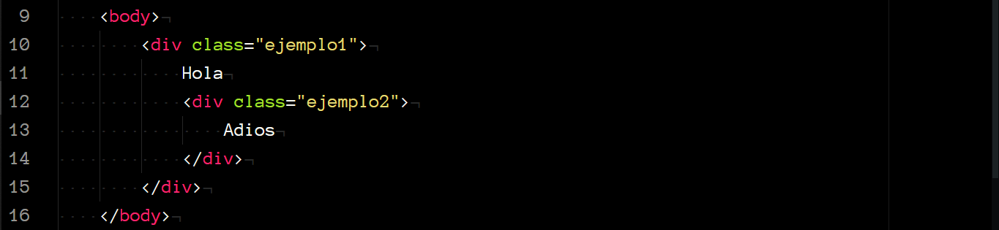

Aquí, definimos dos contenedores anidados, donde `ejemplo1` es el *elemento padre* y `ejemplo2` es el *elemento hijo*.

    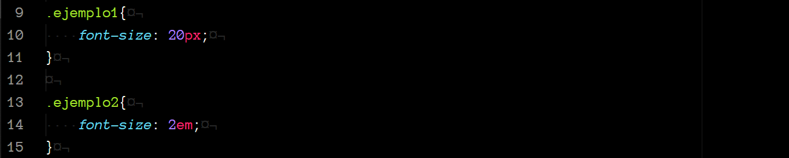

En la hoja de estilos, definimos el tamaño de fuente para `ejemplo1` como `20px` y el tamaño de fuente para `ejemplo2` como `2em`.

    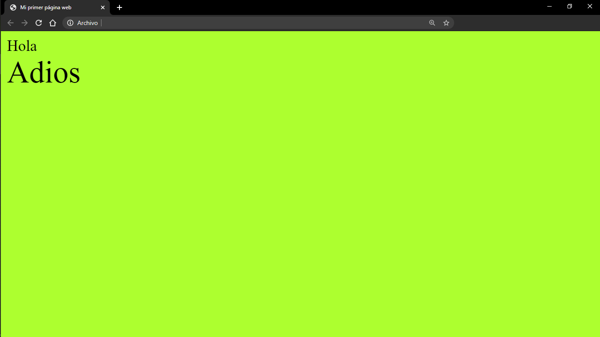

Podemos ver que el texto dentro del segundo contenedor es más grande, esto es porque, `em` es un múltiplo del tamaño de fuente del elemento padre. Entonces, en este ejemplo, el tamaño de fuente del elemento hijo es `2em = 2 x 20px = 40px`.

Estas son solo algunas de la unidades que puedes utilizar, aunque son las más frecuentes, pero [aquí](https://developer.mozilla.org/es/docs/Learn/CSS/Building_blocks/Valores_y_unidades_CSS) puedes consultar más al respecto.
