# Conceptos básicos de CSS (Parte 3)

### Modelo de caja
Cualquier elemento en un documento HTML se presenta en la página web contenido en una **caja rectangular**, compuesta por una serie de propiedades que nos permitirán estilizar la presentación de dicho elemento.

Esta *caja* esta compuesta por el tamaño del contenido (alto y ancho), padding, borde y margen.

    

#### Ancho y alto
El contenido de un elemento tiene dos dimensiones, **alto** y **ancho**.

Por default, las dimensiones de un elementos son únicamente del tamaño necesario para mostrar su contenido.

Para modificar estas dimensiones utilizamos las propiedades `height` y `width`.

    

    

Aquí, podemos ver, el elemento `p` es únicamente del alto necesario para mostrar el texto.

    

    

Aquí, hemos modificado las dimensiones del párrafo, para que tenga una altura de 70 pixeles y un ancho de 100 pixeles.

#### Bordes
El borde es la línea que encierra el contenido del elemento.

La propiedad `border` recibe tres valores:

* `width`: el grosor del borde. Puede ser definido en pixeles o utilizando los valores `thin`, `medium`, `thick`.
* `style`: el diseño del borde. Los navegadores pueden desplegar hasta 10 diseños diferentes. [Aquí](https://developer.mozilla.org/en-US/docs/Web/CSS/border-style#Values) puedes consultarlos.
* `color`: el color del borde.

    

    

Continuando con el ejemplo de arriba, hemos definido, un borde de 3 pixeles de ancho, con estilo sólido y color carmín.

La propiedad `border` nos permite definir el borde para los cuatro lados del elemento, sin embargo, podemos definir cada uno individualmente con las siguientes propiedades:
* `border-right`
* `border-left`
* `border-top`
* `border-bottom`

##### Border radius
Como podemos ver en el ejemplo de arriba, al definir el borde de un elemento, este se muestra rectangular. Sin embargo, utilizando la propiedad `border-radius`, podemos modificar las esquinas del borde para que se muestren redondeadas.

    

    

#### Padding
El espacio entre el contenido de elemento y su borde se conoce como padding.

Para modificar este espacio utilizamos la propiedad `padding`.

Como podemos ver en el ejemplo de arriba, el texto del párrafo de encima con el borde. Esto lo podemos arreglar utilizando el padding.

    

    

Ahora, hemos agregado un padding de 10 pixeles a cada lado de nuestro elemento, por lo que, el modelo de caja de nuestro párrafo, luciría así hasta el momento:

    

La propiedad `padding` nos permite definir el espacio entre el contenido y el borde para los cuatro lados de la caja, sin embargo, podemos definir cada lado individualmente:
* `padding-right`
* `padding-left`
* `padding-top`
* `padding-bottom`

#### Margen
El margen se refiere al espacio fuera de la caja, esto es, el espacio entre el borde del elemento y el resto de los elementos que lo rodean.

Para modificar este espacio utilizamos la propiedad `margin`.

    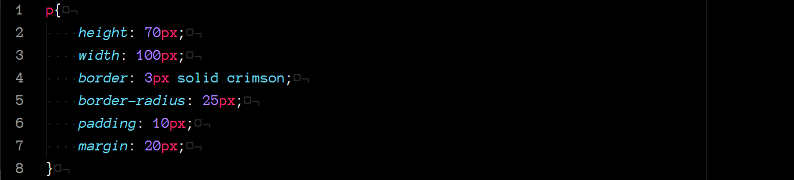

    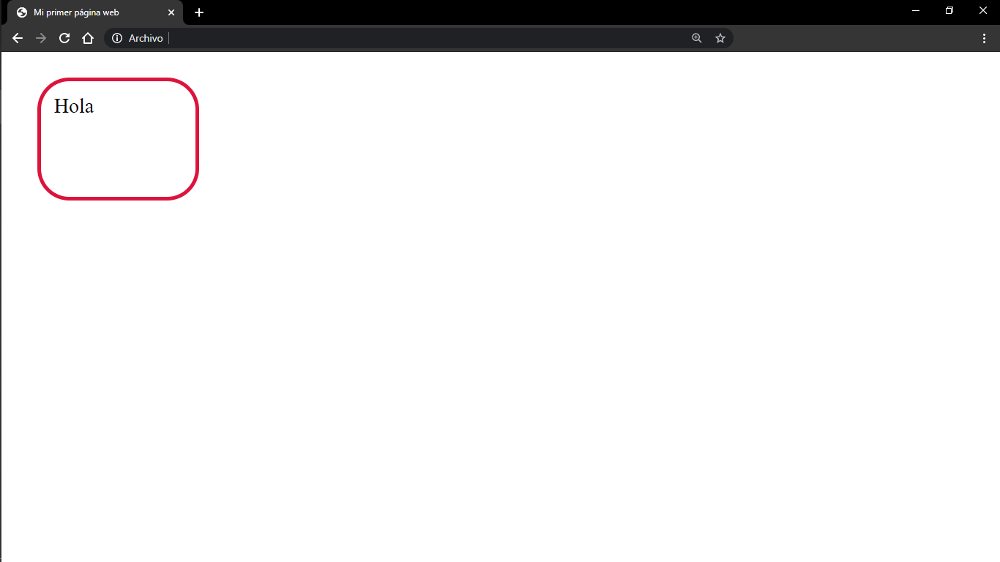

Siguiendo el ejemplo de arriba, si agregamos un margen de 20 pixeles, podemos ver que el elemento se desplaza ligeramente hacia la derecha y hacia abajo.

Entonces, al agregar el margen, el modelo de caja de nuestro elemento luce así:

    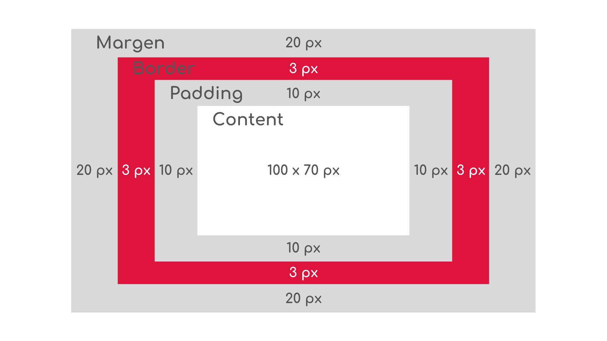

La propiedad `margin` nos permite definir el espacio fuera del elemento para los cuatro lados de la caja, sin embargo, podemos definir cada lado individualmente:
* `margin-right`
* `margin-left`
* `margin-top`
* `margin-bottom`

    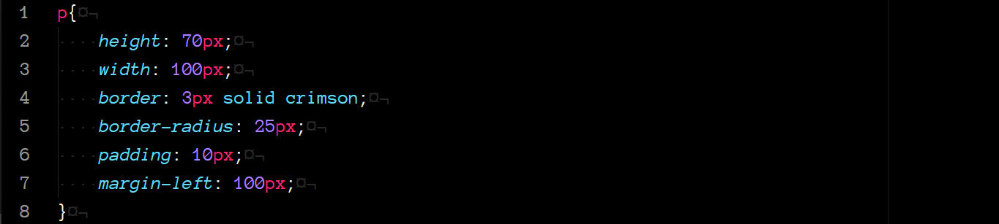

    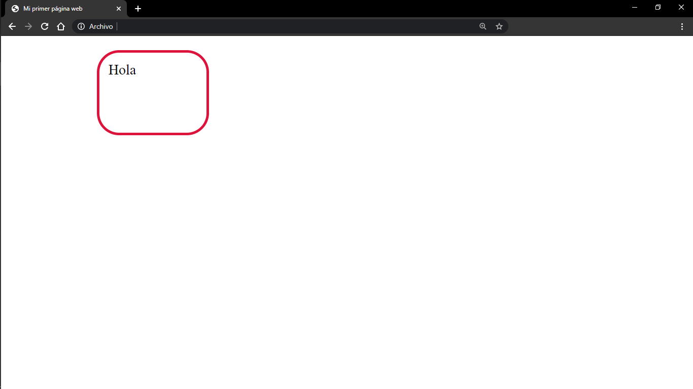

En este ejemplo, definimos únicamente el margen del lado izquierdo, con un valor de 100 pixeles, por lo que podemos ver que el elemento se desplaza hacia la izquierda.

### Position

La propiedad `position` define como se posiciona un elemento en la página web.

Esta propiedad puede recibir uno de cuatro valores distintos:

#### Static
Este es su valor por defecto.

#### Relative
Un elemento con `position = relative` es posicionado con relación a su posición normal.

Para esto, utilizamos además las propiedades:
* `top`: desplaza el elemento hacia abajo.
* `bottom`: desplaza el elemento hacia arriba.
* `right`: desplaza el elemento hacia la izquierda.
* `left`: desplaza el elemento hacia la derecha.

Veamos un ejemplo.

    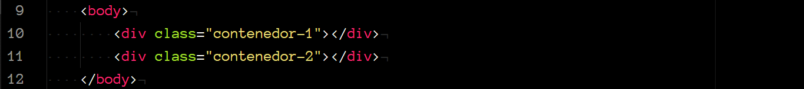

    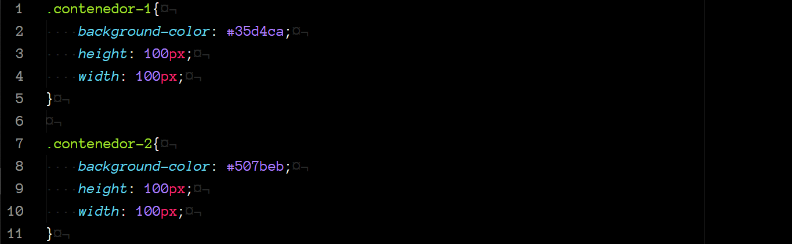

    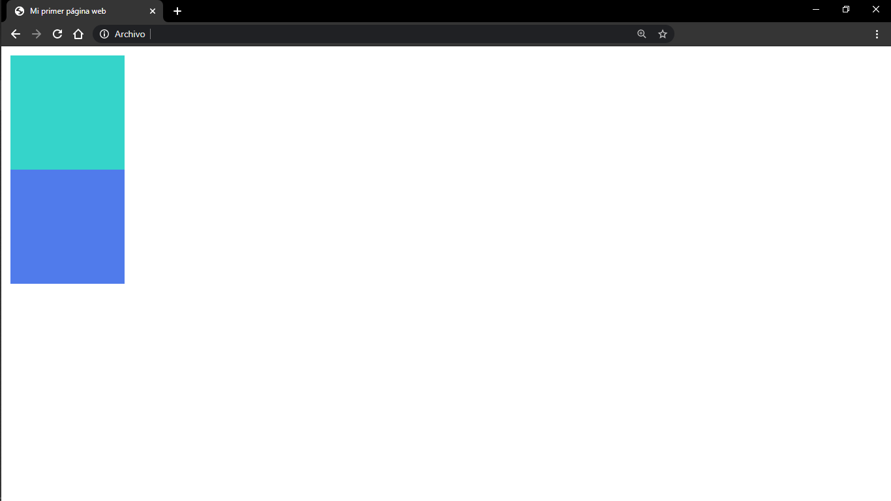

Para comenzar, definimos dos contenedores. Como mencionamos arriba, su posición por defecto es estática.

    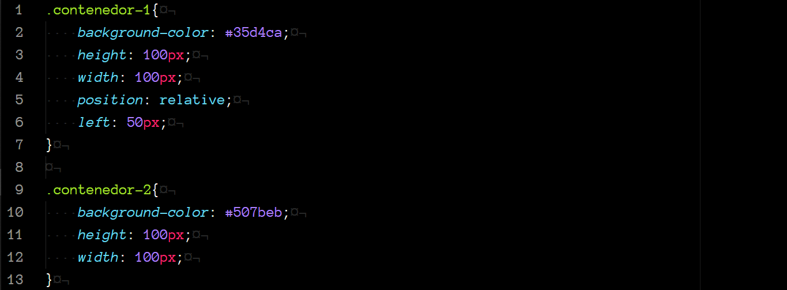

    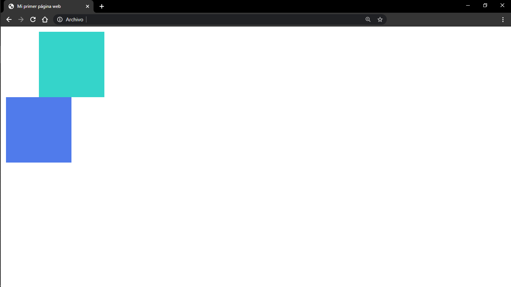

Ahora, al definir la posición del primer contenedor como relativa, utilizamos la propiedad `left` para desplazarlo 50 pixeles hacía la izquierda con respecto a su posición inicial.

#### Absolute
Cuando la posición de un elemento es definida como `position = absolute` el resto de los elementos en la página ignoraran a dicho elemento y el elemento será posicionado con respecto a la posición de su elemento padre.

Al igual que para la posición relativa, podemos utilizar las propiedades `top`, `bottom`, `right` y `left` para mover el elemento por la página.

    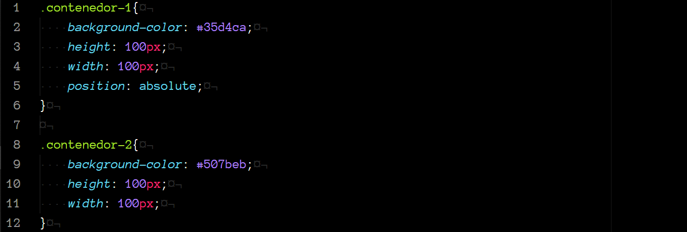

    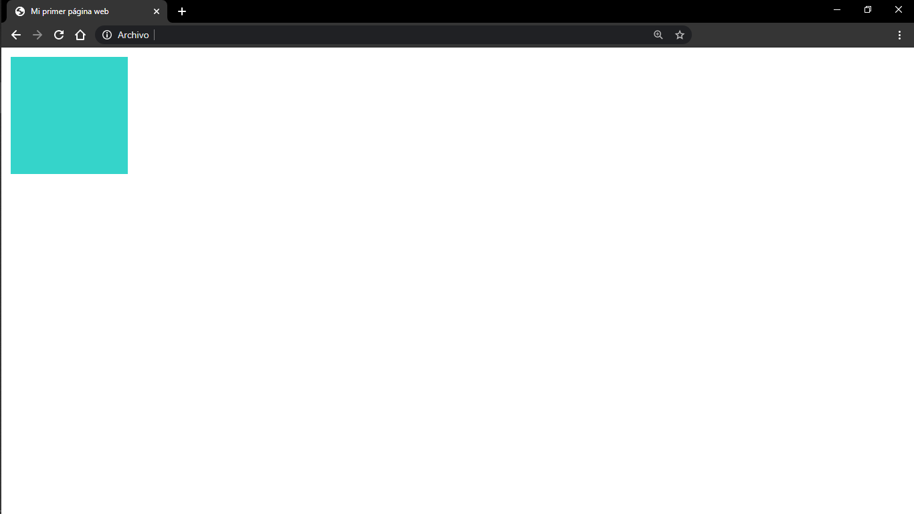

Continuando con el ejemplo de arriba, veamos que, al definir la posición del primer contenedor como absoluta, este cubre completamente al segundo contenedor. Esto es porque el segundo contenedor ignora al primero y es posicionado en el mismo lugar del primer contenedor.

    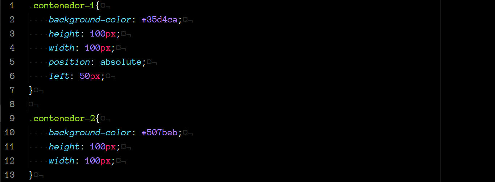

    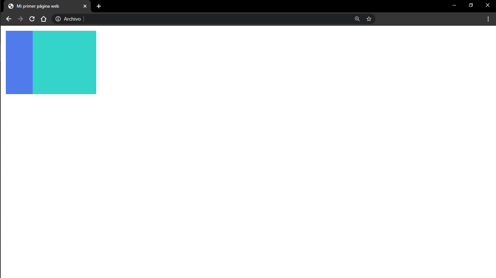

#### Fixed
Un elemento con posición `position = fixed` es posicionado con respecto a la ventana, lo que quiere decir que siempre se mantiene en el mismo lugar, aun cuando el usuario se desplaza por la página.

    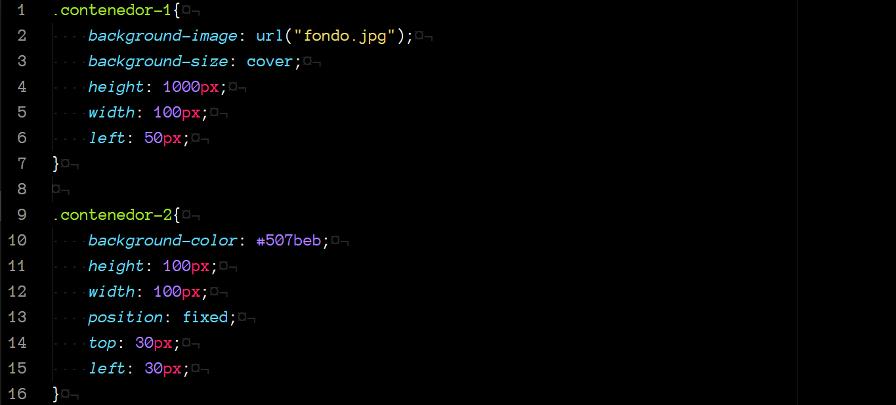

    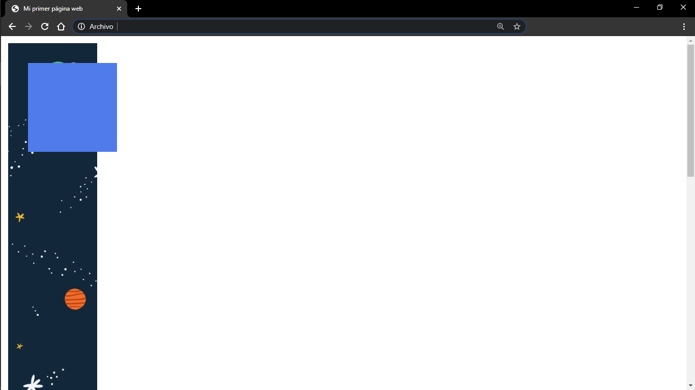

    

Podemos ver que, aunque nos desplazamos por la página, el segundo contenedor se mantiene en el mismo lugar.

#### Z-Index
En algunas ocasiones, como vimos en el ejemplo de la posición absoluta, puede ocurrir que dos o más objetos se superpongan. La propiedad de `z-index` nos permite definir que tan *atrás* o que tan *adelante* se muestra un elemento.

Esta propiedad recibe como valor un número entero, dependiendo del valor el navegador decide el orden en que se mostraran los elementos, este orden consiste en mostrar primero, o al frente, los elementos con un valor entero más grande.

Es importante tener en cuenta que esta propiedad no funciona con posición estática.

Veamos un ejemplo:

    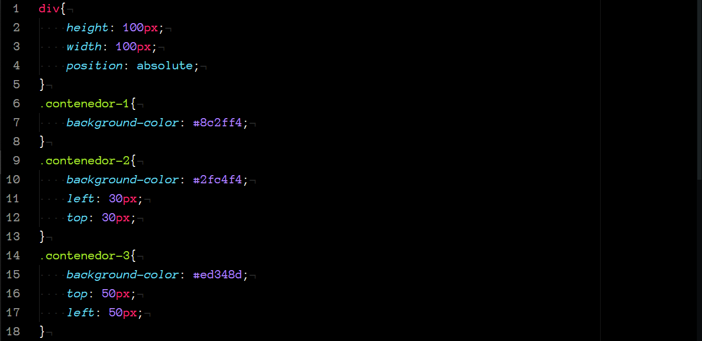

    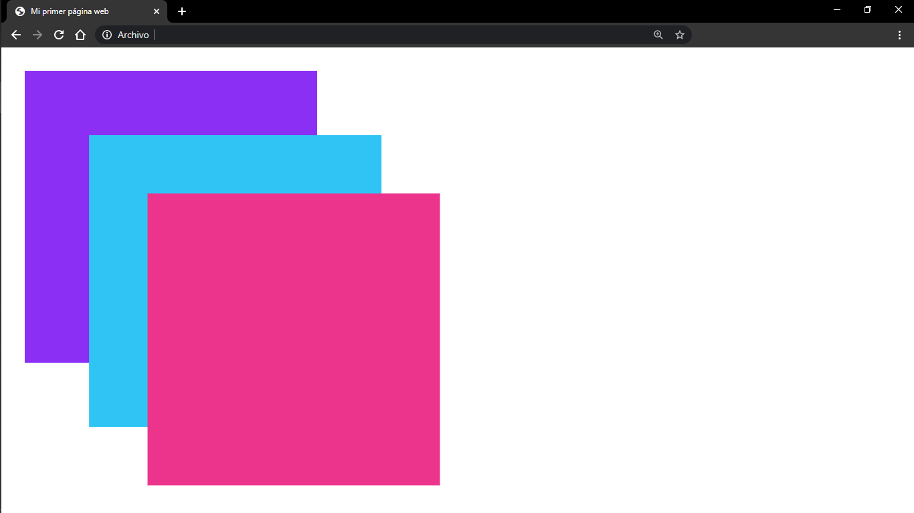

En el ejemplo, definimos tres contenedores con posición absoluta, los cuales se superponen.

Con la propiedad `z-index` podemos modificar el orden en que se muestran estos contenedores.

    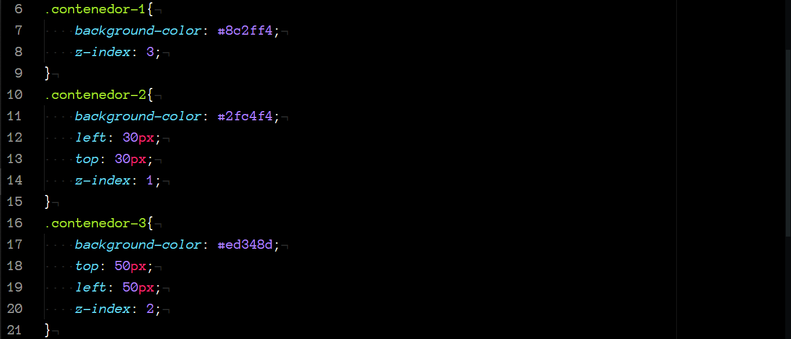

    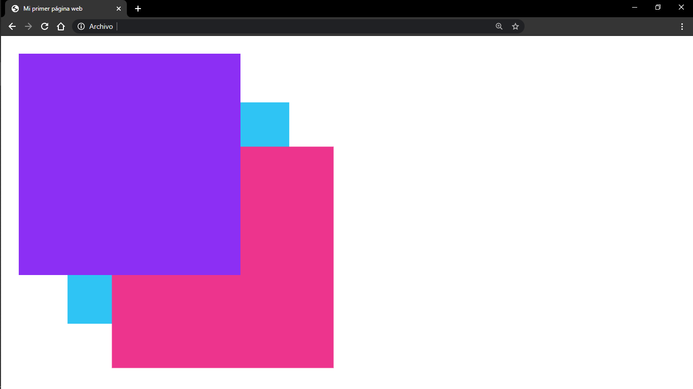

Ahora, el elemento que se despliega hasta el frente es el contenedor color morado, con `z-index = 3`, mientras que el contenedor rosa se despliega en segundo lugar, con `z-index = 2` y el hasta el fondo se muestra el contenedor color azul, con `z-index = 1`.

### Display
La propiedad `display` establece como se desplegará un elemento en la página, y como se desplegarán además sus hijos.

Todos los elementos html tienen un valor de la propiedad `display` definido por defecto, que determina si pueden o no compartir espacio horizontalmente con otros elementos.

#### Inline
Los elementos con la propiedad `display = inline` aparecen contenidos en una caja ([Modelo de caja](#modelo-de-caja)) que solamente utiliza el espacio necesario para desplegar su contenido, y que no necesitan una nueva línea para desplegar el siguiente elemento.

Es importante tener en cuenta que, con el valor de `inline`, no es posible definir las dimensiones del elemento, pues, como mencionamos, el tamaño de su caja solo será el necesario para desplegar el contenido.

    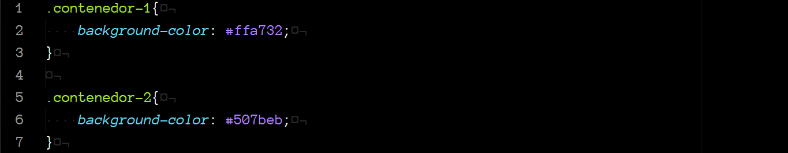

    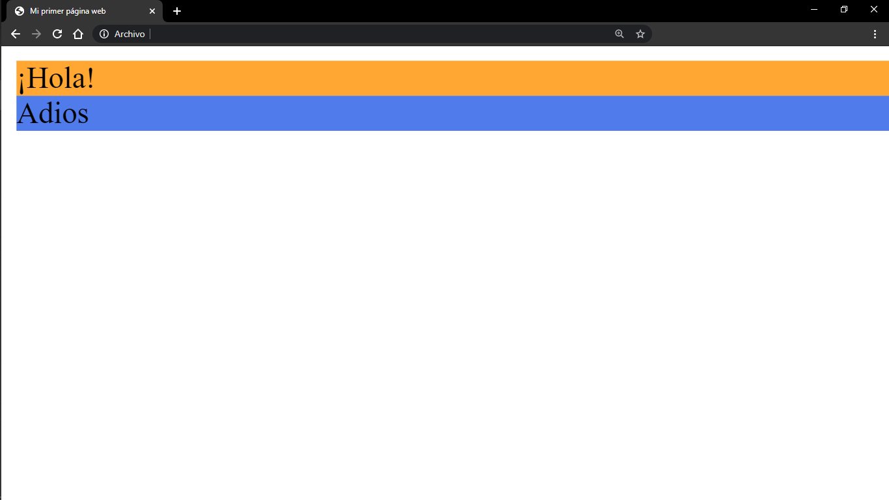

Por defecto, cada contenedor ocupa todo el espacio horizontal de la página web, por lo que cada elemento se muestra en una línea invidual.

    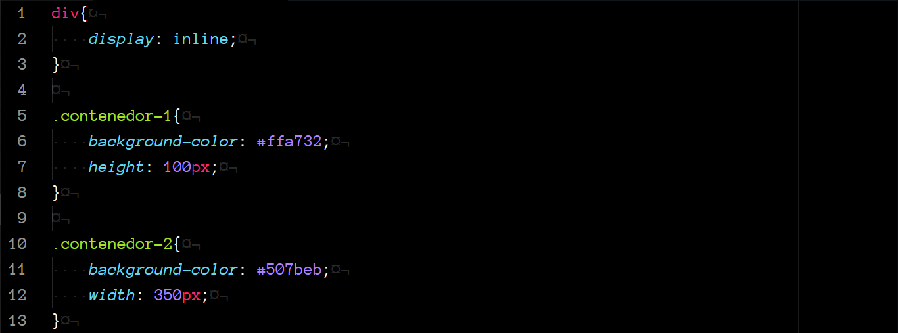

    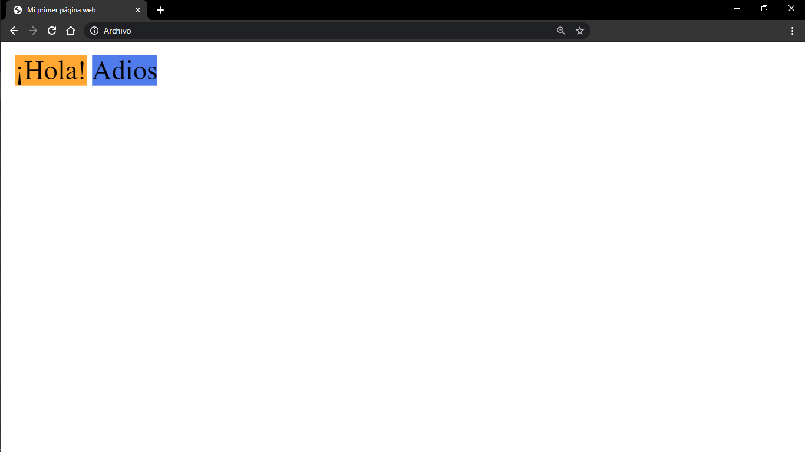

Al definir el valor de `diaplay` de los elementos `div` como `inline`, ambos contenedores se muestran en la misma línea.

Podemos ver que, aunque en el ejemplo definimos la altura del primer contenedor como 100 pixeles, el elemento solo es del tamaño necesario para desplegar su contenido, en este caso la palabra `¡Hola!`.

#### Block
Los elementos con la propiedad `display = block` ocupan todo el espacio horizontal de la página web (como vimos en el ejemplo de arriba). Para estos elementos si podemos especificar sus dimensiones en la hoja de estilos.

Vamos un ejemplo, donde definimos dos elementos con la etiqueta `<a>`.

    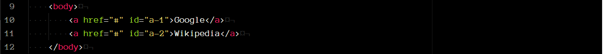

    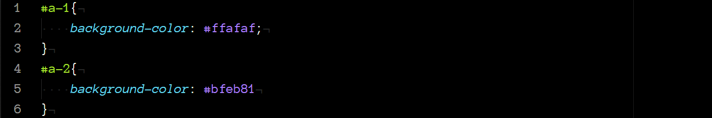

    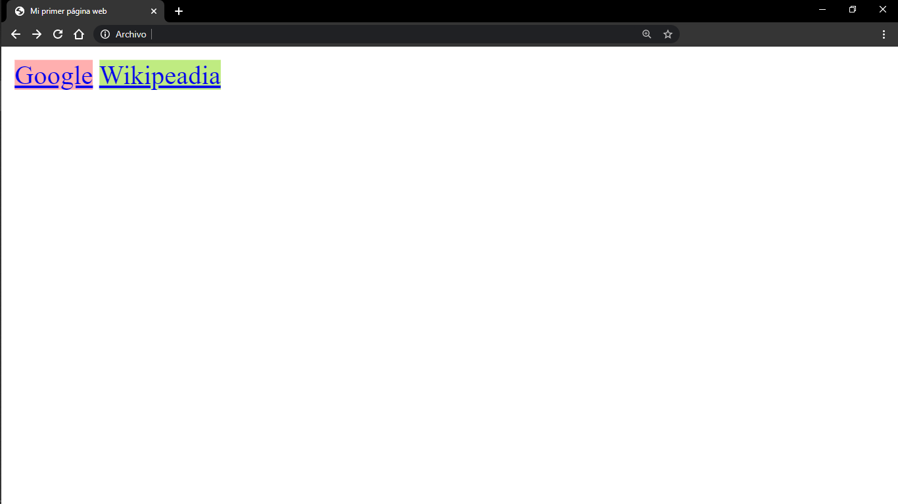

Los links se muestran por defecto como `inline`, por lo que podemos ver que ambos elementos se despliegan en la misma línea.

    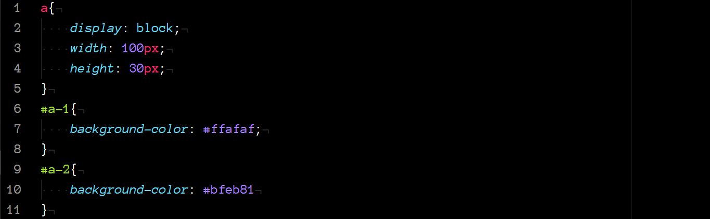

    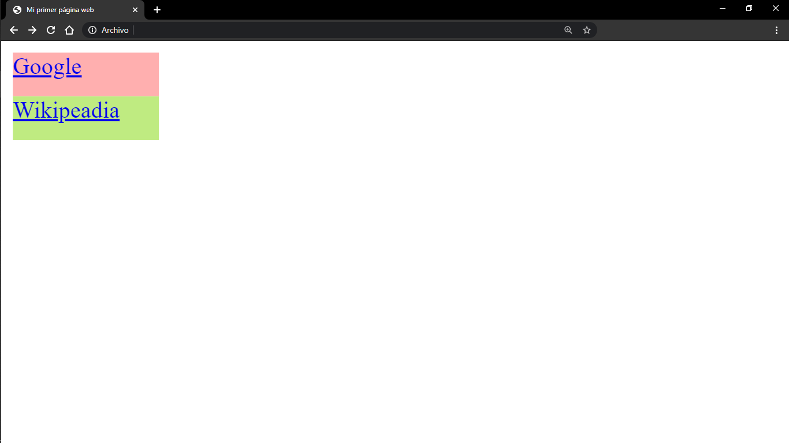

Ahora, al definir `display = block`, cada elemento se muestra en su propia línea horizontal y podemos definir sus dimensiones en la hoja de estilos.

#### Inline-Block
El valor `inline-block` combina características de las dos propiedades anteriores: los elementos pueden aparecer unos junto a otros en la misma línea pero además, podemos definir sus dimensiones.

Continuando con el ejemplo anterior:

    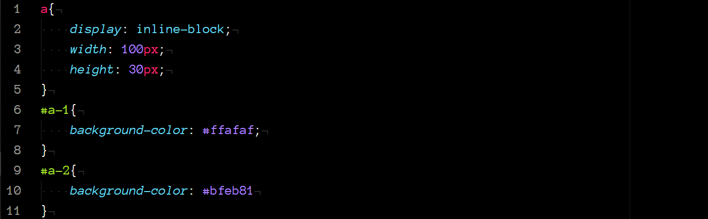

    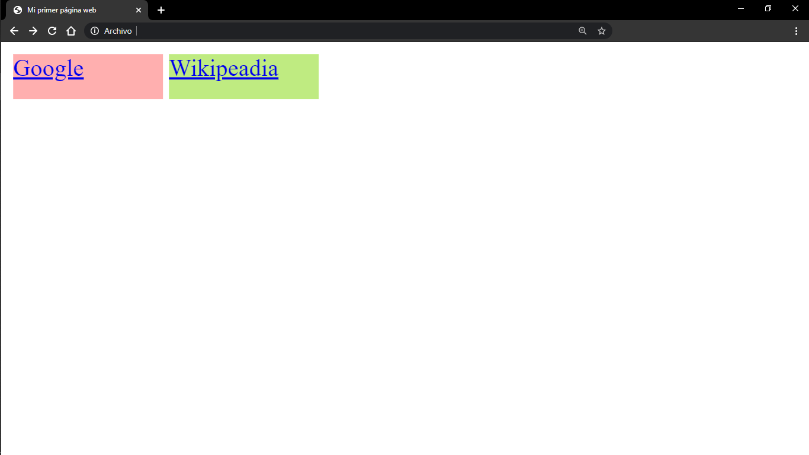

Ahora, al definir la propiedad `display = inline-block` ambos elementos se muestran en la misma línea, pero con las dimensiones `100px x 30px`.
