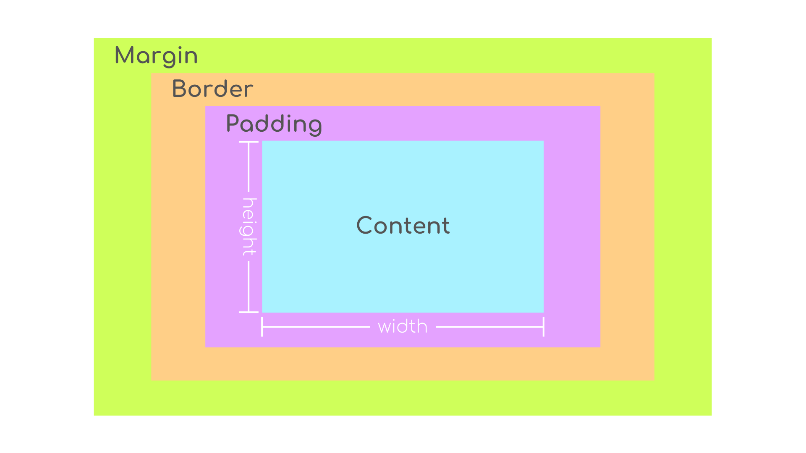
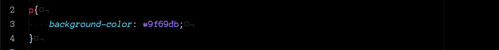
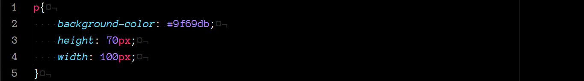
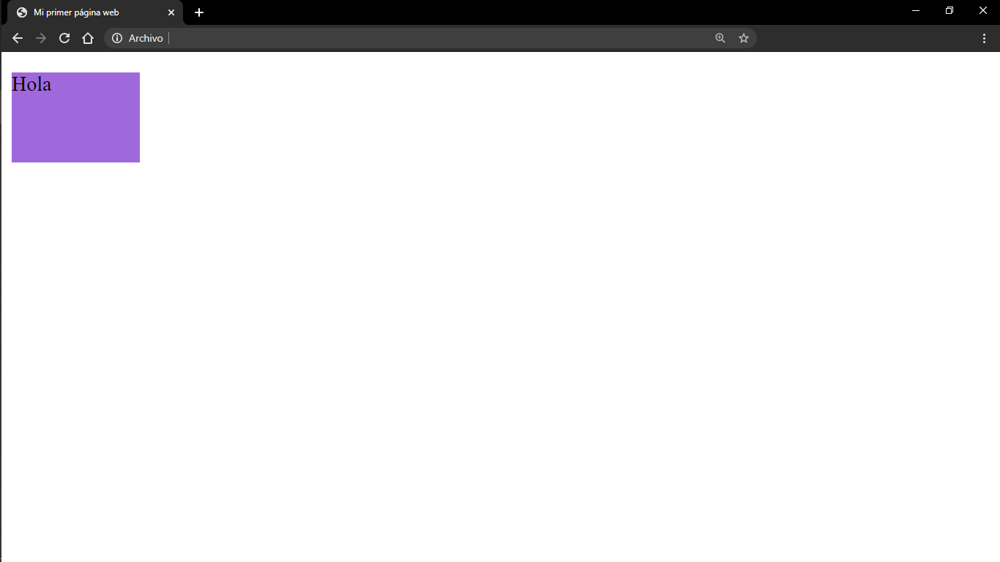
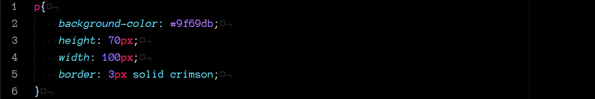
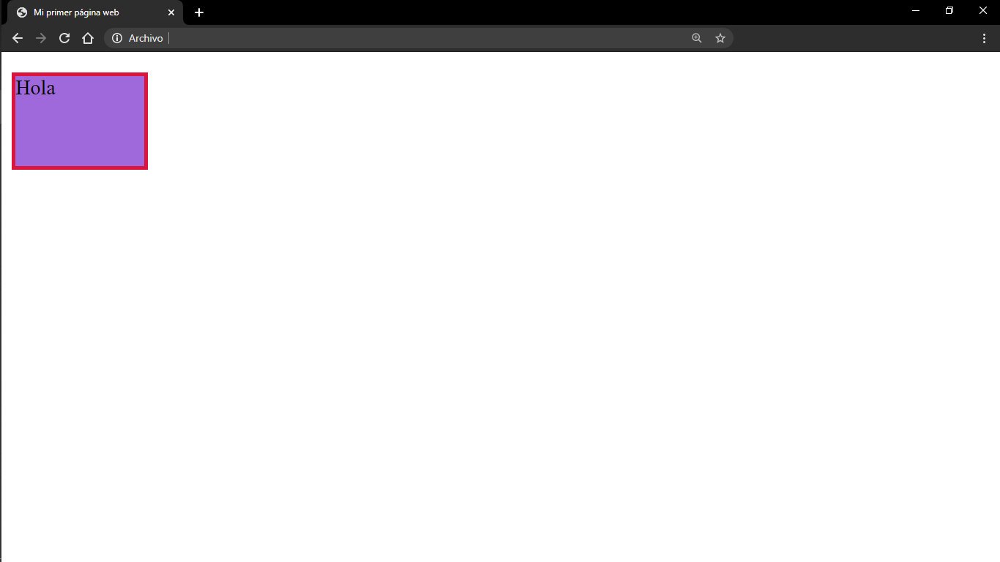
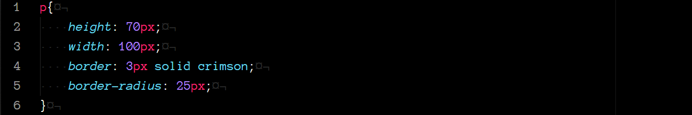
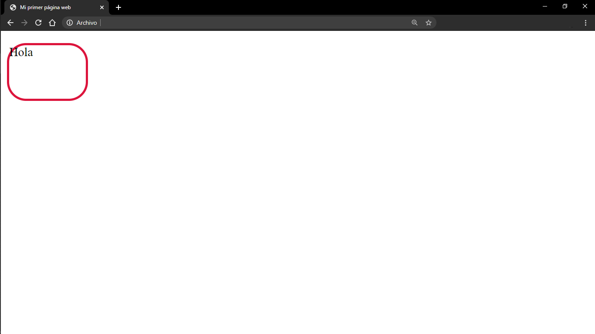
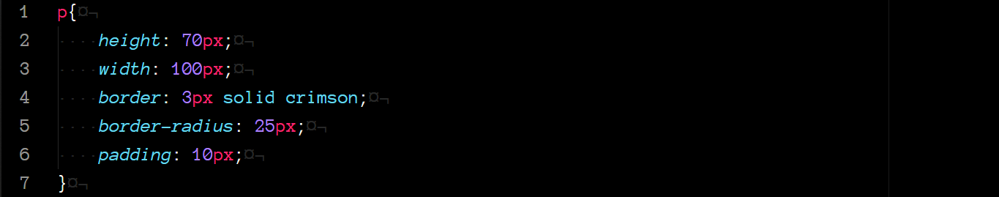
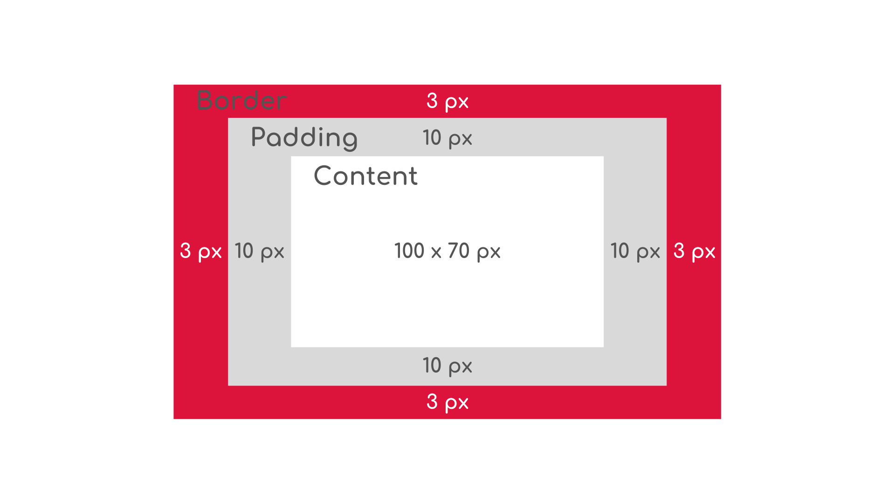

# Conceptos básicos de CSS (Parte 3)

### Modelo de caja
Cualquier elemento en un documento HTML se presenta en la página web contenido en una **caja rectangular**, compuesta por una serie de propiedades que nos permitirán estilizar la presentación de dicho elemento.

Esta *caja* esta compuesta por el tamaño del contenido (alto y ancho), padding, borde y margen.

    

#### Ancho y alto
El contenido de un elemento tiene dos dimensiones, **alto** y **ancho**.

Por default, las dimensiones de un elementos son únicamente del tamaño necesario para mostrar su contenido.

Para modificar estas dimensiones utilizamos las propiedades `height` y `width`.

    

    

Aquí, podemos ver, el elemento `p` es únicamente del alto necesario para mostrar el texto.

    

    

Aquí, hemos modificado las dimensiones del párrafo, para que tenga una altura de 70 pixeles y un ancho de 100 pixeles.

#### Bordes
El borde es la línea que encierra el contenido del elemento.

La propiedad `border` recibe tres valores:

* `width`: el grosor del borde. Puede ser definido en pixeles o utilizando los valores `thin`, `medium`, `thick`.
* `style`: el diseño del borde. Los navegadores pueden desplegar hasta 10 diseños diferentes. [Aquí](https://developer.mozilla.org/en-US/docs/Web/CSS/border-style#Values) puedes consultarlos.
* `color`: el color del borde.

    

    

Continuando con el ejemplo de arriba, hemos definido un borde de 3 pixeles de ancho, con estilo sólido y color carmín.

La propiedad `border` nos permite definir el borde para los cuatro lados del elementos, sin embargo, podemos definir cada uno individualmente con las siguientes propiedades:
* `border-right`
* `border-left`
* `border-top`
* `border-bottom`

##### Border radius
Como podemos ver en el ejemplo de arriba, al definir el borde de un elemento, este se muestra rectangular. Sin embargo, utilizando la propiedad `border-radius`, podemos modificar las esquinas del borde para que se muestren redondeadas.

    

    

#### Padding
El espacio entre el contenido de elemento y su borde se conoce como padding.

Para modificar este espacio utilizamos la propiedad `padding`.

Como podemos ver en el ejemplo de arriba, el texto del párrafo de encima con el borde. Esto lo podemos arregla utilizando el padding.

    

    

Ahora, hemos agregado un padding de 10 pixeles a nuestro elemento, por lo que, el modelo de caja de nuestro párrafo, luciría así hasta el momento:

    

La propiedad `padding` nos permite definir el espacio entre el contenido y el borde para los cuatro lados de la caja, sin embargo, podemos definir cada lado individualmente:
* `padding-right`
* `padding-left`
* `padding-top`
* `padding-bottom`
