# Flexbox
El modelo de Flexbox (o de Caja Flexible) es un modelo unidimensional de layout que nos permite distribuir más fácilmente los objetos de nuestra pagina web.

El layout Flexbox divide sus propiedades en dos; las propiedades del contenedor (el padre de los elementos que deseamos distribuir en el sitio web) y las propiedades de los hijos (los elementos que deseamos distribuir).

### Contenedor

Para comenzar, debemos definir un contenedor que será el padre de los elementos que deseamos distribuir en el sitio utilizando flexbox.

    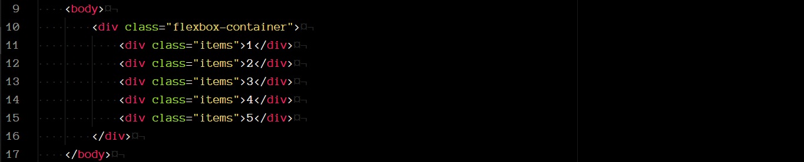

Entonces, nuestro `div` con la clase `flexbox-container` será el contenedor y los `div` con la clase `items` serán los elementos que deseamos distribuir.

Inicialmente, nuestro sitio web luce así:

    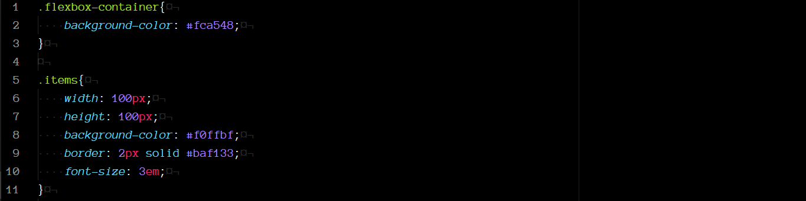

    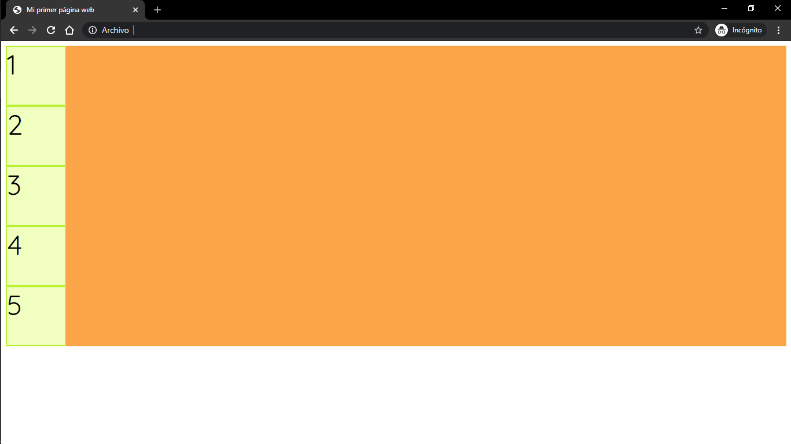

Los cuadrados aparecen cada uno en una línea nueva, y sin espacio entre ellos.

Entonces, es al `flexbox-container` al que le asignaremos la propiedad `display : flex`.

    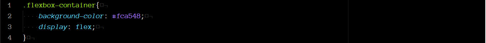

    

##### flex-direction
Para comenzar, debemos pensar en dos ejes, el eje principal y el eje cruzado, estos determinaran la dirección en que se distribuirán los elementos dentro del contenedor.

El eje principal lo definimos utilizando la propiedad `flex-direction` y el eje cruzado es el perpendicular a este. La propiedad `flex-direction` puede tomar cuatro valores distintos:

    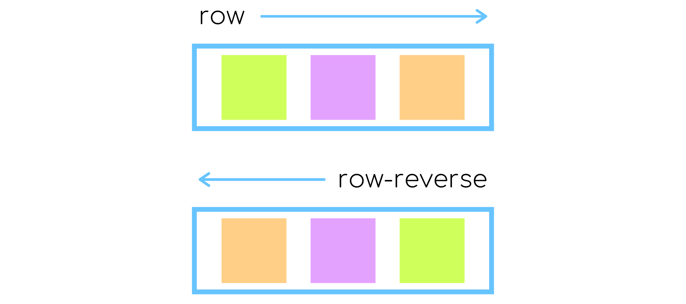

    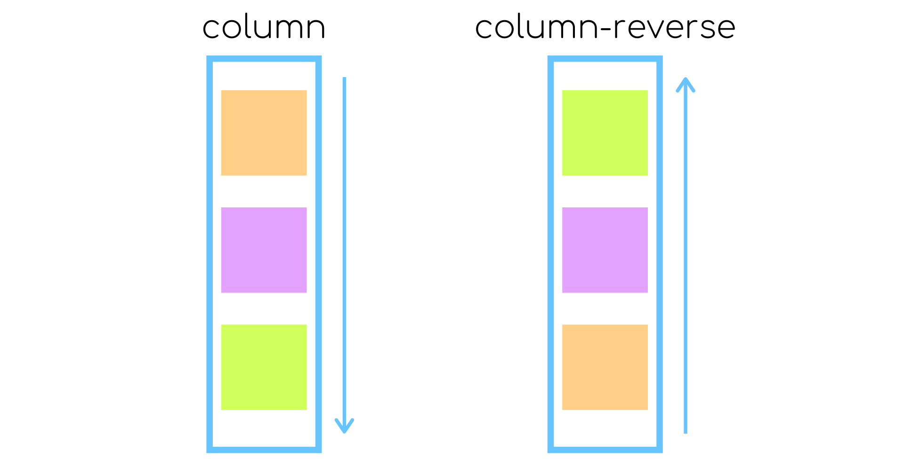

El valor por defecto de `flex-direction` es `row`. Es por eso que, al asignarle a nuestro contenedor la propiedad `flex`, los elementos se muestran distribuidos en una sola fila:

    

#### flex-wrap

Por defecto, los elementos dentro del contenedor intentaran acomodarse todos en una sola fila (o columna dependiendo de la dirección), lo que podría alterar las dimensiones iniciales de estos elementos. Para evitar esto podemos utilizar `flex-wrap`; esta propiedad permite a los elementos acomodarse en una nueva fila o columna si el tamaño de la línea inicial no es suficiente.

La propiedad `flex-wrap` tiene como valor por defecto `nonwrap` que indica que todos los elementos se mostraran en una sola línea, pero puede tomar otros 2 valores distintos:

    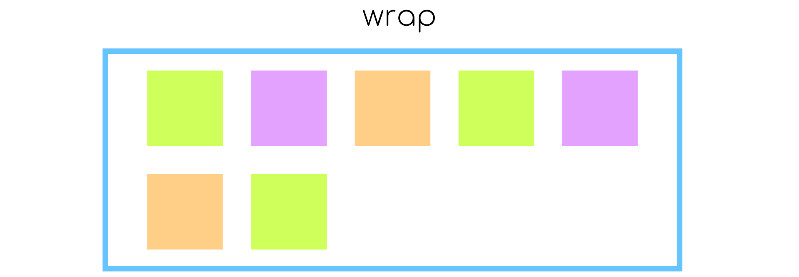

`wrap` distribuye los elementos en una nueva línea hacia abajo (o hacia la derecha).

    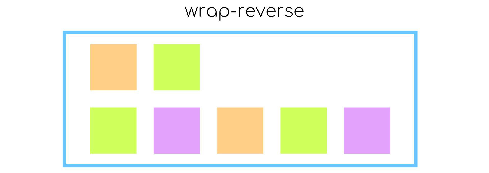

`wrap-reverse` distribuye los elementos en una línea hacia arriba (o hacia la izquierda).

Esta propiedad resulta muy útil para conservar el tamaño original de nuestros elementos aún cuando cambie el tamaño del contenedor, de la ventana del navegador o de nuestra pantalla.

Si reducimos, por ejemplo, la dimensión del ancho de nuestro contenedor, los elementos se verían así:

    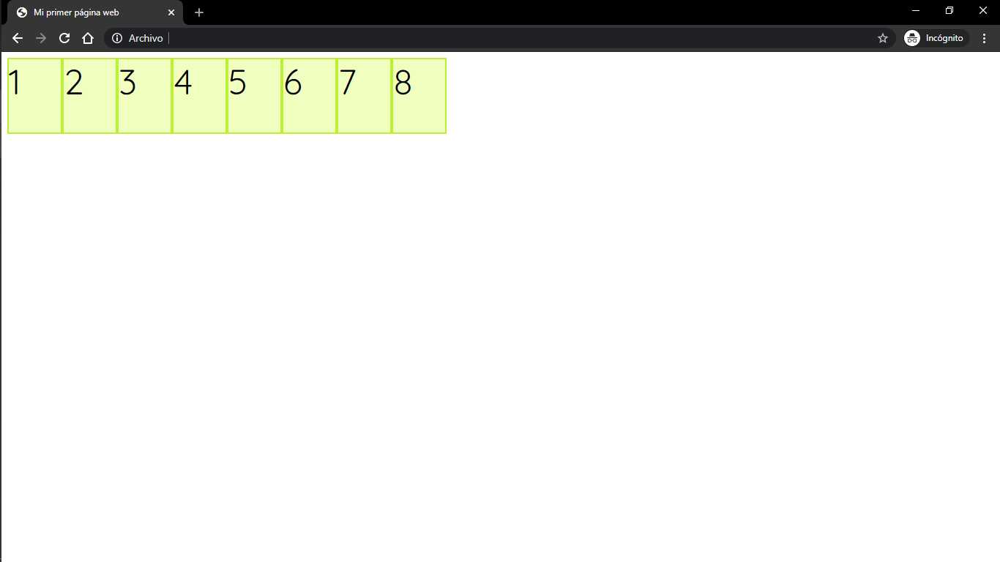

Ahora, con la propiedad `flex-wrap : wrap`, los elementos se distribuyen en una línea nueva y conservan su tamaño:

    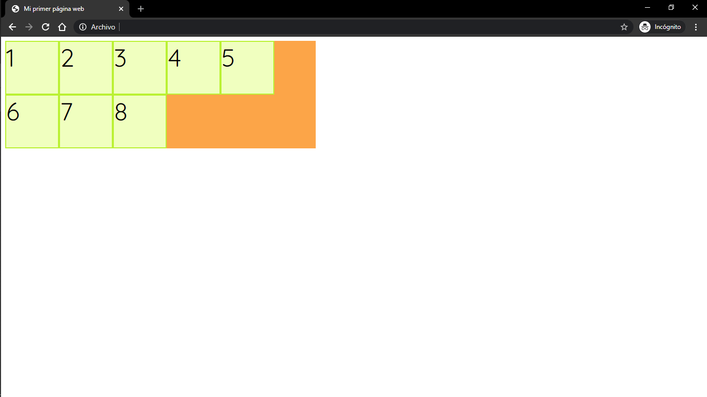

#### flex-flow

`flex-flow` es una fusión de `flex-direction` y `flex-wrap` Su valor por defecto es `row nonwrap`, pero puede tomar cualquier comb|inación de los valores de ambas propiedades.

    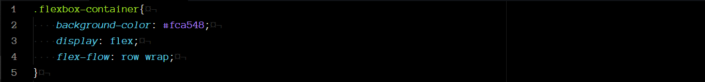

#### justify-content

La propiedad `justify-content` sirve para alinear los elementos dentro del contenedor a lo largo del eje principal. Además, nos permite distribuir el espacio libre dentro del contenedor de manera equitativa.

`justify-content` puede tomar 6 valores distintos:

    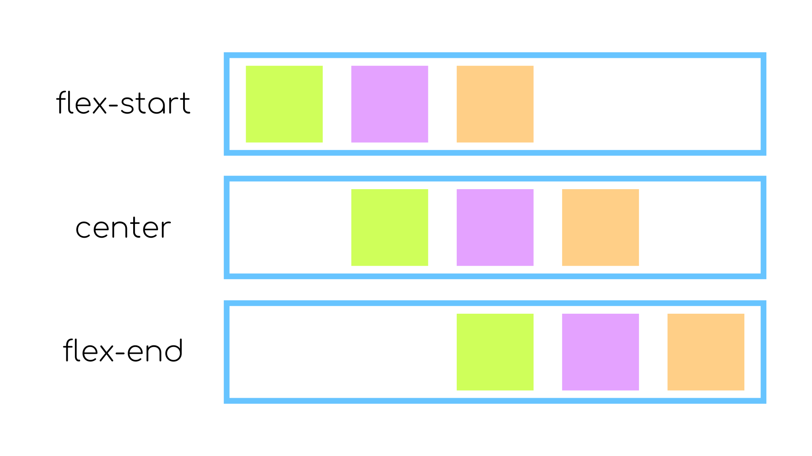

`flex-start` es el valor por defecto.

    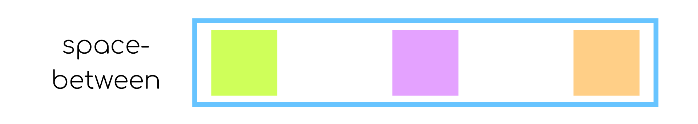

`space-between` alinea el primer elemento al inicio del contenedor y el último al final, y el resto los distribuye equitativamente en el espacio restante.

    

`space-around` asigna el mismo espacio alrededor de cada elemento, por lo que el espacio entre dos elementos sería del doble de tamaño (pues es la suma del espacio que le corresponde a cada uno), como se muestra en la imagen.

    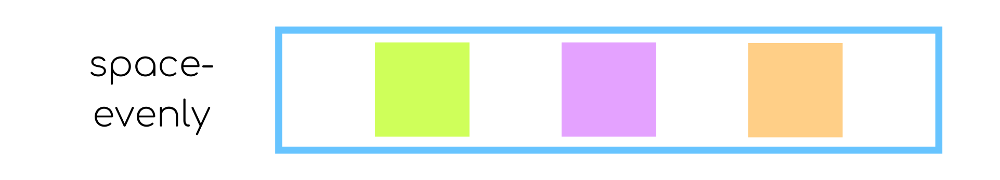

`space-evenly` distribuye equitativamente los elementos en todo el espacio disponible.

#### align-items

`align-items` determina como se alinearan los elementos a lo largo del eje cruzado de cada línea.

    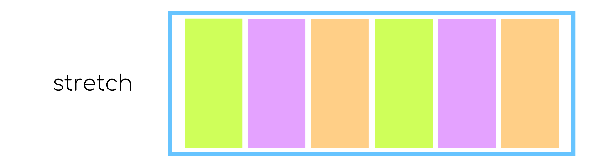

`stretch` es  el valor por defecto. Si los elementos no tienen una altura definida (o ancho, en caso que el eje cruzado sea el horizontal) el elemento se estira hasta ocupar todo el espacio en el contenedor.

    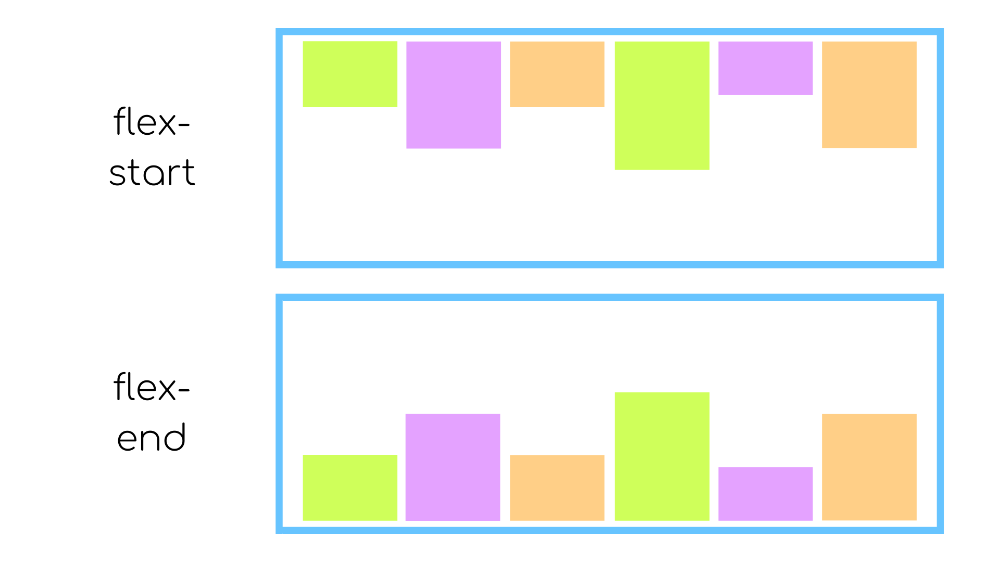

`flex-start` y  `flex-end` alinea los elementos al inicio o final del eje cruzado, respectivamente.

 

Hay muchos más temas por abordar respecto a las hojas de estilos (y mucho más que aprender de los temas ya mencionados), sin embargo, salen del alcance de este curso. Aquí, puedes encontrar más información de gran utilidad para continuar con tu aprendizaje sobre el lenguaje CSS.

* [CSS Almanac](https://css-tricks.com/almanac/): Listado de todas las propiedades de CSS y como utilizarlas.
* [CSS Tutorial](https://www.w3schools.com/css/): Tutorial del lenguaje CSS.
* [CSS CheatSheet](https://htmlcheatsheet.com/css/): Página web interactiva de todas las propiedades de CSS.
