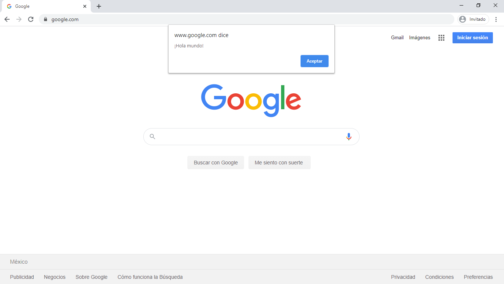

# Conceptos básicos de Javascript

Javascript es un lenguaje de programación que puede utilizarse junto con HTML Y CSS para crear paginas web dinámicos. Una gran mayoría de los sitio web actuales utiliza Javascript, y todos los navegadores modernos, ya sea en computadoras de escritorio y portátiles, teléfonos móviles, consolas de videojuegos o tabletas, incluyen interpretes de Javascript.

### Programas y Sentencias
Un **programa** es una lista de instrucciones que deben ser ejecutadas en una computadora. En un lenguaje de programación, estas instrucciones son llamadas **sentencias**.

Por lo tanto, un programa de Javascript no es más que una lista de sentencias.

Una sentencia está compuesta de *valores, operadores, expresiones, palabras reservadas y comentarios*.

Estas sentencias son ejecutadas por el navegador una por una, en el orden en que están escritas.

Al principio de este curso, mencionamos como acceder a la consola de nuestro navegador, lo que nos permitirá ejecutar sentencias de javascript para interactuar con nuestra página web.


### ¡Hola mundo!
Para comenzar, solo necesitaremos la consola de nuestro navegador.

Nuestro primer programa, mostrará un mensaje al usuario. En la consola de tu navegador, puedes pegar la siguiente línea de código:

```javascript
alert("¡Hola mundo!");
```

<p align="center">
    
</p>

¡Y listo!
Hemos escrito nuestro primer *¡Hola mundo!* en Javascript.

### Consola
En el ejercicio de arriba ya hemos utilizado el método `alert()` para mostrar un mensaje en la página web.

Por otro lado, tenemos también un método muy útil, que nos permite imprimir mensajes en la consola del navegador. Este es el método `console.log()`.

Con este método, podemos imprimir cualquier tipo de información en la consola, como texto, números o *arreglos*.

```javascript
console.log("Hola");
console.log(12);
console.log([1, 2, 3, 4]);
console.log(true);
```

<p align="center">
    
</p>


### Comentarios
Los comentarios nos permiten explicar como funciona un bloque de código o una función, para hacer más legible nuestro programa.

Por otro lado, también nos permiten evitar que se ejecute una sección de nuestro código.

Javascript soporta dos tipos de comentarios.

##### Comentarios de una línea
Se denotan con `//` antes del comentario.
```javascript
//Este es un comentario
console.log("Hola");
```

```javascript
console.log("Hola"); //Puedes comentar después de una línea de código
```

##### Comentario de múltiples líneas
Comienza `/*` y termina con `*/`.
Cualquier texto entre `/*` y `*/` será ignorado por el interprete de Javascript.
```javascript
/*
Este es un comentario de múltiples líneas.
Puedes comentar una sección de código
console.log(5);
Esto evitará que la instrucción de arriba se ejecute
*/
```
