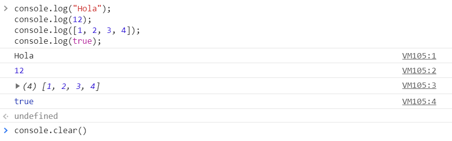
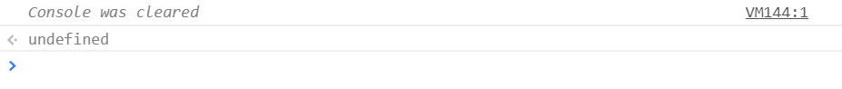
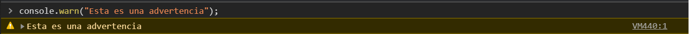
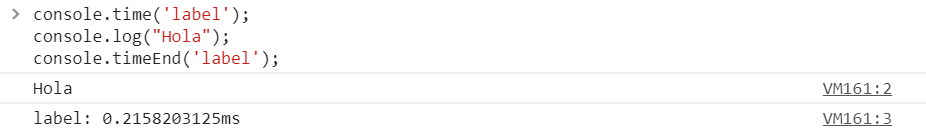

# Conceptos básicos de Javascript

Javascript es un lenguaje de programación que puede utilizarse junto con HTML Y CSS para crear paginas web dinámicos. Una gran mayoría de los sitio web actuales utiliza Javascript, y todos los navegadores modernos, ya sea en computadoras de escritorio y portátiles, teléfonos móviles, consolas de videojuegos o tabletas, incluyen interpretes de Javascript.

### Programas y Sentencias
Una **programa** es una lista de instrucciones que deben ser ejecutadas en una computadora.

En un lenguaje de programación, estas instrucciones son llamadas **sentencias**.

Por lo tanto, un programa de Javascript no es más que una lista de sentencias.

Una sentencia está compuesta de *valores, operadores, expresiones, palabras reservadas y comentarios*.

Por ejemplo, la siguiente sentencia le indica al navegador que muestre un mensaje con la frase *¡Hola mundo!*

```javascript
alert("¡Hola mundo!");
```

Estas sentencias son ejecutadas por el navegador una por una, en el orden en que están escritas.

### Console
En Javascript la palabra reservada `console` se refiere a un objeto, una colección de datos y acciones, que podemos utilizar en nuestro código.

Al principio de este curso, mencionamos como acceder a la consola de nuestro navegador, lo que nos permitirá ejecutar sentencias de javascript para interactuar con nuestra página web.

Veamos entonces, algunos de los métodos disponibles con el objeto `console`.

#### log()
El método `console.log()` nos permite imprimir información en la consola.

```javascript
console.log("Hola");
console.log(12);
console.log([1, 2, 3, 4]);
console.log(true);
```

<p align="center">
    
</p>

#### clear()
`console.clear()` sirve para limpiar la consola.
<p align="center">
    
</p>
<p align="center">
    
</p>

#### error()
El método `console.error()` nos permite imprimir un mensaje de error en la consola, lo cual es muy útil cuando estamos probando nuestro código.

```javascript
console.error("Este es un mensaje de error");
```
<p align="center">
    
</p>

Por defecto, los mensajes de error se muestran en color rojo.

#### warn()

Similiar a `console.error()`, `console.warn()` nos permite imprimir un mensaje de advertencia en la consola.
<p align="center">
    
</p>

Por defecto, estos mensajes aparecen en color amarillo.

#### time() y timeEnd()
Los métodos `console.time()` y `console.timeEnd()` nos permiten conocer cuanto tiempo tarda en ejecutarse una función o un bloque de código. Reciben como parámetro una etiqueta, que debe ser la misma para ambos métodos.
<p align="center">
    
</p>

#### table()
El método `console.table()` nos permite mostrar datos en la consola representados como una tabla. Recibe un arreglo o un objeto como parámetro.
<p align="center">
    
</p>

<br>

Existen más métodos disponibles para el objeto `console`, [aquí](https://developer.mozilla.org/es/docs/Web/API/Console) puedes consultarlos todos.


### Tipos de datos

### Operadores aritméticos

### Operadores lógicos

### Variables
