# Tipos de datos

Un programa de computadora funciona manipulando valores, como números, textos, listas, etcétera. Los diferentes valores que se pueden representar y manipular en un lenguaje de programación se conocen como *tipos*, y una de las principales características de un lenguaje de programación es el tipo de datos de admite.

En Javascript, existen 5 tipos de datos *primitivos*.

### Number
A diferencia de otros lenguajes de programación, Javascript no hace ninguna distinción entre números enteros y números de punto flotante. *Todos los números en Javascript son representados como valores de punto flotante*.

<p align="center">
    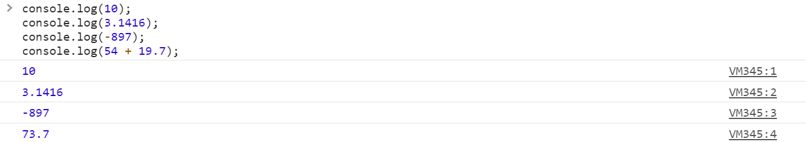
</p>

### String
Una cadena consiste de cualquier secuencia de caracteres que puedes encontrar en tu teclado (letras, números, símbolos, espacios, etcétera). El tipo de dato string es la forma que utiliza Javascript para representar texto.

Para representar una cadena, debemos encerrar el texto entre comillas, ya sea dobles `"..."`  o sencillas `'...'`.

<p align="center">
    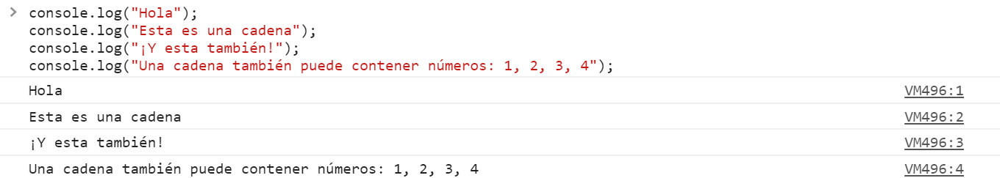
</p>

### Boolean
Este tipo de dato solo acepta dos posibles valores: `true` o `false`. Es sencillo pensar en los valores booleanos como una respuesta a una pregunta de *si* o *no*.

<p align="center">
    
</p>

Como podemos ver, en el primer ejemplo preguntamos si *5 es mayor que 7*, y obtenemos como respuesta `false`. Por otro lado, en el segundo ejemplo, preguntamos si *10 es igual a 10* a lo que obtenemos `true` como respuesta.

### Null
`null` es una palabra reservada del lenguaje, utilizada para referirse a un valor especial que indica la *ausencia de un valor* o de un tipo de dato.

### Undefined
`undefined` es otra palabra reservada del lenguaje, que al igual que `null`, representa la ausencia de un valor, aunque funciona de manera diferente.

`undefined` se utiliza para aquellas variables a las cuales no se les ha asignado un tipo de dato.

# Variables
Una variable funciona como un caja que contiene a un valor. En una variable podemos *asignar* valores como un nombre de usuario, una contraseña, una fecha de nacimiento, o una lista de cosas por hacer, que se almacenan en la memoria de la computadora y que podemos recuperar cuando necesitemos utilizarlos. Estos valores son datos primitivos, objetos y funciones.

Las variables nos permiten, además, etiquetar información de manera descriptiva, de modo que nos facilita su uso y entendimiento en nuestro código.

En pocas palabras, las variables nos permiten etiquetar y almacenar valores en la memoria de la computadora para utilizarlos después.

<p align="center">
    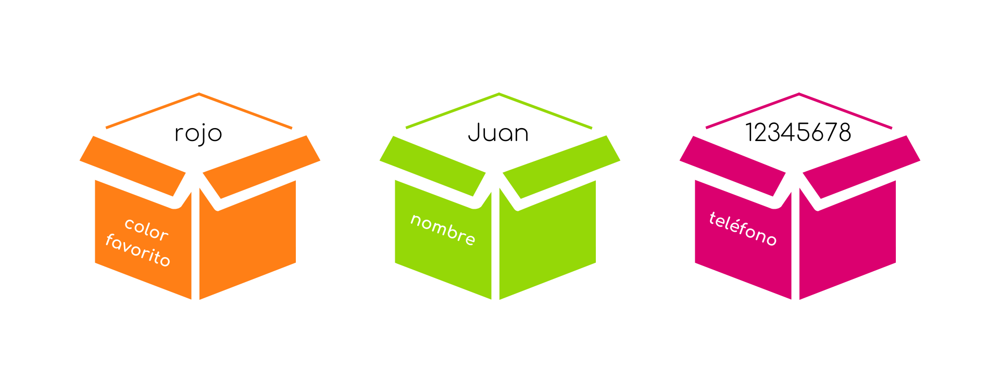
</p>

Existen diferentes formas en que podemos crear o *declarar* estas variables, además de ciertas convenciones que siguen los programadores para hacer el código más entendible.

### var
En 2015, la versión de ES6 de Javascript presentó algunos cambios importantes, uno de ellos siendo la forma en que se declaraban variables. Aunque ahora es cada vez menos común, aún podemos encontrarnos con la palabra reservada `var` para crear una variable.

```javascript
var x = 5;
```

### let
La palabra reservada `let` es una de las adiciones hechas al lenguaje en la versión ES6 y, actualmente, es la forma más utilizada para declarar variables.

```javascript
let nombre = "Juan";
```

* La palabra reservada `let` indica que estamos creando una nueva variable.

* `nombre` es el identificador (o nombre) de la variable.

* `=` es el *operador de asignación* que se encargar de asignarle un valor a nuestra variable.

* `"Juan"` es el valor que le estamos asignando a la variable en cuanto la creamos. Podemos decir entonces que la varible `nombre` se *inicializa* con el valor de `"Juan"`.

Ahora, en lugar de hacer algo como esto, que habíamos visto en un ejemplo anterior:
<p align="center">
    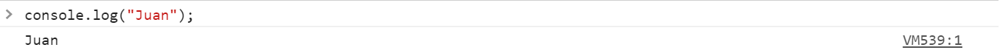
</p>

Podemos hacer algo así:
<p align="center">
    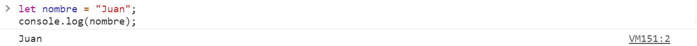
</p>

Ahora, al método `console.log()` no le estamos indicando directamente que valor imprimir, si no que le estamos diciendo que imprima el valor almacenado en la variable `nombre`.

Además de asignar un valor a una variable, podemos actualizar el valor de una variable existente.

Continuando con el ejemplo anterior, hemos inicializado la variable `nombre` con el valor `"Juan"`, pero podemos cambiar su valor para que ahora, `nombre` contenga el valor `"Pedro"`. Para hacer esto no es necesario volver a utilizar la palabra reservada `let`, basta con indicar que valor le será asignado a la variable, utilizando el operador de asignación, `=`.

```javascript
nombre = "Pedro";
```

Entonces, ahora, al imprimir el valor de `nombre` obtendríamos el siguiente resultado:
<p align="center">
    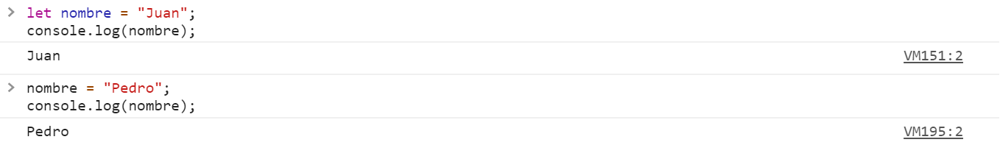
</p>

Javascript es un lenguaje de programación **débilmente tipado**, lo que significa que, al declarar una variable, no es necesario especificar el tipo del valor que le asignaremos. Como resultado, podemos actualizar el valor de una variable por cualquier tipo de dato, sin importar el valor con el que fue inicializada.

Continuando con el ejemplo de arriba, entonces podemos, por ejemplo, asignar a `nombre` un número.
<p align="center">
    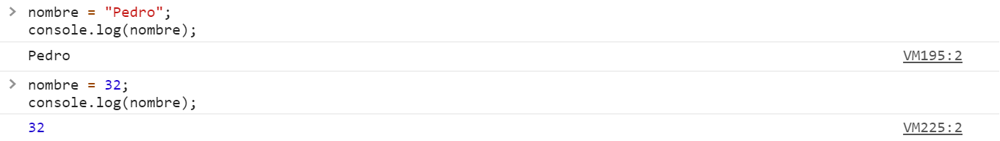
</p>

<br>
Es importante tener en cuenta que no es necesario asignar un valor a la variable para declararla. En tal caso, la variable sería inicializada con el valor de `undefined`.
<p align="center">
    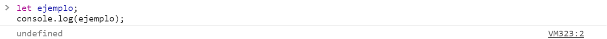
</p>

<br>

Para nombrar a los identificadores (nombre de variables y funciones), utilizamos algo que se conoce como **camel case**. Esta es una convención seguida por los programadores, después de todo no es obligatorio hacerlo para que el código funcione, pero se considera una buena práctica de programación que facilita la lectura y legibilidad de nuestro código. Para esto, el nombre de un identificador debe comenzar *con letra minúscula* y, si está compuesto por más de una palabra, *las siguientes palabras se escribirán comenzando con letra mayúscula*, sin dejar ningún espacio.

```javascript
let comidaFavorita = "pizza";
let numeroDeMascotas = 3;
```

Hay ciertos puntos que es importante recordar para nombrar una variable:
* El nombre de un identificador puede contener tanto letras como digitos, guiones y símbolos de dolar.
* Aunque, como ya mencionamos, su nombre debe comenzar con una letra.
* Javascript es sensible a mayúsculas y minúsculas, por lo que la variable `nombre` y la variable `Nombre` no serían la misma.
* Las palabras reservadas no pueden ser utilizadas para nombrar variables.

### const
La variables asignadas con la palabra reservada `const` se comportan igual que aquellas creadas con el `let`, excepto por que **no pueden ser reasignadas**.

```javascript
const pi = 3.1416;
```
<p align="center">
    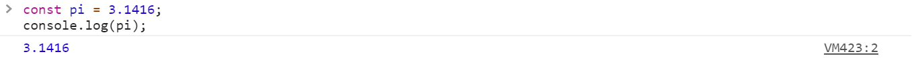
</p>
<p align="center">
    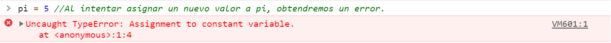
</p>

#### Ejemplo
Ahora que hemos aprendido como almacenar valores en una variable para utilizarlos en nuestro programa veamos un rápido ejemplo.

Al inicio de este curso, vimos como mostrar un mensaje en el navegador utilizando el método `alert()`. Para esto, debiamos indicarle entre los paréntesis que mensaje imprimir, pero, ¿qué pasa si no sabemos lo que dirá este mensaje? Digamos que queremos que el usuario decida que mostrar en el mensaje.

Para esto, podemos utilizar el método `prompt()`. Este método nos permite mostrar un mensaje al usuario (opcionalmente) para solicitarle que ingrese un texto.

```javascript
prompt("Di algo");
```

<p align="center">
    
</p>

Entonces, utilizando el método `prompt()`, podemos solicitarle al usuario que ingrese un texto e imprimir después un mensaje. Para poder hacerlo, necesitamos recordar cual es el texto que ingrese el usuario utilizando una variable.

```javascript
let mensaje = prompt("Di algo"); //Aquí, estamos almacenando en la variable mensaje el texto que recibirá el método prompt.
alert(mensaje); //Y ahora, solo nos resta mostrar el texto que hayamos almacenado en la variable.
```

<p align="center">
    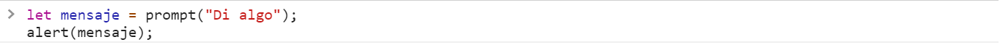
</p>

<p align="center">
    
</p>

<p align="center">
    
</p>

# Operadores
Javascript tiene una amplia gama de operadores que nos permiten manipular valores para utilizarlos en nuestro programa.

Existen 3 tipos principales de operadores:
* Los operadores *unarios* son aquellos que requieren un único operando, por ejemplo `x++`.
* Los operadores *binarios* son aquellos que necesitan de dos operandos, por ejemplo una suma `5 + 10`.
* El operador *terciario* necesita 3 operandos y es un caso especial que revisaremos mas adelante.

### Operadores aritméticos
Toman valores numéricos en sus operandos y dan como resultado un valor también numérico.

Además de los operadores básicos que ya conocemos: `+`, `-`, `*`, `/`, existen algunos otros:

###### Modulo `%`
`x % y`. El operador módulo, nos devuelve el residuo obtenido al dividir `x / y`.

```javascript
let x = 20 % 6; //x = 2.
```

###### Incremento `x++`, `++x`
Incrementa el operando en una unidad. Es similar a asignar `x = x + 1`.

`++x` devuelve el valor de x después de haberle sumado 1. Por otro lado, `x++` devuelve el valor de x antes de sumarle 1 unidad.

Veamos un ejemplo:

<p align="center">
    
</p>

<p align="center">
    
</p>

El operador `++x` incrementa en una unidad el valor de `x` y se lo asigna a la variable antes de pasárselo a `console.log()`, por lo que el método imprime 21 en la consola.

<p align="center">
    
</p>

Y si después volvemos a imprimir el valor de `x`, podemos ver que, en efecto, tiene asignado el valor de 21.

Por otro lado, `x++` le pasa el valor de `x`, en este caso 20, a `consle.log()` antes de incrementarlo.
<p align="center">
    
</p>
<p align="center">
    
</p>

Por lo que, si después, imprimimos el valor de `x`, podemos ver que ahora es x es igual a 21.

<p align="center">
    
</p>

##### Decremento `x--`, `--x`
Funciona de manera idéntica al incremento solo que decrementa en una unidad el valor de x.

##### Exponenciación `**`
La versión ES6 presentó el operador de exponenciación, `x ** y`, que nos devuelve el resultado de elevar `x` a la `y` potencia.

```javascript
let x = 2 ** 5; //x = 32
```

### Operadores de comparación

Los operadores de comparación comparan los valores de dos operandos y devuelven como resultado un dato booleano.

Los operandos pueden ser valores numéricos, cadenas, booleanos u objetos. En el caso de las cadenas, la comparación la realizan basándose en el orden lexicográfico.

##### Igualdad `==`

Devuelve `true` si ambos operandos son iguales, o `false` en caso contrario. Si los operandos son de tipos distintos, javascript intenta convertirlos al tipo apropiado para poder compararlos.

```javascript
25 == 12; //false
"hola" == "hola"; //true
"3" == 3; //true
```

##### Desigualdad `!=`
Al contrario de la igualdad, devuelve `true` si los operandos son distintos o `false` en caso de que sean iguales.

```javascript
5 != 5; //false
"hola" != "adios"; //true
12 != "12"; //false
```
##### Mayor que `>`
Compara si el primer operando es estrictamente mayor que el segundo, de ser así devuelve `true` o `false` en caso contrario

```javascript
12 > 10; //true
-9.2 > 0; //false
3 > 3; //false
```

##### Mayor o igual que `>=`
Compara si el primer operando es mayor o igual que el segundo, de ser así devuelve `true` o `false` en caso contrario

```javascript
3 >= 7; //false
7 >= 7; //true
```

##### Menor que `<`
Compara si el primer operando es estrictamente menor que el segundo, de ser así devuelve `true` o `false` en caso contrario

```javascript
7 < 10; //true
0 < 1.3; //true
3 < 3; //false
```

##### Mayor o igual que `<=`
Compara si el primer operando es menor o igual que el segundo, de ser así devuelve `true` o `false` en caso contrario

```javascript
3 <= 7; //true
1.2 >= 1.2;//true
```

##### Estrictamente iguales `===`
Similar a la igualdad, solo que devuelve `true` si los operandos son iguales y son además del mismo tipo o `false` en otro caso.

```javascript
5 === 5; //true
2 === "2"; //false
```

##### Estrictamente desiguales `!==`
Del mismo modo, devuelve `true` si los operandos no son iguales o son de diferente tipo, y `false` en caso de que sean iguales y además sean del mismo tipo.

```javascript
5 !== "5"; //true
13 !== 2; //true
```

### Operadores lógicos
Convencionalmente funcionan con operandos booleanos y nos devuelve un resultado booleano dependiendo de si se cumple o no una condición.

##### And lógico `&&`
Devuelve `true` si ambos operandos evalúan a `true`, o `false` en otro caso.

```javascript
let x = (5 >= 3) && (12 == 12); //x = true
```
En el ejemplo de arriba, la comparación del primer operando devuelve `true`, al igual que la comparación del segundo operando, por lo que tenemos `true && true`, lo cual nos da `true` como resultado.

```javascript
let y = (2 < 10) && (1 != 1); //x = false
```

##### Or lógico `||`
Devuelve `false` si ambos operandos evalúan a `false` o, `true` en otro caso.

```javascript
let x = (2 === "2") || (1 >= 0); //x = true
```

En el ejemplo de arriba, la comparación del primer operando devuelve `false`, pero el segundo devuelve `true`, con lo que tenemos `false || true`, por lo que tenemos `true` como resultado.

```javascript
let y = (20 > 10) && (3 != 3); //x = false
```

##### Negación `!`
Devuelve el valor contrario al valor de su operando.

```javascript
let x = !true; //x = false
let y = !(5 == 6); //y = true
```

### Operadores de asignación
Un operando de asignación le asigna, al operando de lado izquierdo, el valor obtenido del operando del lado derecho.

##### Asignación `=`
Asigna al operando en el lado izquierdo el valor obtenido del operando del lado derecho.

```javascript
let x = 5; //x = 5
let y = (4 ** 3); //y = 64
```

##### Asignación de adición `+=`
`x += y`. Le asigna a `x` el resultado de sumar `x + y`.

```javascript
let x = 5;
x += 10; //x = 5 + 10 = 15
```

##### Asignación de sustracción `-=`
`x -= y`. Le asigna a `x` el resultado de restar `x - y`.

```javascript
let x = 12;
x -= 8; //x = 12 - 8 = 4
```

##### Asignación de multiplicación `*=`
`x *= y`. Le asigna a `x` el resultado de multiplicar `x * y`.

```javascript
let x = 2;
x *= 7; //x = 2 * 7 = 14
```

##### Asignación de división `/=`
`x /= y`. Le asigna a `x` el resultado de dividir `x / y`.

```javascript
let x = 24;
x /= 8; //x = 24 / 8 = 3
```

##### Asignación de módulo `%=`
`x %= y`. Le asigna a `x` el resultado de obtener el módulo de `x % y`.

```javascript
let x = 35;
x %= 6; //x = 35 % 6 =  5
```

##### Asignación de exponenciación `**=`
`x **= y`. Le asigna a `x` el resultado de elevar `x ** y`.

```javascript
let x = 2;
x **= 8; //x = 2 ** 8 = 256
```

### Concatenación de cadenas `+`
Una operación muy útil y muy importante que podemos realizar con el tipo de dato string es la concatenación. Este operando nos devuelve una nueva cadena compuesta por la unión de las dos cadenas que recibe como operandos.

```javascript
let x = "Hola" + " " + "mundo"; //x = "Hola mundo"
```

Además de concatenar dos cadenas, podemos concatenar una cadena y un número y también obtendremos como resultado una cadena.

```javascript
let y = "Adios" + 4; //y = "Adios4"
```

#### Ejemplo
Continuando con el ejemplo anterior y utilizando además la concatenación de cadenas, ahora podemos mostrar un mensaje personalizado.

Utilizando el método `prompt()` podemos solicitarle al usuario su nombre, y almacenarlo en una variable.

```javascript
let nombre = prompt("¿Cuál es tu nombre?");
```

<p align="center">
    
</p>

Ahora, solo resta utilizar el método `alert()` para mostrar el mensaje.

```javascript
alert("¡Hola, " + nombre + "!"));
```

<p align="center">
    
</p>
