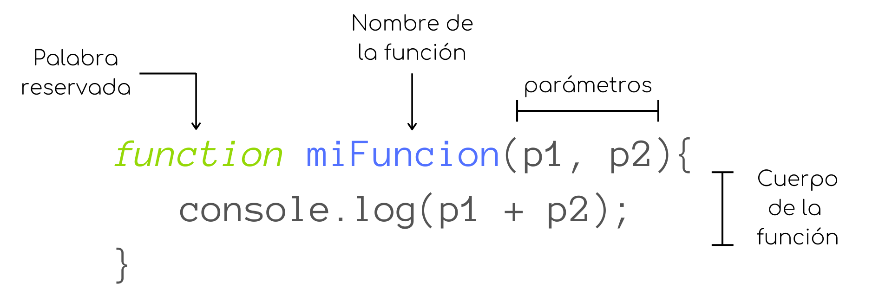
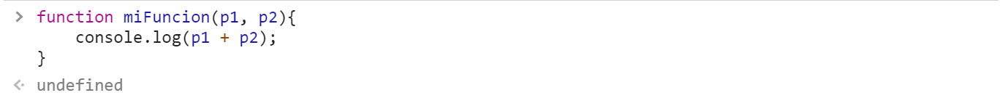
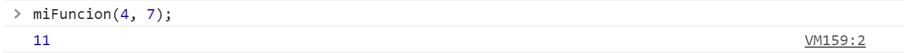
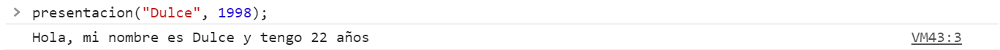
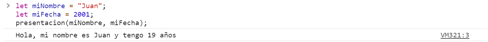
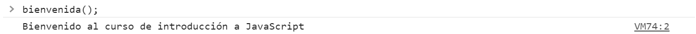

# Funciones

En programación, una función es un bloque de código diseñado para realizar una determinada tarea, con el propósito de escribir dicho bloque de código una sola vez pero utilizarlo múltiples veces. Estas funciones se ejecutan al ser *invocadas* en alguna otra parte el programa.

### Sintaxis
En Javascript una función es definida con la palabra reservada `fuction`, seguida de un identificador (nombre), y paréntesis.

La funciones suelen nombrarse siguiendo la misma convención que las variables (camel case).

Los paréntesis `()` contienen los parámetros que recibirá la función, cada uno separado por una coma. Pueden quedar vacíos si la función no necesita parámetros.

El código que se ejecutará al invocar la función está delimitado por `{}`.

<p align="center">
    
</p>

### Invocación de funciones
Arriba explicamos como definir o crear una función, sin embargo, para poder utilizarla debemos *invocarla*, esto es, llamarla o utilizarla en alguna otra parte del código.

<p align="center">
    
</p>

Aquí, solo hemos creado la función `miFuncion`, por lo que no ocurre nada más, hasta que la llamamos utilizando *argumentos*.

<p align="center">
    
</p>

`miFuncion`, necesita conocer los valores de `p1` y `p2` para poder imprimir en la consola el resultado de su suma, es por esto que, al invocarla, debemos indicarle cuales son estos valores, estos son los *argumentos*.

En este ejemplo, los argumentos de `miFuncion` son `4` y `7`, por lo tanto, al ejecutar `miFuncion`, tendríamos que `p1 = 4` y `p2 = 7`;

### Parámetros y argumentos
Como explicamos brevemente arriba, cuando declaramos una función podemos especificar sus **parámetros**, los cuales funcionan como variables que podemos utilizar y manipular dentro del cuerpo de la función.

Por ejemplo, creemos una función `presentacion` que recibirá como parámetro tu nombre y tu año de nacimiento y que imprimirá en la consola una presentación con tu nombre y tu edad.

```javascript
function presentacion(nombre, fecha){
    let edad = 2020 - fecha;
    console.log("Hola, mi nombre es " + nombre + " y tengo " + edad + " años");
}
```

Entonces, al invocar la función, necesitamos decirle cuales serán los valores de `nombre` y `fecha`, a esto se le conoce como **argumentos**.
<p align="center">
    
</p>

Además de utilizar valores explícitos como argumentos, también podemos utilizar variables.
<p align="center">
    
</p>


<br>

Por otro lado, también pueden existir funciones que no necesiten parámetros.

Definamos una función `bienvenida`.

```javascript
function bienvenida(){
    console.log("Bienvenido al curso de introducción a JavaScript");
}
```

Como podemos ver, está función no necesita parámetros, pues solamente imprime un mensaje en la consola. Entonces, para invocar nuestra función `bienvenida` no necesitamos pasarle ningún argumento.
<p align="center">
    
</p>

### Return

### Function Expressions

### Arrow Functions
