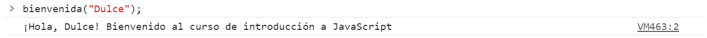
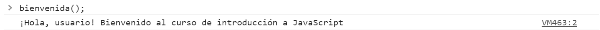
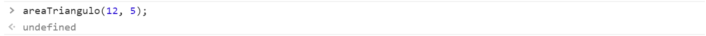
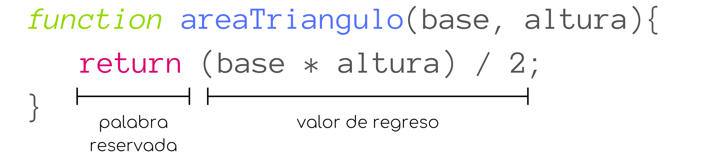
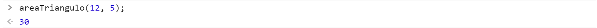

# Funciones

En programación, una función es un bloque de código diseñado para realizar una determinada tarea, con el propósito de escribir dicho bloque de código una sola vez pero utilizarlo múltiples veces. Estas funciones se ejecutan al ser *invocadas* en alguna otra parte el programa.

### Sintaxis
En Javascript una función es definida con la palabra reservada `fuction`, seguida de un identificador (nombre), y paréntesis.

La funciones suelen nombrarse siguiendo la misma convención que las variables (camel case).

Los paréntesis `()` contienen los parámetros que recibirá la función, cada uno separado por una coma. Pueden quedar vacíos si la función no necesita parámetros.

El código que se ejecutará al invocar la función está delimitado por `{}`.

<p align="center">
    
</p>

### Invocación de funciones
Arriba explicamos como definir o crear una función, sin embargo, para poder utilizarla debemos *invocarla*, esto es, llamarla o utilizarla en alguna otra parte del código.

<p align="center">
    
</p>

Aquí, solo hemos creado la función `miFuncion`, por lo que no ocurre nada más, hasta que la llamamos utilizando *argumentos*.

<p align="center">
    
</p>

`miFuncion`, necesita conocer los valores de `p1` y `p2` para poder imprimir en la consola el resultado de su suma, es por esto que, al invocarla, debemos indicarle cuales son estos valores, estos son los *argumentos*.

En este ejemplo, los argumentos de `miFuncion` son `4` y `7`, por lo tanto, al ejecutar `miFuncion`, tendríamos que `p1 = 4` y `p2 = 7`;

### Parámetros y argumentos
Como explicamos brevemente arriba, cuando declaramos una función podemos especificar sus **parámetros**, los cuales funcionan como variables que podemos utilizar y manipular dentro del cuerpo de la función.

Por ejemplo, creemos una función `presentacion` que recibirá como parámetro tu nombre y tu año de nacimiento y que imprimirá en la consola una presentación con tu nombre y tu edad.

```javascript
function presentacion(nombre, fecha){
    let edad = 2020 - fecha;
    console.log("Hola, mi nombre es " + nombre + " y tengo " + edad + " años");
}
```

Entonces, al invocar la función, necesitamos decirle cuales serán los valores de `nombre` y `fecha`, a esto se le conoce como **argumentos**.
<p align="center">
    
</p>

Además de utilizar valores explícitos como argumentos, también podemos utilizar variables.
<p align="center">
    
</p>


<br>

Por otro lado, también pueden existir funciones que no necesiten parámetros.

Definamos una función `bienvenida`.

```javascript
function bienvenida(){
    console.log("Bienvenido al curso de introducción a JavaScript");
}
```

Como podemos ver, está función no necesita parámetros, pues solamente imprime un mensaje en la consola. Entonces, para invocar nuestra función `bienvenida` no necesitamos pasarle ningún argumento.
<p align="center">
    
</p>

##### Parámetros por defecto
Otra de las características añadidas en la versión ES6 de Javascript son los **parámetros por defecto**. Esto, nos permite definir un valor por defecto para los parámetros de nuestra función en caso de que al invocarla esta no reciba un los argumentos correspondientes.

Retomemos nuestra función `bienvenida`. Para hacer el mensaje más amigable, podemos agregar el nombre del usuario. Entonces la función se vería de la siguiente forma:

```javascript
function bienvenida(nombre = "usuario"){
    console.log("¡Hola, " + nombre + "! Bienvenido al curso de introducción a JavaScript");
}
```

En el código de arriba, utilizamos el operador `=` para asignar el valor `"usuario"` al parámetro `nombre`.

Entonces, si invocamos la función utilizando un argumento, obtendríamos el siguiente resultado:
<p align="center">
    
</p>

Pero, si invocamos la función `bienvenida` sin pasarle ningún argumento, tendríamos lo siguiente:
<p align="center">
    
</p>

De esta forma al asignarle al parámetro un valor por defecto tenemos un plan de respaldo en caso de que la función sea invocada sin los argumentos que necesita.

### Return

Cuando invocamos una función el interprete ejecuta el código en el cuerpo en el cuerpo de la función y evalúa su resultado. Por defecto, el resultado será `undefined`

Por ejemplo, definamos la función `areaTriangulo`, que recibe como parámetro la base y la altura de un triángulo y calcula su área.

```javascript
function areaTriangulo(base, altura){
    let perimetro = (base * altura) / 2;
}
```

<p align="center">
    
</p>

Aunque, en efecto, la función asigna a la variable `perimetro` el resultado de calcular el perímetro de un triángulo, al invocar la función obtenemos como resultado `undefined`.

Y entonces, ¿cómo podemos conseguir que la función nos devuelva el resultado? Para esto tenemos la palabra reservada `return`.

<p align="center">
    
</p>

La palabra reservada `return` nos permite devolver información de la ejecución de una función.

Cuando se utiliza la sentencia `return` la ejecución de la función se detiene, por lo que si hay más código después, este no será ejecutado.

```javascript
function areaTriangulo(base, altura){
    let perimetro = (base * altura) / 2;
    return perimetro;
}
```

Volviendo a nuestro ejemplos, ahora podemos agregar la sentencia `return` al final, que devolverá el valor en la variable `perimetro`.

<p align="center">
    
</p>

Y ahora, al invocar nuestra función obtenemos un resultado.


### Function Expressions

### Arrow Functions
