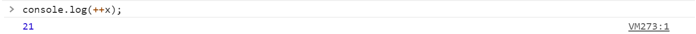
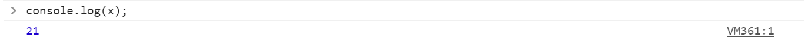
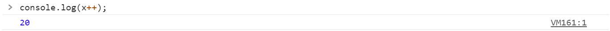
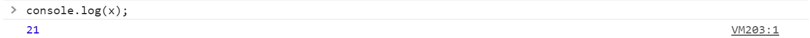

# Operadores
Javascript tiene una amplia gama de operadores que nos permiten manipular valores para utilizarlos en nuestro programa.

Existen 3 tipos principales de operadores:
* Los operadores *unarios* son aquellos que requieren un único operando, por ejemplo `x++`.
* Los operadores *binarios* son aquellos que necesitan de dos operandos, por ejemplo una suma `5 + 10`.
* El operador *ternario* o condicional necesita 3 operandos y es un caso especial que revisaremos mas adelante.

### Operadores aritméticos
Toman valores numéricos en sus operandos y dan como resultado un valor también numérico.

Además de los operadores básicos que ya conocemos: `+`, `-`, `*`, `/`, existen algunos otros:

###### Modulo `%`
`x % y`. El operador módulo, nos devuelve el residuo obtenido al dividir `x / y`.

```javascript
let x = 20 % 6; //x = 2.
```

###### Incremento `x++`, `++x`
Incrementa el operando en una unidad. Es similar a asignar `x = x + 1`.

`++x` devuelve el valor de x después de haberle sumado 1. Por otro lado, `x++` devuelve el valor de x antes de sumarle 1 unidad.

Veamos un ejemplo:

<p align="center">
    
</p>

<p align="center">
    
</p>

El operador `++x` incrementa en una unidad el valor de `x` y se lo asigna a la variable antes de pasárselo a `console.log()`, por lo que el método imprime 21 en la consola.

<p align="center">
    
</p>

Y si después volvemos a imprimir el valor de `x`, podemos ver que, en efecto, tiene asignado el valor de 21.

Por otro lado, `x++` le pasa el valor de `x`, en este caso 20, a `consle.log()` antes de incrementarlo.
<p align="center">
    
</p>
<p align="center">
    
</p>

Por lo que, si después, imprimimos el valor de `x`, podemos ver que ahora es x es igual a 21.

<p align="center">
    
</p>

##### Decremento `x--`, `--x`
Funciona de manera idéntica al incremento solo que decrementa en una unidad el valor de x.

##### Exponenciación `**`
La versión ES6 presentó el operador de exponenciación, `x ** y`, que nos devuelve el resultado de elevar `x` a la `y` potencia.

```javascript
let x = 2 ** 5; //x = 32
```

### Operadores de asignación
Un operando de asignación le asigna, al operando de lado izquierdo, el valor obtenido del operando del lado derecho.

##### Asignación `=`
Asigna al operando en el lado izquierdo el valor obtenido del operando del lado derecho.

```javascript
let x = 5; //x = 5
let y = (4 ** 3); //y = 64
```

##### Asignación de adición `+=`
`x += y`. Le asigna a `x` el resultado de sumar `x + y`.

```javascript
let x = 5;
x += 10; //x = 5 + 10 = 15
```

##### Asignación de sustracción `-=`
`x -= y`. Le asigna a `x` el resultado de restar `x - y`.

```javascript
let x = 12;
x -= 8; //x = 12 - 8 = 4
```

##### Asignación de multiplicación `*=`
`x *= y`. Le asigna a `x` el resultado de multiplicar `x * y`.

```javascript
let x = 2;
x *= 7; //x = 2 * 7 = 14
```

##### Asignación de división `/=`
`x /= y`. Le asigna a `x` el resultado de dividir `x / y`.

```javascript
let x = 24;
x /= 8; //x = 24 / 8 = 3
```

##### Asignación de módulo `%=`
`x %= y`. Le asigna a `x` el resultado de obtener el módulo de `x % y`.

```javascript
let x = 35;
x %= 6; //x = 35 % 6 =  5
```

##### Asignación de exponenciación `**=`
`x **= y`. Le asigna a `x` el resultado de elevar `x ** y`.

```javascript
let x = 2;
x **= 8; //x = 2 ** 8 = 256
```

### Operadores de comparación

Los operadores de comparación comparan los valores de dos operandos y devuelven como resultado un dato booleano.

Los operandos pueden ser valores numéricos, cadenas, booleanos u objetos. En el caso de las cadenas, la comparación la realizan basándose en el orden lexicográfico.

##### Igualdad `==`

Devuelve `true` si ambos operandos son iguales, o `false` en caso contrario. Si los operandos son de tipos distintos, javascript intenta convertirlos al tipo apropiado para poder compararlos.

```javascript
25 == 12; //false
"hola" == "hola"; //true
"3" == 3; //true
```

##### Desigualdad `!=`
Al contrario de la igualdad, devuelve `true` si los operandos son distintos o `false` en caso de que sean iguales.

```javascript
5 != 5; //false
"hola" != "adios"; //true
12 != "12"; //false
```
##### Mayor que `>`
Compara si el primer operando es estrictamente mayor que el segundo, de ser así devuelve `true` o `false` en caso contrario

```javascript
12 > 10; //true
-9.2 > 0; //false
3 > 3; //false
```

##### Mayor o igual que `>=`
Compara si el primer operando es mayor o igual que el segundo, de ser así devuelve `true` o `false` en caso contrario

```javascript
3 >= 7; //false
7 >= 7; //true
```

##### Menor que `<`
Compara si el primer operando es estrictamente menor que el segundo, de ser así devuelve `true` o `false` en caso contrario

```javascript
7 < 10; //true
0 < 1.3; //true
3 < 3; //false
```

##### Mayor o igual que `<=`
Compara si el primer operando es menor o igual que el segundo, de ser así devuelve `true` o `false` en caso contrario

```javascript
3 <= 7; //true
1.2 >= 1.2;//true
```

##### Estrictamente iguales `===`
Similar a la igualdad, solo que devuelve `true` si los operandos son iguales y son además del mismo tipo o `false` en otro caso.

```javascript
5 === 5; //true
2 === "2"; //false
```

##### Estrictamente desiguales `!==`
Del mismo modo, devuelve `true` si los operandos no son iguales o son de diferente tipo, y `false` en caso de que sean iguales y además sean del mismo tipo.

```javascript
5 !== "5"; //true
13 !== 2; //true
```

### Operadores lógicos
Convencionalmente funcionan con operandos booleanos y nos devuelve un resultado booleano dependiendo de si se cumple o no una condición.

##### And lógico `&&`
Devuelve `true` si ambos operandos evalúan a `true`, o `false` en otro caso.

```javascript
let x = (5 >= 3) && (12 == 12); //x = true
```
En el ejemplo de arriba, la comparación del primer operando devuelve `true`, al igual que la comparación del segundo operando, por lo que tenemos `true && true`, lo cual nos da `true` como resultado.

```javascript
let y = (2 < 10) && (1 != 1); //x = false
```

##### Or lógico `||`
Devuelve `false` si ambos operandos evalúan a `false` o, `true` en otro caso.

```javascript
let x = (2 === "2") || (1 >= 0); //x = true
```

En el ejemplo de arriba, la comparación del primer operando devuelve `false`, pero el segundo devuelve `true`, con lo que tenemos `false || true`, por lo que tenemos `true` como resultado.

```javascript
let y = (20 > 10) && (3 != 3); //x = false
```

##### Negación `!`
Devuelve el valor contrario al valor de su operando.

```javascript
let x = !true; //x = false
let y = !(5 == 6); //y = true
```

### Concatenación de cadenas `+`
Una operación muy útil y muy importante que podemos realizar con el tipo de dato string es la concatenación. Este operando nos devuelve una nueva cadena compuesta por la unión de las dos cadenas que recibe como operandos.

```javascript
let x = "Hola" + " " + "mundo"; //x = "Hola mundo"
```

Además de concatenar dos cadenas, podemos concatenar una cadena y un número y también obtendremos como resultado una cadena.

```javascript
let y = "Adios" + 3; //y = "Adios3"
```

### Plantillas de cadena de texto `${}`

Otra característica incluida con la versión ES6 de Javascript son las plantillas de cadena de texto.

Mientras que la concatenación de cadenas nos permite unir una o más cadenas o una cadena con un valor, las plantillas de cadena de texto nos permiten incrustar expresiones.

Las plantillas de cadena de texto se delimitan por comillas invertidas ` `` `. Estas plantillas pueden contener expresiones con la sintaxis `${expresión}` de modo que se toma el valor de la expresión y se concatena para formar una sola cadena.

Veamos un ejemplo:

```javascript
let color = "azul";
let num = 3;
let string = `Mi color favorito es el ${color} y tengo ${num} mascotas`; //string = "Mi color favorito es el azul y tengo 3 mascotas"
```

#### Ejemplo
Continuando con el ejemplo del tema anterior y utilizando además la concatenación de cadenas, ahora podemos mostrar un mensaje personalizado.

Utilizando el método `prompt()` podemos solicitarle al usuario su nombre, y almacenarlo en una variable.

```javascript
let nombre = prompt("¿Cuál es tu nombre?");
```

<p align="center">
    
</p>

Ahora, solo resta utilizar el método `alert()` para mostrar el mensaje.

```javascript
alert("¡Hola, " + nombre + "!"));
```

<p align="center">
    
</p>
