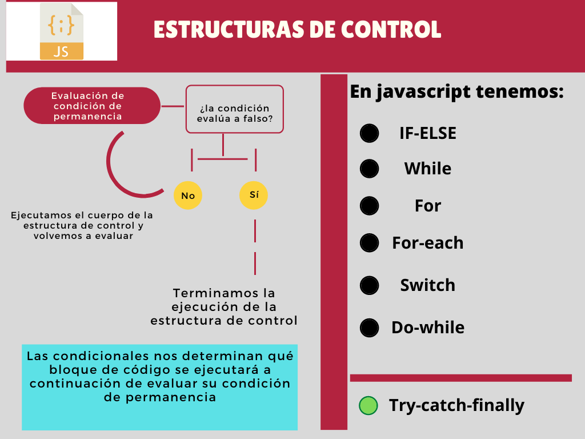
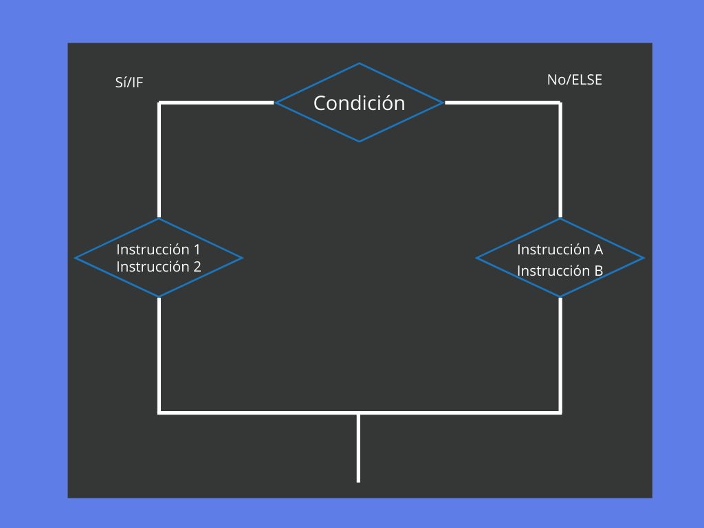
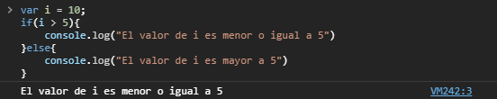
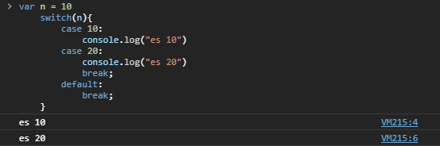

#  Condicionales y estructuras de control


<p align="center">
    
</p>


Como en cualquier lenguaje, las estructuras de control nos dan control sobre el flujo de ejecución de nuestro programas. Igual que muchos lenguajes, Javascript cuenta con algunas estructuras de control que funcionan casi igual en principio a las de otros lenguajes.  

## If-else if-else

Quizá sea la estructura de control más elemental y su estructura es la siguiente:  

```Javascript
    if (condicion-uno) {
      //  código si evalúa a verdadero
    } else if (condicion-dos) {
      //  código si evalúa a verdadero si al condición uno es falsa
    } else {
      //  código si las dos primeras condiciones son falsas
    }
```  
Las llaves y paréntesis forman una parte importante de la estructura, mientras que en el paréntesis tenemos la o las condiciones a evaluar, las llaves delimitan el bloque de código correspondiente a la condición.  


Una estructura if-else nos permite dividir el código (comportamiento) de cierta parte del programa dependiendo el cumplimiento de ciertas condiciones.  

<p align="center">
    
</p>

Podemos ver un ejemplo a continuación:  

<p align="center">
    
</p>

Hagamos un ejercicio pequeño y común con la estructura **If-else** donde podamos aplicar conceptos aprendidos previamente de paso, veamoslo siguiente:  

"**Diseñar un script que permita saber si un año es bisiesto. Un año sea bisiesto debe ser divisible por 4 y no debe ser divisible por 100, excepto que también sea divisible por 400.**"

```javascript
    var year = window.prompt("Escribe un año");
    if(year%4 == 0){
        if((year%100 != 0) || (year%400 == 0)){
            console.log("Bisiesto");
        }else{
            console.log("No bisiesto");
        }
    }else{
        console.log("No es bisiesto");
    }
```  
## Switch

La estructura switch surge de un concepto conocido como **caza de patrones**, la idea es que dada una "expresión" de algún tipo se evalue y se ejecute el código correspondiente a ese **caso**. Algunos lenguajes como python no implementan ésta estructura pero es facil implementarlo usando la estructura **if-else if-else**.

La estructura del switch es la siguiente:  
```Javascript
    switch(expresion){    
        case x:
        // bloque de código
            break;
        case y:
        // bloque de código
            break;
        default:
            break;
    }
``` 

Los pasos que se ejecutan en una **estructura switch** son:  
    1. La expresión del switch es evaluada.  
    2. Se compara el valor resultante con cada uno de los casos (case).  
    3. Si existe coincidencia, se ejecuta el bloque de código correspondiente al case.  
    4. En otro caso, si no hay coincidencia, se ejecuta el case por defecto **default**.  
                                                                                          
### Continue y brake

**Brake** es una palabra reservada del lenguaje que nos permite terminar de forma instantánea la ejecución de determinado bloque de código, la importancia de tener un brake en el caso de un switch es que en el caso de no ponerlo, la ejecución del código se seguirá hasta terminar todos los case o encontrar el primer brake en la estructura de control.

```javascript
    var n = 10
    switch(n){
        case 10:
            console.log("es 10")
        case 20:
            console.log("es 20")
            break;
        default:
            break;
    }
``` 

<p align="center">
    
</p>

