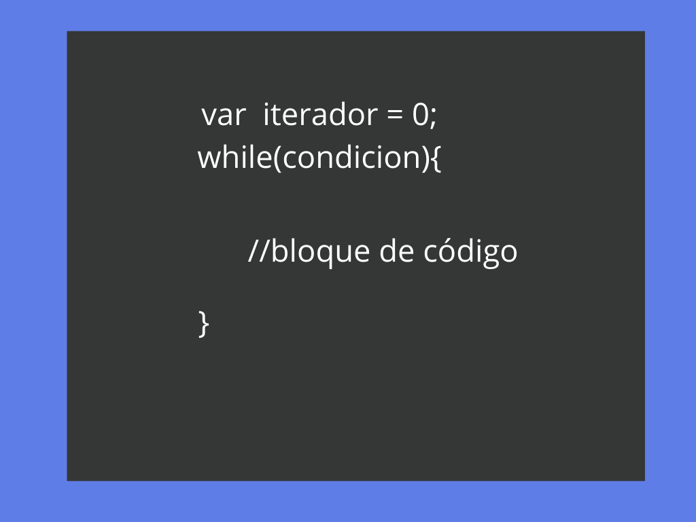
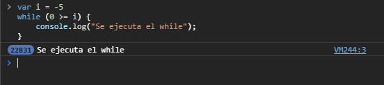
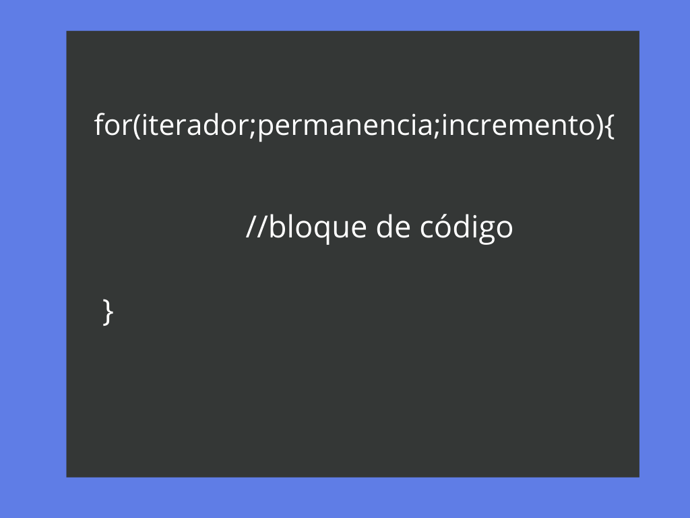
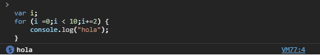

#  Estructuras de control

En Javascript, tenemos varias estructuras de control que nos modificar el flujo de ejecución de nuestro código dependiendo de si se cumple o no cierta condición.

### Condicionales

Muchas veces, debemos tomar la decisión de si ejecutaremos o una acción determinada en nuestro programa, es decir, dada cierta condición podemos determinar si se ejecutará un bloque de código y otro.

Para esto existen los `Condicionales`.

#### If-else

La estructura de control `if else`, es posiblemente la más utilizada en cualquier lenguaje de programación pues nos permite ejecutar un determinado bloque de código dependiendo de si una condición es verdadera o falsa.

<p align="center">
    
</p>


La estructura if-else nos permite dividir el código (comportamiento) de cierta parte del programa dependiendo de el cumplimiento de cierta condición.  


Podemos ver un ejemplo a continuación:  

```javascript
let i = 10;
if(i > 5){
    console.log(`El valor se i es mayor a 5`);
}
else{
    console.log(`El valor se i es menor a 5`);
}
```

Podemos ver que, en efecto, la condición entre paréntesis se evalúa a `true`, por lo que se ejecuta el código dentro del primer bloque de código.

La sentencia `else` le indica al código que, *de no cumplirse la condición, se ejecutará el siguiente bloque de código*. Podemos ver que solamente puede ejecutarse uno de los bloques a la vez pues el valor de la condición solamente puede ser o `true` o `false`, por lo que ambos bloques de código nunca se ejecutaran al mismo tiempo.

No siempre es necesario que se ejecute una acción cuando la condición no se cumple, por lo que también es posible utilizar la sentencia `if` por si sola.

```javascript
let i = 2;
if(i % 2 == 0)
    console.log(`${i} es número par`);
```

Si la condición del `if` no se cumple simplemente no pasada nada.

Como podrás notar en el ejemplo de arriba no hemos colocado llaves para delimitar el bloque de código que se ejecuta cuando la condición es cierta. Esto no es obligatorio y solamente es posible si el bloque de código esta compuesto por una línea, de lo contrario, el bloque debe estar delimitado por llaves.

Veamos un pequeño ejercicio donde utilizamos la estructura `If-else`.

Vamos a diseñar un script que nos permita saber si un año es bisiesto. Un año bisiesto debe ser divisible por 4 y no debe ser divisible por 100, excepto que también sea divisible por 400.

```javascript
    let year = prompt("Escribe un año");
    if(year % 4 == 0){
        if((year%100 != 0) || (year%400 == 0)){
            console.log("Bisiesto");
        }else{
            console.log("No bisiesto");
        }
    }else{
        console.log("No es bisiesto");
    }
```  

En este caso, tenemos anidadas dos estructuras `if else`: si la condición del primer `if` se cumple ejecutamos una segunda estructura de control.

## Switch

La estructura switch surge de un concepto conocido como **caza de patrones**, la idea es que dada una "expresión" de algún tipo se evalue y se ejecute el código correspondiente a ese **caso**. Algunos lenguajes como python no implementan ésta estructura pero es facil implementarlo usando la estructura **if-else if-else**.

La estructura del switch es la siguiente:  
```Javascript
    switch(expresion){    
        case x:
        // bloque de código
            break;
        case y:
        // bloque de código
            break;
        default:
            break;
    }
```

Los pasos que se ejecutan en una **estructura switch** son:  
    1. La expresión del switch es evaluada.  
    2. Se compara el valor resultante con cada uno de los casos (case).  
    3. Si existe coincidencia, se ejecuta el bloque de código correspondiente al case.  
    4. En otro caso, si no hay coincidencia, se ejecuta el case por defecto **default**.  

### Continue y brake

**Brake** es una palabra reservada del lenguaje que nos permite terminar de forma instantánea la ejecución de determinado bloque de código, la importancia de tener un brake en el caso de un switch es que en el caso de no ponerlo, la ejecución del código se seguirá hasta terminar todos los case o encontrar el primer brake en la estructura de control.

```javascript
    var n = 10
    switch(n){
        case 10:
            console.log("es 10")
        case 20:
            console.log("es 20")
            break;
        default:
            break;
    }
```

<p align="center">
    
</p>

Como podemos ver en el caso de no tener el break en el case 10, ésto hace que se ejecuten los códigos de los dos case 10 y 20 respectivamente.

**Continue** es usada en los ciclos o estructuras con el fin de terminar la iteración actual  y continuar con la siguiente.

## While

Nos brinda la opción de crear ciclos y ejecutar el ciclo interno siempre y cuando la condición de permanencia sea evaluada a verdadera. La estructura es la siguiente:  

<p align="center">
    
</p>

Un ciclo while en general, se caracteriza por el manejo manual de los **iteradores**, es decir el programador se encarga de la actualización del código. Si lo pensamos un while nos es útil para ejecutar un mismo comportamiento un determinado número de veces.

Hagamos un ejemplo con un ciclo while:  
**Leamos una cadena de entrada desde una ventana e invertimos la cadena imprimiendo el resultado en pantalla**

```javascript
function reversa(cadena) {
  var i = cadena.length;
  var cadenaInversa = "";

  while (i>=0) {
    cadenaInversa += cadena.charAt(x);
    i--;
  }
  console.log(cadenaInversa);
}
var cad = window.prompt("Escribe la cadena a invertir");
reversa(cad)
```  

Los pasos a seguir son:  

    1. Creamos una función llamada reversa que recibe la cadena como parámetro.   
    2. Definimos nuestro iterador i inicializado en el tamaño de la cadena de entrada.     
    3. Definimos una cadena auxiliar cadenaInvertida inicializada en la cadena vacía.  
    4. Creamos un ciclo while donde la condición de permanencia nos garantice que se ejecuta si y solamente si el iterador es mayor o igual a 0.  
    5. A nuestra cadena auxiliar le iremos copiando el caraceter en la i-ésima posición de la cadena original, recordemos que la cadenas las podemos recorrer o iterar tal y como
    iteramos nuestros arreglos y listas.  
    6. Recordemos que en cada iteración debemos decrementar el iterador, ésto nos garantiza que no caiga en lo que se conoce como un loop infinito.  
    7. Una vez terminado el ciclo while podemos garantizar que en cadenaInvertida tenemos la cadena recibida como parámetro de forma invertida.
    8. Imprimimos el resultado.  

Hablemos un poco de los **loops** infinitos o ciclos infinitos.  
Los **ciclos infinitos** son un error de programación en el que el ciclo nunca llega a la negación de la condición de permanencia, por lo que el ciclo siempre se ejecutará durante la ejecución del programa. Un **loop** infinito se puede ver tan fácil como el siguiente ejemplo:  


```javascript
var i = -5
while (0 >= i) {
    console.log("Se ejecuta el while");
}
```

<p align="center">
    
</p>

Como podemos ver el simple hecho de no incrementar el valor de la variable **i** o no incrementarla de forma adecuada en cada iteración hace que caiga en **loop infinito**
y nunca terminará o en otro caso dependiendo lo que estemos haciendo terminará dependiendo la memoria virtual llegando a un error conocido como desbordamiendo de memoria.  


## For

For es uan estructura muy interesante, en comportamiendo y funcionamiento es similar al while pero tiene una estructura diferente:  

<p align="center">
    
</p>

**Hablemos de las 3 partes que componen al for**.

### Iterador

Al igual que el while, el iterador es una variable que nos servirá para ejecutar el ciclo for un determinado número de veces. Un ejemplo de inicialización se puede ver de la siguiente forma:  

```javascript
var i;
for (i =0;permanencia;incremento) {
    // cuerpo del for
}
```  
La diferencia entre el for y while es muy notoria en el manejo del iterador.  

### Permanencia del ciclo

La permanencia del ciclo es aquella condición donde se determina si el ciclo se ejecuta o termina. Aquí en general es una evaluación a verdadero o falso, en caso de que no se cumpla la condición de permanencia el ciclo terminará.  

Lo podemos ver en el siguiente ejemplo:  
```javascript
var i;
for (i =0;i < 10;incremento) {
    // cuerpo del for
}
```  

El cuerpo del for se ejecutará n veces dependiendo el incremento del iterador.  

### Incremento del iterador

El incremento del iterador es donde indicamos en cuánto actualiza su valor el iterador puede ser ascendente o descendente.  

```javascript
var i;
for (i =0;i < 10;i+=2) {
    console.log("hola");
}
```  

Notemos que el ciclo se ejecutará 5 veces, cuando el valor del iterador sea **0,2,4,6,8**

<p align="center">
    
</p>

## For Each  

La estructura de control  **ForEach** es un caso particular del ciclo for, ya que nos permite iterar sobre las propiedades de los objetos iterables. Es una forma breve de hacer in ciclo y su estructura es la siguiente:  

<p align="center">
    
</p>

Hagamos un pequeño ejercicio con la estructura for-each.

Vamos a quitar los múltiplos de 5 de una lista de enteros positivos sin repeticiones.

```javascript
numeros = [1,2,3,4,5,6,7,8,9,10,11,12,13,14,15]
for (num in numeros) {
    if(num % 5 == 0){
      var indice = numeros.indexOf(num);
      numeros.splice(1, indice);
    }
}
console.log(numeros)
```  
