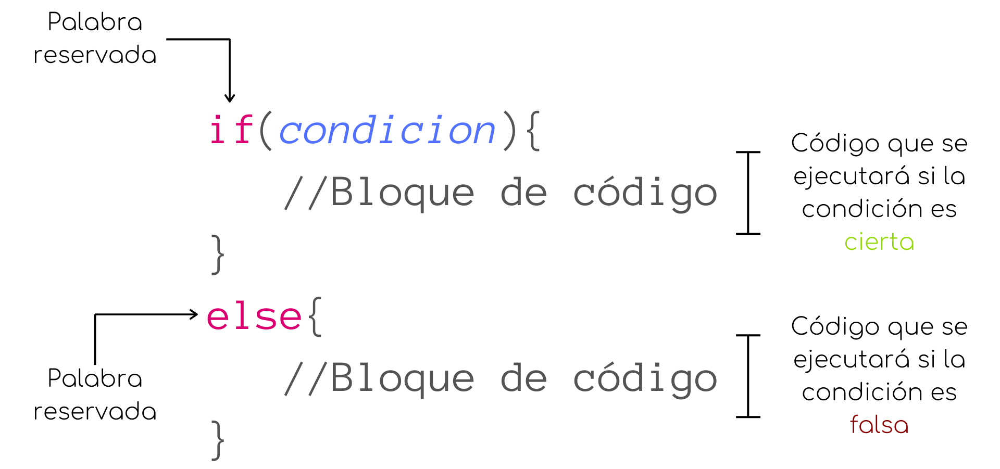
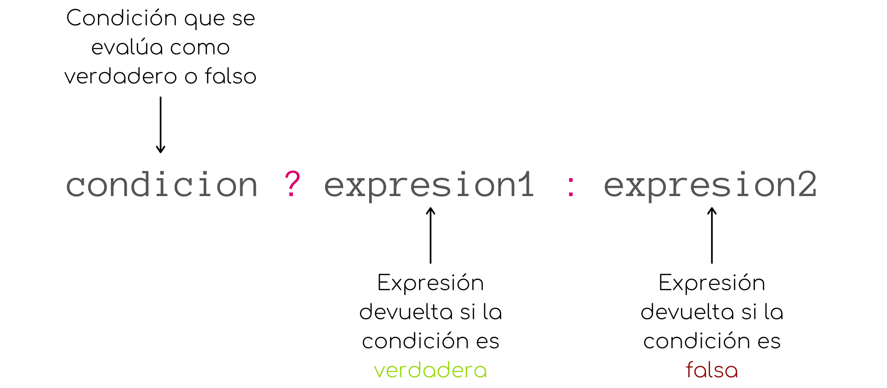
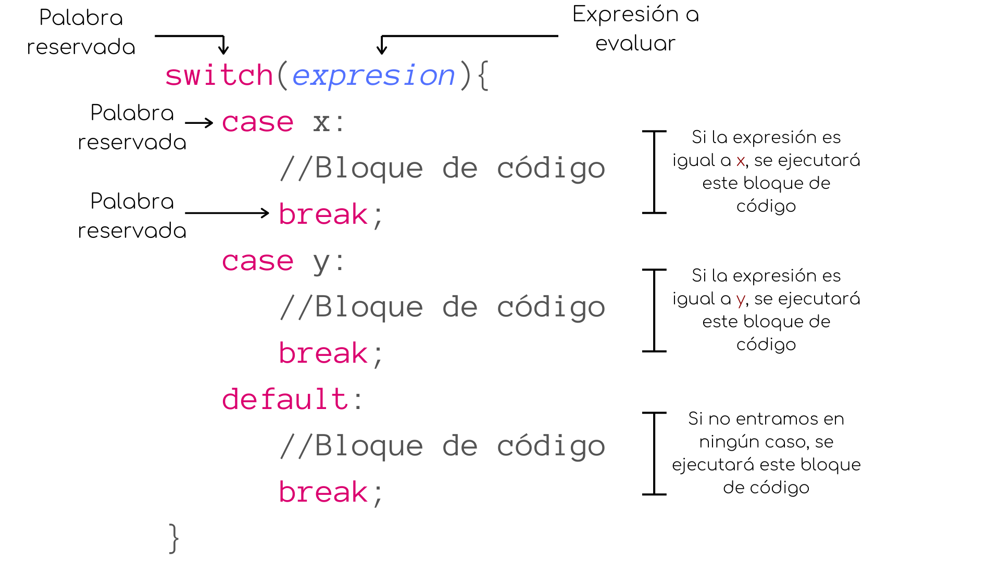
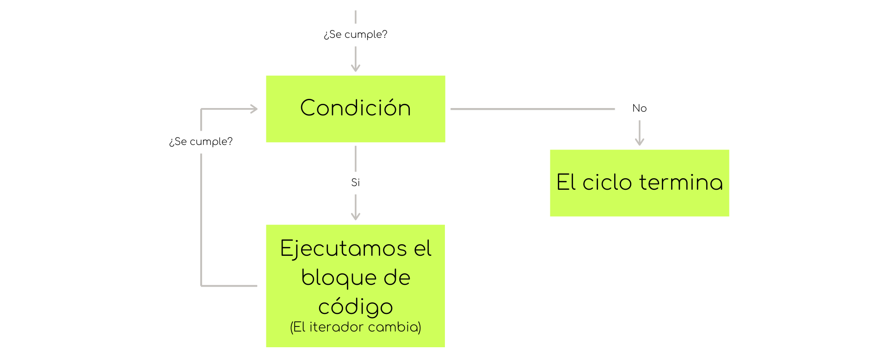
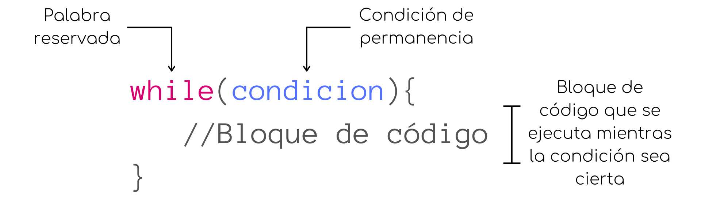
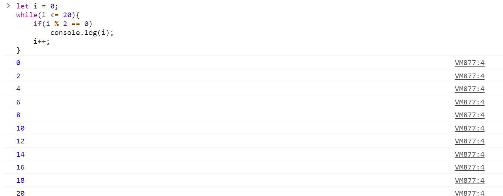
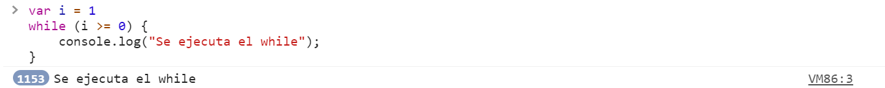
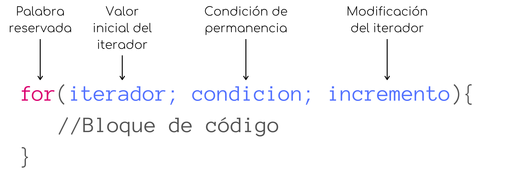

#  Estructuras de control

En Javascript, tenemos varias estructuras de control que nos modificar el flujo de ejecución de nuestro código dependiendo de si se cumple o no cierta condición.

Podemos dividir estas estructuras de control en dos grandes grupos: condicionales y ciclos.

### If-else

Muchas veces, debemos tomar la decisión de si ejecutaremos o una acción determinada en nuestro programa, es decir, dada cierta condición podemos determinar si se ejecutará un bloque de código y otro.

Para esto existen los `Condicionales`.

La estructura de control `if else`, es posiblemente la más utilizada en cualquier lenguaje de programación pues nos permite ejecutar un determinado bloque de código dependiendo de si una condición es verdadera o falsa.

<p align="center">
    
</p>


La estructura if-else nos permite dividir el código (comportamiento) de cierta parte del programa dependiendo de el cumplimiento de cierta condición.  


Podemos ver un ejemplo a continuación:  

```javascript
let i = 10;
if(i > 5){
    console.log(`El valor se i es mayor a 5`);
}
else{
    console.log(`El valor se i es menor a 5`);
}
```

Podemos ver que, en efecto, la condición entre paréntesis se evalúa a `true`, por lo que se ejecuta el código dentro del primer bloque de código.

La sentencia `else` le indica al código que, *de no cumplirse la condición, se ejecutará el siguiente bloque de código*. Podemos ver que solamente puede ejecutarse uno de los bloques a la vez pues el valor de la condición solamente puede ser o `true` o `false`, por lo que ambos bloques de código nunca se ejecutaran al mismo tiempo.

No siempre es necesario que se ejecute una acción cuando la condición no se cumple, por lo que también es posible utilizar la sentencia `if` por si sola.

```javascript
let i = 2;
if(i % 2 == 0)
    console.log(`${i} es número par`);
```

Si la condición del `if` no se cumple simplemente no pasada nada.

Como podrás notar en el ejemplo de arriba no hemos colocado llaves para delimitar el bloque de código que se ejecuta cuando la condición es cierta. Esto no es obligatorio y solamente es posible si el bloque de código esta compuesto por una línea, de lo contrario, el bloque debe estar delimitado por llaves.

Veamos un pequeño ejercicio donde utilizamos la estructura `If-else`.

Vamos a diseñar un script que nos permita saber si un año es bisiesto. Un año bisiesto debe ser divisible por 4 y no debe ser divisible por 100, excepto que también sea divisible por 400.

```javascript
    let year = prompt("Escribe un año");
    if(year % 4 == 0){
        if((year%100 != 0) || (year%400 == 0)){
            console.log("Bisiesto");
        }else{
            console.log("No bisiesto");
        }
    }else{
        console.log("No es bisiesto");
    }
```  

En este caso, tenemos anidadas dos estructuras `if else`; si la condición del primer `if` se cumple ejecutamos una segunda estructura de control.

En algunas ocaciones, puede ocurrir que necesitemos checar más de una condición y que, con utilizar un  `else` no sea suficiente. Para esto, podemos utilizar la sentencia `else if` que nos permite checar una condición si es que la condición en el `if` inicial no se cumplió:

```javascript
if(i > 5){
    //Bloque de código
}
else if(i % 2 == 0){
    //Bloque de código
}
else{
    //Bloque de código
}
```

En este caso, si `i` no es mayor a 5, entonces checaremos si `i` es par; si tampoco se cumple esta condición, se ejecutara el último bloque de código.

### Operador condicional
En el capítulo anterior mencionamos al operador ternario o condicional, un operador que utiliza 3 operandos y en algunas ocasiones puede utilizarse como una abreviación de la estructura `if else`.

<p align="center">
    
</p>

```javascript
let i = (15 % 3 == 0) ? "Si es múltiplo" : "No es múltiplo"; //i = "Si es múltiplo"
```

En este ejemplo tenemos que, si 15 es múltiplo de 3, el valor de i será igual a la primera expresión, de lo contrario sería igual a la segunda expresión.

### Switch

La estructura switch surge de un concepto conocido como **caza de patrones**: la idea es que dada una `expresión` esta se evalúe y se ejecute el código correspondiente a ese **caso**. Si no encontramos un caso que *coincida* con la expresión, se ejecutará el bloque de código definido es `default`, aunque no es obligatorio definir este caso.

<p align="center">
    
</p>

Los pasos que se ejecutan en una **estructura switch** son:  
    1. La expresión del switch es evaluada.  
    2. Se compara el valor resultante con cada uno de los casos (`case`).  
    3. Si existe una coincidencia, se ejecuta el bloque de código correspondiente al `case` y la ejecución de la estructura termina al llegar al `break`.  
    4. En otro caso, si no hay coincidencias, se ejecuta el caso por defecto (`default`).  

`brake` es una palabra reservada del lenguaje que nos permite terminar de forma instantánea la ejecución de un bloque de código.

En el caso de la estructura `switch` es esencial colocar un `break` al final de cada caso (incluyendo el `default`), pues de lo contrario, se ejecutarían también los casos siguientes.

```javascript
    let n = 10
    switch(n){
        case 10:
            console.log("Es 10")
        case 20:
            console.log("Es 20")
            break;
        default:
            console.log("No se cumplió ningún caso");
            break;
    }
```

<p align="center">
    
</p>

Como podemos ver, al no tener el `break` en el `case : 10`, se ejecuta el código tanto de ese caso , como del caso siguiente.


### While

Ahora que hemos visto los condicionales pasemos a los ciclos.

Un ciclo es una estructura de control que nos permite ejecutar un mismo bloque de código varias veces hasta que cierta condición no sea cierta (conocida como **condición de permanencia**).

El termino *iteración* es un termino altamente asociado a los ciclos, pues suele referirse a cada ejecución del bloque de código indicada por el ciclo; es decir, a cada repetición.


La estructura de control `while` verifica una condición y ejecuta el bloque de código siempre que está condición sea cierta; en cuanto la condición sea falsa el ciclo dejará de ejecutarse.

<p align="center">
    
</p>


<p align="center">
    
</p>

Un ciclo `while` en general, se caracteriza por el manejo manual de los iteradores. Un *iterador* es un valor que utilizamos para controlar las repeticiones del ciclo (usualmente aparece en la condición de permanencia) y evitar quedarnos estancados es un solo valor; esto ocasionaría que el ciclo se ejecutará infinitamente, pues al no cambiar el valor en la condición no llegaríamos nunca a un punto en donde la condición sería falsa. Para lograr esto, debemos modificar el valor de dicho iterador en cada ejecución del bloque de código.

Veamos un ejemplo. Imprimiremos todos los números pares del 1 al 20.

```javascript
let i = 0;
while(i <= 20){
    if(i % 2 == 0)
        console.log(i);
    i ++;
}
```  
Para empezar, definimos la variable `i` con el valor 0. Utilizaremos esta variable como nuestro iterador; se encargará de recorrer cada número entero entre 0 y 20.

En el `while` definimos la clausula de permanencia como: *mientras `i` sea menor o igual que 20*.

Dentro del ciclo solo comprobamos si `i` es par, y de ser así, imprimimos su valor en la consola. Al final, se ejecute o no el `if`, incrementamos en uno el valor de `i`. De esta forma en cada iteración `i` cambiará su valor, con lo que, eventualmente, será mayor que 20, y la condición de permanencia dejará de cumplirse por lo que el ciclo terminará de ejecutarse.

<p align="center">
    
</p>


Hablemos un poco de los ciclos infinitos.

Los **ciclos infinitos** son un error de programación en el que el ciclo nunca llega a un caso donde la condición de permanencia sea falsa, por lo que el ciclo siempre se ejecutará durante la ejecución del programa. Un ciclo infinito se puede ver tan fácil como el siguiente ejemplo:  


```javascript
var i = 1
while (i >= 0) {
    console.log("Se ejecuta el while");
}
```

<p align="center">
    
</p>

Como podemos ver, lo único que ocurre en el cuerpo del `while` es que imprimimos el mensaje "Se ejecuta el while", pero el valor de `i` nunca cambia. Entonces en cada iteración, al verificar la condición de permanencia, siempre tendremos que `i = 1 >= 0`. Esto provoca que el ciclo no se detenga nunca, por lo que continuaría ejecutándose infinitamente, lo que ocasionaría un error conocido como *desbordamiento de memoria*.

## For

De manera similar a `while`, el `for` es otra estructura de control que nos permite ejecutar un bloque código cierto número de veces.

Es posible realizar las mismas actividades utilizando cualquiera de los dos ciclos, sin embargo, es algunas situaciones es más sencillo utilizar uno o el otro.

<p align="center">
    
</p>

La sintaxis del `for` se compone de tres elementos principales:

##### Iterador

Al igual que en el `while`, la estructura `for` utiliza un iterador para controlar el número de veces que se ejecuta un ciclo.

Comúnmente el iterador se crea como una nueva variable solo para usarse en el ciclo, sin embargo esto no es obligatorio y puede utilizase una variable que haya sido creada antes en alguna otra parte del código. Este sentencia se ejecuta una sola vez, al inicio de la ejecución del ciclo.

```javascript
for (let i = 0; permanencia; incremento) {
    // Bloque de código.
}

let j;
for(j = 10; permanencia; incremento){
    //Bloque de código.
}
```

##### Permanencia
Aquí, también necesitamos una condición de permanencia que nos diga si continuar o no la ejecución del ciclo.

Si la condición se evalúa como `true` el cuerpo del ciclo se ejecuta por otra iteración, si la condición se evalúa como `false` la ejecución termina.

```javascript
for (let i = 0; i < 10; incremento) {
    //Bloque de código  
}
```  

##### Incremento
El tercer elemento es la modificación del valor del iterador.
Es común que esta sentencia consista en incrementar el valor del iterador, pero también es posible decrementarlo.

```javascript
for (let i = 0; i < 10; i += 2) {
    //Bloque de código  
}
```  
En este caso, estamos incrementando el valor del iterador de 2 en 2.

Veamos un ejemplo:

```javascript
for (let i = 0; i <= 20; i++) {
    if(i % 2 == 0)
        console.log(i);
}
```

Comenzamos por crear la variable `i` y asignarle el valor de 0. Después, al inicio de cada vuelta del ciclo verificamos si *`i` es menor o igual que 20*, de ser así, ejecutamos el cuerpo del `for` y finalmente incrementamos el valor de `i` en 1, lo contrario la ejecución del ciclo termina.

<p align="center">
    
</p>


Como puedes ver, es el mismo ejemplo que utilizamos para el `while`, pues como mencionábamos arriba, es posible realizar las mismas tareas utilizando ambas estructuras.


## For Each  

La estructura de control  **ForEach** es un caso particular del ciclo for, ya que nos permite iterar sobre las propiedades de los objetos iterables. Es una forma breve de hacer in ciclo y su estructura es la siguiente:  

<p align="center">
    
</p>

Hagamos un pequeño ejercicio con la estructura for-each.

Vamos a quitar los múltiplos de 5 de una lista de enteros positivos sin repeticiones.

```javascript
numeros = [1,2,3,4,5,6,7,8,9,10,11,12,13,14,15]
for (num in numeros) {
    if(num % 5 == 0){
      var indice = numeros.indexOf(num);
      numeros.splice(1, indice);
    }
}
console.log(numeros)
```  
