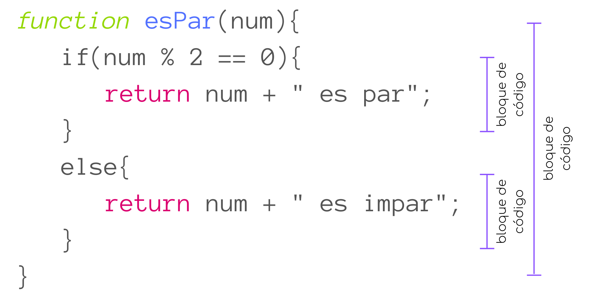
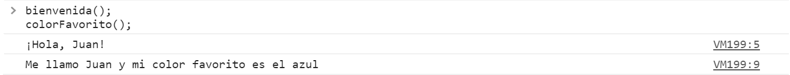
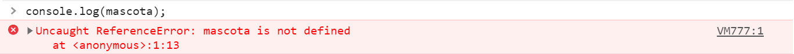
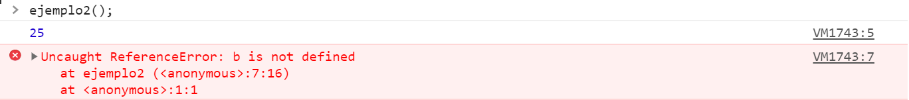
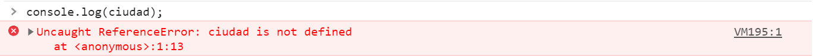

# Alcance

Un concepto muy importante en la programación es el concepto de **alcance**.

El alcance define en que partes del código se puede acceder o utilizar una variable, ya que mientras algunas variables pueden ser accedidas en cualquier parte del programa, otras solo pueden ser utilizadas en ciertas partes del código.

### Bloques
Para comprender el concepto de alcance necesitamos primero explicar brevemente que es un *bloque*.

Se le denomina *bloque* al código que se encuentra delimitado entre llaves `{}`. Los bloques de código nos permiten agrupar una o más sentencias.

Ya hemos utilizado bloques antes, en funciones y estructuras de control, por ejemplo:

<p align="center">
    
</p>

### Alcance global
En el *alcance global* las variables se declaran fuera de los bloques de código. Por esto mismo, como las variables no pertenecen exclusivamente a un solo bloque pueden ser utilizadas desde cualquier parte del código. A estas variables se les conoce como **variables globales**.

```javascript
const nombre = "Juan";
let color = "azul";

function bienvenida(){
    console.log("¡Hola, " + nombre + "!");
}

function colorFavorito(){
    console.log("Me llamo " + nombre + " y mi color favorito es el " + color);
}
```
<p align="center">
    
</p>

Como podemos ver en el ejemplo, ambas funciones pueden utilizar las variables `nombre` o `color` pues estas fueron definidas fuera de los bloques de código.

### Alcance local

Cuando una variable es definida dentro de un bloque, esta solo puede ser utilizada por el código dentro del mismo bloque. Las variables que son definidas dentro de un bloque de código se conocen como **variables locales**.

```javascript
const ejemplo = () =>{
    let mascota = "perro";
    alert(mascota);
}

console.log(mascota) //Error
```

Aquí declaramos la variable `mascota` dentro del cuerpo de la función por lo que, al intentar utilizarla fuera de las llaves tendríamos un error.

<p align="center">
    
</p>

El error nos dice que `mascota no está definido`, esto es porque la variable solo existe dentro de la función.

Veamos otro ejemplo.

```javascript
const ejemplo2 = () =>{
    let a = 10;
    if(a > 5){
        let b = 15;
        console.log(a + b); //Se imprime en consola 25;
    }
    return a + b; //Error
}

ejemplo2() //Error
```

<p align="center">
    
</p>

En este caso, obtenemos un error al ejecutar la función `ejemplo2()`, pues aunque la condición del `if` se cumple y el cuerpo se ejecuta (se crea la variable `b = 15`), esta no existe fuera de las llaves donde fue creada, por lo que no podemos utilizarla en el `return`.

Es importante recordar también que los argumentos que recibe una función al ser invocada funcionan como variables locales dentro del cuerpo de la función.

```javascript
const ejemplo3 = (ciudad) => {
    alert("Mi ciudad favorita es: " + ciudad);
}

ejemplo3("San Francisco");

console.log(ciudad); //Error
```

<p align="center">
    
</p>

### Vida de una variable
La vida de una variable comienza cuando es declarada.

Las variables locales son eliminadas cuando termina la ejecución de su bloque de código, mientras que en el navegador las variables globales son eliminadas cuando se cierra la ventana o pestaña donde se encuentra la página web.

### Buenas prácticas
Aunque en principio podría parecer más sencillo hacer todas la variables accesibles para nuestro código, esto se considera una muy mala práctica de programación pues conforme tu programa vaya creciendo esto podría ocasionarte problemas.

Es por eso que siempre debemos intentar utilizar variables locales. De esta forma no solo puedes evitar errores o confusiones con los nombres y valores de tus variables, sino que el utilizar variables locales hará tu código más legible pues los bloques te proporcionan una mejor organización e incluso te permitirá ahorrar espacio, pues las variables dejarán de existir en cuanto su bloque termine de ejecutarse.
