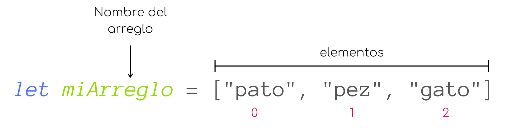

# Arreglos

En javascript los arreglos son utilizados para almacenar múltiples valores en una sola variable. Podemos pensar en los arreglos como una lista de valores que deseamos almacenar en un solo sitio.

Los arreglos pueden almacenar cualquier tipo de datos y, al igual que en una lista, los elementos de un arreglo tienen una posición numerada lo que significa que podemos utilizar un índice para acceder a ellos.

### Sintaxis
Para crear un arreglo encerramos sus elementos entre corchetes `[]` y separamos cada uno con una coma. Más comúnmente, asignamos el arreglo a una variable, para así poder darle un nombre.

<p align="center">
    
</p>

En Javascript podemos definir arreglos heterogéneos, esto es que los elementos de un arreglo pueden ser de diferentes tipos, e incluso pueden ser otros arreglos.

```javascript
let arreglo = [1, "hola", true, 20.5, undefined, [1, 2, "adios"]];
```

### Acceder a los elementos de un arreglo
Como mencionamos arriba, los elementos de un arreglo se encuentra numerados, por lo que podemos utilizar su *índice* para acceder a ellos.

La numeración de los elementos en un arreglo comienza por el número 0.

Para acceder a los elemntos de un arreglo utilizamos la siguiente sintaxis.

<p align="center">
    
</p>

Al acceder a un elemento de un arreglo, podemos asignarlo a una variable, por ejemplo.

```javascript
let miArreglo = ["pato", "pez", "gato"];
let animal = miArreglo[1]; //animal = "pez"
```

No solo podemos acceder a un elemento en un arreglo para guardarlo en una variable, también podemos modificarlo.

```javascript
miArreglo[2] = "ratón"; //miArreglo = ["pato", "pez", "ratón"]
```
Como sabemos, el valor de una variable `const` no puede ser reasignado, sin embargo, sin embargo los elementos de un arreglo declarado con `const` si pueden ser modificados.

```javascript
const numeros = [1, 2, 3, 4, 5];
numeros[2] = 10; //numeros = [1, 2, 10, 4, 5]
```

### Longitud de un arreglo
Una de las propiedades de los arreglos es su longitud. Podemos recuperar la longitud de un arreglo utilizamos la palabra reservada `length`.

```javascript
const numeros = [1, 2, 3, 4, 5];
let longitud = numeros.length; //longitud = 5
```

### Recorriendo un arreglo
Una de las principales acciones que realizaras utilizando arreglos será recorrerlos. Para esto, comúnmente utilizamos la estructura de control `for`.

Veamos un ejemplo.

```javascript
const animales = ["perro", "gato", "pez", "pato", "jirafa"];

for(let i = 0; i < animales.length; i++){
    console.log(animales[i]);
}
```

Analicemos el `for` por partes:
* Primero, definimos una variable `i = 0`, esto es porque, como mencionamos antes, la númeración de los elementos del arreglo comienza en 0, por lo que, para recorrerlo necesitamos posicionarnos en su primer elemento.

* La condición de permanencia del `for` es; *mientras i sea menor que la longitud de animales*. Pensemos en un arreglo de 3 elementos, al comenzar su numeración en 0, tendríamos el elemento 0, el elemento 1 y el elemento 2, por lo tanto, la numeración de los elementos del arreglo es más pequeña que su longitud por 1. Entonces, en cuanto `i` es igual a la longitud del arreglo podemos saber que ya hemos recorrido todos los elementos.

* Y por último incrementamos `i` en una unidad para recorrer cada uno de los elementos.

* Dentro del `for` solo estamos imprimiendo en la consola cada elemento del arreglo. Para esto accedemos a los elementos del arreglo con `animales[i]`. Como podemos ver no estamos utilizando explícitamente un número para representar el índice de cada elemento, sino que utilizamos `i`, pues en cada iteración `i` será igual al índice de cada uno de los elementos.

<br>
También podemos utilizar la estructura de control `while` para recorrer un arreglo:

```javascript
let i = 0;
while(i < animales.length){
    console.log(animales[i]);
    i++;
}
```
Para esto, tenemos que definir `i`, la variable que utilizaremos para recorrer el arreglo, antes de utilizar la estructura de control, además de que debemos recordar incrementar a `i` al final de la iteración.

<br>

Otra forma de recorrer los elementos de un arreglo es utilizando el método `forEach()`.

El método `forEach()` recibe como parámetro una función que aplica a cada elemento del arreglo.

```javascript
animales.forEach(animal => console.log(animal));
}
```

Aquí, le estamos diciendo a la función `forEach()`: *Por cada animal en el arreglo imprime ese animal en la consola*.

### Agregar elementos a un arreglo
La forma mas sencilla de agregar un elemnto a un arreglo es utilizando el método `push()`, que recibe el nuevo elemento como parámetro y lo agrega al final del arreglo.

```javascript
const animales = ["perro", "gato", "pez", "pato", "jirafa"];

animales.push("elefante"); //animales = ["perro", "gato", "pez", "pato", "jirafa", "elefante"]
}
```

Otra forma de agregar elementos a un arreglo es ayudándonos con la propiedad de longitud

```javascript
animales[animales.length] = "delfín";
//animales.length = 5
//animales[5] = "delfín"
//animales = ["perro", "gato", "pez", "pato", "jirafa", "delfín"]
```
Aquí, utilizamos la longitud del arreglo para acceder a la posición siguiente al último elemento (recordemos que el índice del último elemento es la longitud del arreglo menos 1) y asignarle el nuevo elemento.

### Eliminar el último elemento de un arreglo
Podemos utilizar el método `pop()` para eliminar el último elemento de un arreglo. Este método no recibe ningún parámetro.

```javascript
const animales = ["perro", "gato", "pez", "pato", "jirafa"];

let ultimo = animales.pop(); //ultimo = "jirafa"
//animales = ["perro", "gato", "pez", "pato"]
}
```

Al eliminar un elemento del arreglo su longitud disminuye.
