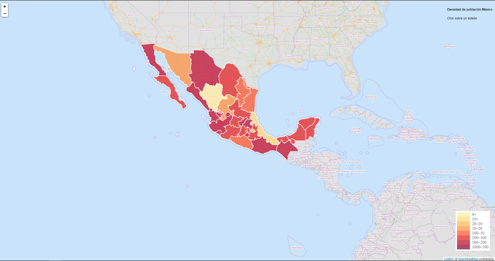
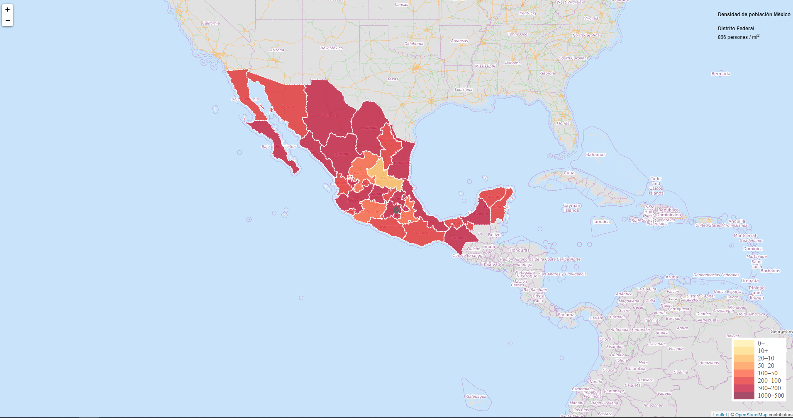

# Leaflet y Javascript  

Ya hemos abarcado los conocimientos mínimos necesarios del lenguaje Javascript para que podamos empezar con breves ejemplos de aplicación al **framework** **leaflet**, enseñaremos a realizar algunos ejemplos donde podemos visualizar información en un mapa.  

Lo primero que necesitamos es crear nuestra estructura de html básica como podemos ver a continuación:  

<p align="center"> 

</p>   

Debemos importar el framework de leaflet.js leaflet.css entre otros, para ello podemos encontrarlos en los siguientes links:  

* https://leafletjs.com/download.html  
  
  ```html
  <link rel="stylesheet" href="https://unpkg.com/leaflet@1.6.0/dist/leaflet.css" />
  <script src="https://unpkg.com/leaflet@1.6.0/dist/leaflet.js"></script> 
  ```  
  
  Aquí podremos encontrar diferentes formas de bajar el archivo, ya sea en algún lugar donde esté hosteado ó directamente podemos guardar el archivo en nuestra computadora. 
  Para fines prácticos cargaremos la versión en la nube y enseñaremos una forma rápida (no recomendamos usar ésta forma para aplicaciones en el mundo real por cuestiones de         seguridad que no están en el alcance de éste curso) 
* https://developers.google.com/speed/libraries

  ```html
  <script src="https://ajax.googleapis.com/ajax/libs/jquery/3.2.1/jquery.min.js"></script>

  ```  
  
Con el siguiente código css centraremos nuestro mapa que es lo que de momento nos interesa  
```html
<style type="text/css" media="screen">

		#map{
			position: absolute;
			top: 0;
			bottom: 0;
			left: 0;
			right: 0;
			z-index: 1;
		}
		#legend {
		    line-height: 18px;
		    color: #555;
		    position: absolute;
		    bottom: 40px;
		    right: 20px;
		    z-index: 2;
		    background-color: white;
		    padding: 5px;
		}
		#legend i {
		    width: 50px;
		    height: 18px;
		    float: left;
		    margin-right: 8px;
		    opacity: 0.7;
		}
</style>
```  

Debemos crear un bloque **div** donde inicializaremos nuestro mapa de leaflet, para ello agregamos el siguiente código junto con un div container y uno legend tal cual podemos observar al inicio de la página:  

```html
	<div class="container">
		<div id="map"></div>
		<div id="legend"></div>
	</div>
```  
Ahora solo debemos ver la parte correspondiente a Javascript, pero antes como se mencionó antes para cargar los archivos desde la máquina local que actua como servidor usaremos un script de python.  

```python3
#!/usr/bin/env python3
# encoding: utf-8
"""Use instead of `python3 -m http.server` when you need CORS"""

from http.server import HTTPServer, SimpleHTTPRequestHandler

class CORSRequestHandler(SimpleHTTPRequestHandler):
    def end_headers(self):
        self.send_header('Access-Control-Allow-Origin', '*')
        self.send_header('Access-Control-Allow-Methods', 'GET')
        self.send_header('Cache-Control', 'no-store, no-cache, must-revalidate')
        return super(CORSRequestHandler, self).end_headers()
httpd = HTTPServer(('localhost', 8080), CORSRequestHandler)
httpd.serve_forever()
```  
Usaremos una terminal para correr el servidor, el puerto será el 8080 y con localhost (127.0.0.1).  
 
<p align="center"> 

</p>  

Para jalar nuestros archivos debemos tener la terminal parada en la misma carpeta que nuestros datos a cargar, además de manejar correctamente ya sea la ruta absoluta o relativa como se verá más adelante.  
Idealmente lo correcto es crear un archivo js con el código, pero para fines prácticos lo haremos dentro de un tag **script** de html 


```html
	<script type="text/javascript" charset="utf-8" >
	</script>  
```  

Vamos a inicializar e instanciar nuestro mapa de leaflet con la siguiente línea:  
```javascript
	<script type="text/javascript" charset="utf-8">
		var map = L.map('map').setView([19.4,-99.15],5);
	</script>  
```  

<p><span style="color:blue">Lo que aquí le estamos indicando es que utilize el div con el id 'map' que creamos en el html y centre el mapa en las latitud, longitud = 19.4, -99.15 correspondiente a la Ciudad de México, México.</span></p> 

Lo siguiente es cargar un tile layer base para nuestro mapa, en éste caso usaremos el que nos brinda **OpenStreetMaps**, un layer lo podemos pensara como un archivo ó herramienta que es un conjunto de datos geográficos (TERMINAR DE DEFINIR UN TILE LAYER).  


A través del método tileLayer(...) podemos cargar y desplegar capas en nuestro mapa, entre los parámetros de la función está el **URL** al tile layer.

Recordando un poco nuestro aprendizaje previo del lenguaje Javascript, recordemos que podemos aplicar funciones a resultados de funciones previas, entonces nuestra función **addTo(map)** que podemos encontrar al final de **tileLayer()**, con ésto le estamos indicando que se agregue el layer a nuestro mapa. Hasta éste punto deberemos tener nuestro mapa de la siguiente manera:  

<p align="center"> 

</p> 

### L.Control(...)

En leaflet existen dos tipos de capas, las base layers que son exclusivas entre sí y las overlays, que agregan información ***encima*** de la capa base.
**Control es la clase base para implementar controladores en el mapa**.  

Agregaremos el siguiente código que nos indicará el nombre del estado junto con la densidad de población asociada:  

```javascript
	//código previo
	var info = L.control();
``` 

Inicializamos e instanciamos de la clase Control la variable info, posteriormente definiremos un evento **onAdd** sobre nuestra instancia que 
representará una función:  

```javascript
	<script type="text/javascript" charset="utf-8">
	//código previo
	info.onAdd = function (map) {
			this._div = L.DomUtil.create('div', 'info');
			this.update();
			return this._div;
	};
	</script>
```
La función en pocas palabras nos crea un bloque **div** en nuestro dom del html con un **id="info**.  

Ahora agregamos sobre el evento **update** el siguiente código con la información que queremos mostrar:  

```javascript
	<script type="text/javascript" charset="utf-8">
	//código previo
	info.update = function (props) {
			this._div.innerHTML = '<h4>Densidad de población México</h4>' +  (props ?
				'<b>' + props.entidad_nombre + '</b><br />' + props.density + ' personas / mi<sup>2</sup>'
				: 'Click sobre un estado');
	};
	</script>
```  

Aquí hay que resaltar que conocemos de antemano el nombre de los atributos de los objetos en el **geojson**, contamos con una propiedad denominada **entidad_nombre** y **density**, al div **info** previamente creado le estamos insertando en el html la información correspondiente.  

```javascript
	<script type="text/javascript" charset="utf-8">
	//código previo
	info.addTo(map);
	</script>
```  
Solo nos queda agregar el control al mapa.  


### Aplicación a un mapa coroplético  

Un mapa coroplético es un tipo de mapa en el que las áreas se sombrean de distintos colores, representando los distintos valores de una variable estadística de una determinada región. De momento usaremos valores aleatorios para asignarle a cada estado de la república y pintarla de determinado color con fines ilustrativos.  


```javascript
  	colores = ['#BD0026','#E31A1C','#FC4E2A','#FC4E2A','#FD8D3C','#FEB24C','#FED976','#FFEDA0'] //el arreglo de colores para el mapa
        
	function getColor(d) {
		return d > 1000 ? '#800026' :
		   d > 500  ? '#BD0026' :
		   d > 200  ? '#E31A1C' :
		   d > 100  ? '#FC4E2A' :
		   d > 50   ? '#FD8D3C' :
		   d > 20   ? '#FEB24C' :
		   d > 10   ? '#FED976' :
			      '#FFEDA0';
	}
	function style(feature) {
	    return {
	        fillColor: getColor(feature.properties.density),
	        weight: 2,
	        opacity: 1,
	        color: 'white',
	        dashArray: '3',
	        fillOpacity: 0.7
	    };
	}  
```
En el código hay que notar que en arreglo colores definimos los colores en su valor hexadecimal que usaremos en el mapa, los valores son arbitrarios, los podemos ajustar de acorde a las necesidades pero por ahora usaremos los colores por defecto.  

La función **getColor()** solo evaluará el valor del parámetro d y acorde al intervalo al que pertenezca se retornará el valor hexadecimal correspondiente. Por otra parte la función **style** nos brinda la posibilidad de personalizar cada elemento del geojson, ésta función la mandaremos llamar cuando carguemos los datos del geojson más adelante.  
Las configuración de style que se usara es:  

	1. fillColor:  
		Aquí indicamos el color de relleno de la geometría.  
	2. weight:  
		Indicamos el valor de la anchura  
	3. opacity:  
		Indicamos el valor de la opacidad  
	4. color:  
		El color del contorno de la geometría  
	5. dashArray:  
		  
	6. fillOpacity:  
		Especifica la operación de pintado para rellenar el elemento.  
#### Funciones auxiliares para resaltar estados  

Agregaremos unas funciones adicionales para cuando queramos hacer zoom sobre un estado concreto y consultar determinada información  

```javascript
	  // código previo
	  function highlightFeature(e) {
				var layer = e.target;

				layer.setStyle({
					weight: 5,
					color: '#666',
					dashArray: '',
					fillOpacity: 0.7
				});

				if (!L.Browser.ie && !L.Browser.opera && !L.Browser.edge) {
					layer.bringToFront();
				}

				info.update(layer.feature.properties);
	   }
	
```
Con éste código estamos logrando que cuando nuestro mouse apunte a un éstado concreto, éste de alguna forma resalte sobre los demás. Para ello usamos la propiedad **target** del evento de javascript, se guarda en una variable y se le asigna un estilado, al final actualizamos el **div info** con las propiedades concretas del estado.  

```javascript
	// código previo
	var datageo;
	function resetHighlight(e) {
		geojson.resetStyle(e.target);
		info.update();
	}
	function zoomToFeature(e) {
		map.fitBounds(e.target.getBounds());
	}
	function onEachFeature(feature, layer) {
		layer.on({
			mouseover: highlightFeature,
			mouseout: resetHighlight,
			click: zoomToFeature
		});
	}
```

Definiremos una variable **geojson** que nos servirá más adelante para guardar información. Ahora cada una de las tres funciones tiene un objetivo:  

	1. resetHighlight vuelve al color original el estado al que hayamos hecho click
	2. zoomToFeature nos hace zoom y centra la vista sobre la entidad a la que hayamos hecho click
	3. onEachFeature manda a ejecutar las dos funciones anteriores una vez hecho click sobre un estado


### L.geoJSON() 

Usaremos la función geoJSON() para crear y representar una capa con un objeto de tipo geojson o un arreglo de objetos geojson para visualizarlos en el mapa, al extender LayerGroup nos permite manipular varias layers en una sola.  

Existen dos formas de hacerlo, podemos pasarle directamente el objeto geojson o inicializar el objeto vacío y posteriormente agregarle los datos.
		
### Cargar datos desde servidor

Ahora que tenemos todo preparado veremos cómo cargar las geometrías de los estados para completar nuestro mapa.  

```javascript
	<script type="text/javascript" charset="utf-8">
		//código anterior  
		$.getJSON("http://127.0.0.1:8080/entidades.geojson", function(data) {
        	data['features'].forEach(element => 
        		element.properties["density"] = Math.floor(Math.random() * 1000))
        	datageo = L.geoJson(data, {style: style, onEachFeature: onEachFeature}).addTo(map);	
    	})
	</script>  
``` 
Con ayuda del framework JQuery haremos una petición get a la url que se indica como parámetro, recordemos que tenemos montado un servidor con la ayuda de python en **localhost 
puerto 8080** y el sufijo **entidades.geojson** corresponde al nombre del archivo.  
Notemos que recibe como parámetro también una función anónima, en ella podemos definir el comportamiento que queremos ejecutar al leer la información. **Data** es el parámetro de dicha función que es el geojson previamente cargado, una vez hecho ésto, necesitamos contar con un atributo del objeto para poder realizar nuestro mapa, como nuestro geojson no tiene ningún valor estadístico asignaremos uno aleatorio para cada estado en un rango de [0,999].  

En el código previo veamos que iteramos cada objeto de **features** en el geojson y en las **properties** definimos un nuevo atributo llamado density inicializado en un valor aleatorio entre [0,1000]. Cuando acabe el ciclo **for each** ya solo debemos cargar los datos a un tyle con la función **geoJson**, le pasaremos la configuración que habíamos definido previamente **style** y lo agregaremos al mapa junto con la función **onEachFeature** definida con anterioridad, el resultado lo guardaremos en la variable **datageo**


<p><span style="color:blue">Con ésto deberemos tener ya listo nuestro mapa y ser verá de la siguiente forma (recordando que al tomar valores aleatorios los colores de los estados pueden variar).</span></p>

<p align="center"> 

</p>  

<br>

<p align="center"> 

</p>  
