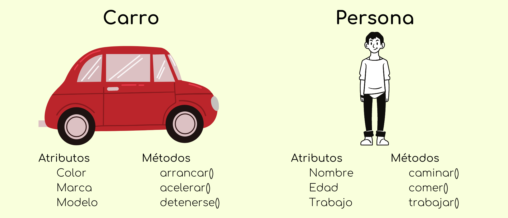
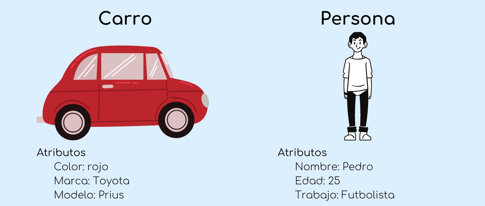
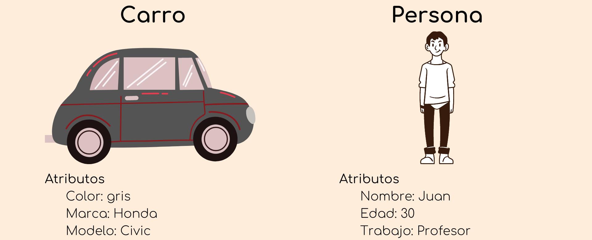
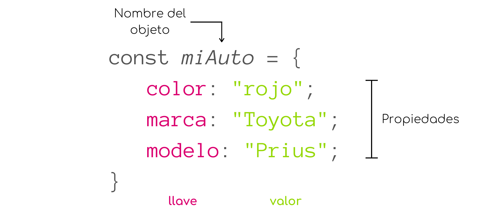

# Objetos

En capítulos anteriores mencionamos 5 tipos de datos primitivos del lenguaje Javascript, sin embargo, existe un sexto tipo *estructural* conocido como **objeto**.

Los objetos son una estructura básica presente en casi cada aspecto del lenguaje. Un objeto no es más que una colección de propiedades (atributos) y acciones (métodos).

Pensemos en un objeto de la vida real; un auto. Un auto tiene propiedades como un nombre, un modelo y una marca. Además un auto puede realizar múltiples acciones como arrancar, acelerar o frenar.

Otro ejemplo sería una persona. Una persona puede tener un nombre, edad, trabajo, hobby, nacionalidad, entre muchas otras propiedades. Y, una persona puede realizar acciones como caminar, comer, dormir, trabajar, etc.

    

Todos los auto, o todas las personas, tienen las mismas propiedades, pero con diferentes valores y todos pueden realizar las mismas acciones.

    

    

Entonces, aunque tenemos dos autos con diferentes propiedades, ambos autos pueden encender, acelerar y detenerse.

### Sintaxis

Para crear un objeto en Javascript podemos asignarlo a una variable como cualquier tipo de dato, y el contenido del objeto lo delimitamos por llaves `{}`.

El contenido del objeto está organizado en pares, *llave*-*valor*

    

La llave funciona como el nombre de una variable y apunta a una dirección en memoria donde se almacena el valor. El valor, correspondiente a una llave, puede se cualquier tipo de dato del lenguaje, incluyendo objetos o funciones.
