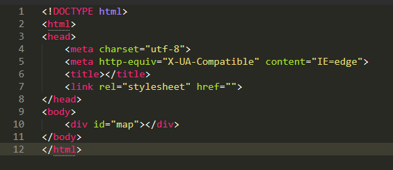
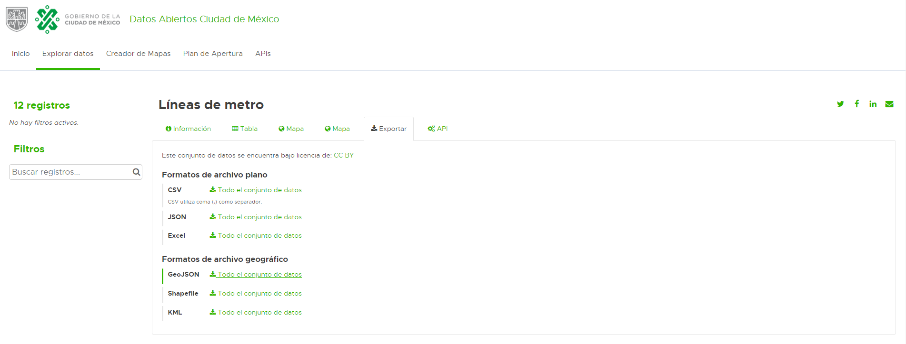
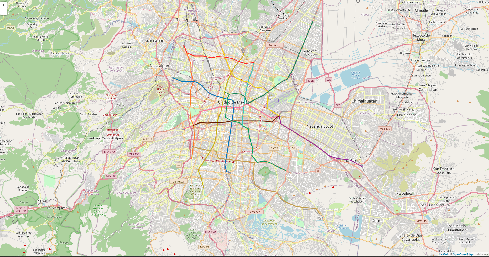

# Leaflet y Javascript segundo ejemplo  

Aquí cargaremos las geometrías de las líneas del metro de la CDMX, y marcadores con movimiento.  

Primero que nada creamos un template de html básico:  

<p align="center"> 

</p>   

Cargamos las bibliotecas necesarias como se ha visto previamente:  


```html
	<link rel="stylesheet" href="https://unpkg.com/leaflet@1.6.0/dist/leaflet.css" />
	<script src="https://unpkg.com/leaflet@1.6.0/dist/leaflet.js"></script>
    	<script src="https://ajax.googleapis.com/ajax/libs/jquery/3.2.1/jquery.min.js"></script>
	<script src="../js/leaflet.ajax.min.js"></script>
``` 

**Debemos descargar el archivo js de moving marker** lo podemos encontrar tanto en el repositorio o en la siguiente liga:  

**https://github.com/ewoken/Leaflet.MovingMarker**

```html
	<script type="text/javascript" src="../js/MovingMarker.js"></script>
``` 

Recordemos que para jalar archivos locales debemos tener montado el mini-server con python o importar uno hosteado desde algún link.


En el **head** agregamos el siguiente css 

```html
<style type="text/css" media="screen">
	#map{
			position: absolute;
			top: 0;
			bottom: 0;
			left: 0;
			right: 0;
	}
</style>
```  

Creamos el tag script para nuestro código JS  

```html
<script type="text/javascript" charset="utf-8" ></script>		

```

Inicializamos, instanciamos y centramos el mapa en las coordenadas, así como el base layer correspondiente de **OSM**

```javascript
<script type="text/javascript" charset="utf-8" >
	var map = L.map('map').setView([19.40,-99.12],12);
			var baseLayer = L.tileLayer('http://{s}.tile.osm.org/{z}/{x}/{y}.png', {
	        attribution: '&copy; <a href="https://www.openstreetmap.org/copyright">OpenStreetMap</a> contributors'
	}).addTo(map);


</script>		
```

No es necesaria ésta función pero sirve para resaltar las líneas con su color correspondiente:  

```javascript
	// código previo
	function getColor(d) {
    		switch (d) {
    			case "Linea B":
    				return '#117f58'
    				
    			case "Linea 1":
    				return '#ff71a1'
    				
    			case "Linea 7":
    				return '#ff7825'
    				
    			case "Linea 3":
    				return '#c6ae0e'
    				
    			case "Linea 8":
    				return '#009f5d'
    				
    			case "Linea 2":
    				return '#0075bb'
    				
    			case "Linea A":
    				return '#972094'
    				
    			case "Linea 9":
    				return '#671a00'
    				
    			case "Linea 5":
    				return '#f6da14'
    				
    			case "Linea 4":
    				return '#39c7b9'
    				
    			case "Linea 12":
    				return '#bf9c4a'
    				
    			case "Linea 6":
    				return '#ff2122'
    				
    			default:
    				// statements_def
    				break;
    				
    		}
	}	
```
 
Usaremos una estructura switch case para cazar el color de la linea correspondiente  

Creamos una función para darle estilo a cada una de las geometrías como vimos en el ejemplo anterior: 

```javascript
	//código previo
	function linestyle(feature) {
		return {
			weight: 3,
			opacity: 2,
			color: getColor(feature.properties.name),  //Outline color
			fillOpacity: 1
		};
	}
```  

**getColor()** es la llamada a la función donde dado el nombre de la línea determinamos el color que está asociado. Para ello al geojson que definiremos posteriormente 
le pasaremos la propiedad nombre contenida en **properties** de cada objeto.   

Cargaremos los datos del geojson, los datos abiertos los podemos encontrar en el siguiente link 

https://datos.cdmx.gob.mx/explore/dataset/lineas-de-metro/export/


<p align="center"> 

</p> 

```javascript
	//código previo
var geojsonFeature = {"type":"FeatureCollection","features":[{"type": "Feature", "geometry": {"type": "LineString", "coordinates": [[-99.1453725, 19.4451408], [-99.1392624, 19.4427583], [-99.1313499, 19.4433754], [-99.1233194, 19.4425205], [-99.1182554, 19.4389745], [-99.1148007, 19.4302734], [-99.1036642, 19.436607], [-99.0943193, 19.4408057], [-99.0871739, 19.4457529], [-99.079417, 19.450963], [-99.0692568, 19.4581051], [-99.0613174, 19.4616861], [-99.0545368, 19.4730559], [-99.0488827, 19.4858612], [-99.0466619, 19.4909688], [-99.041968, 19.5017045], [-99.0359974, 19.5153316], [-99.0333796, 19.5213181], [-99.0301716, 19.5284976], [-99.027347266674, 19.5344532308002]]}, "properties": {"name": "Linea B", "geo_point_2d": [19.467874767049036, -99.07673381124572]}},{"type": "Feature", "geometry": {"type": "LineString", "coordinates": [[-99.2005488, 19.3982501], [-99.187097, 19.4031605], [-99.1821724, 19.4129053], [-99.1762608, 19.420813], [-99.1706067, 19.421926], [-99.1627908, 19.4236259], [-99.154653, 19.425867], [-99.149074, 19.42741], [-99.1422343, 19.4267827], [-99.1374546, 19.4265399], [-99.13291100000001, 19.4257912], [-99.1246551, 19.4254927], [-99.1194355, 19.4288468], [-99.1148007, 19.4302734], [-99.1102624, 19.4272178], [-99.102264, 19.4232414], [-99.0960038, 19.4197101], [-99.0903497, 19.4164114], [-99.0823781, 19.412288], [-99.0722072, 19.4153591]]}, "properties": {"name": "Linea 1", "geo_point_2d": [19.41927069254014, -99.13849469920137]}},{"type": "Feature", "geometry": {"type": "LineString", "coordinates": [[-99.189586, 19.3607037], [-99.1878051, 19.3761645], [-99.1863245, 19.3847724], [-99.1860509, 19.3912798], [-99.187097, 19.4031605], [-99.1912866, 19.4119136], [-99.1919732, 19.4255433], [-99.1910237, 19.4335161], [-99.1914367675781, 19.4468455104825], [-99.1870825, 19.4586984], [-99.1905999, 19.4700922], [-99.1905784606934, 19.4806724417591], [-99.1948807000001, 19.4905036], [-99.2000628, 19.5046121]]}, "properties": {"name": "Linea 7", "geo_point_2d": [19.433335825383974, -99.19037660570524]}},{"type": "Feature", "geometry": {"type": "LineString", "coordinates": [[-99.1739595, 19.3244574], [-99.1766363, 19.3359178], [-99.1810191, 19.3468358], [-99.1760355, 19.3537143], [-99.1704994, 19.3614528], [-99.1649204, 19.3707294], [-99.1591108, 19.3798486], [-99.1574532, 19.3855061], [-99.1562569, 19.3956264], [-99.1538858, 19.4135984], [-99.1505706, 19.4195583], [-99.149074, 19.42741], [-99.1478777, 19.4332682], [-99.1471374, 19.4373152], [-99.1453725, 19.4451408], [-99.1427922, 19.4551006], [-99.1369236, 19.4702742], [-99.1321707, 19.4769704], [-99.1265702, 19.4837877], [-99.1209751134766, 19.4906856228133], [-99.1194999, 19.4953987]]}, "properties": {"name": "Linea 3", "geo_point_2d": [19.410416317539855, -99.15363531586777]}},{"type": "Feature", "geometry": {"type": "LineString", "coordinates": [[-99.1392624, 19.4427583], [-99.1419393, 19.4361922], [-99.1414833068848, 19.4306578806949], [-99.1422343, 19.4267827], [-99.1433448, 19.4216528], [-99.1441816, 19.4133303], [-99.1357434, 19.4084883], [-99.1262913, 19.4065657], [-99.1216993, 19.4027355], [-99.1135132, 19.398551], [-99.1122043, 19.3886637], [-99.1095865, 19.3793223], [-99.1077197, 19.3737557], [-99.1091895, 19.3650309], [-99.1013199, 19.3561791], [-99.0934932, 19.3578999], [-99.085511, 19.3560526], [-99.0747285, 19.3507281], [-99.0638816, 19.3459804]]}, "properties": {"name": "Linea 8", "geo_point_2d": [19.387434311930075, -99.11311505678736]}},{"type": "Feature", "geometry": {"type": "LineString", "coordinates": [[-99.214788, 19.4634108], [-99.203158, 19.4587829], [-99.1870825, 19.4586984], [-99.182151, 19.457488], [-99.1747749, 19.4521567], [-99.1718835, 19.4489852], [-99.1673774, 19.4447058], [-99.1611063, 19.441782], [-99.1555005, 19.4397232], [-99.1471374, 19.4373152], [-99.1419393, 19.4361922], [-99.1369029, 19.4356521], [-99.1329861, 19.4332227], [-99.13291100000001, 19.4257912], [-99.1345682, 19.416019], [-99.1357434, 19.4084883], [-99.1368914, 19.4008785], [-99.1378087, 19.3952064], [-99.1390371, 19.3874695], [-99.140260219574, 19.3795146127671], [-99.1415638, 19.369945], [-99.1429317, 19.3619032], [-99.1449916, 19.353284], [-99.142524, 19.3441988]]}, "properties": {"name": "Linea 2", "geo_point_2d": [19.41880024475406, -99.15616781168305]}},{"type": "Feature", "geometry": {"type": "LineString", "coordinates": [[-99.0722072, 19.4153591], [-99.0698737, 19.4047948], [-99.0593863, 19.3987332], [-99.0463722, 19.3912849], [-99.0356326, 19.3851316], [-99.0170825, 19.3733205], [-99.0056777, 19.3647171], [-98.9952278137207, 19.3613566081823], [-98.9768708, 19.3590285], [-98.9609921, 19.3506572]]}, "properties": {"name": "Linea A", "geo_point_2d": [19.37804116610925, -99.02076833800143]}},{"type": "Feature", "geometry": {"type": "LineString", "coordinates": [[-99.187097, 19.4031605], [-99.1788948, 19.4062317], [-99.1684502, 19.406171], [-99.1552055, 19.4066618], [-99.1448736, 19.407021], [-99.1357434, 19.4084883], [-99.1217637, 19.409125799999998], [-99.1128802, 19.4085693], [-99.1030419, 19.4085693], [-99.0912294, 19.4084529], [-99.0824747, 19.4072234], [-99.0722072, 19.4153591]]}, "properties": {"name": "Linea 9", "geo_point_2d": [19.407908907357076, -99.12863332363204]}},{"type": "Feature", "geometry": {"type": "LineString", "coordinates": [[-99.1492832, 19.5008499], [-99.1449058, 19.4896945], [-99.1407001, 19.4790945], [-99.1369236, 19.4702742], [-99.1307974, 19.4634058], [-99.1193229, 19.458798], [-99.1139048, 19.4580545], [-99.105413, 19.4514081], [-99.0963578, 19.4511957], [-99.0871739, 19.4457529], [-99.0876889, 19.4338247], [-99.0874207, 19.4240913], [-99.0722072, 19.4153591]]}, "properties": {"name": "Linea 5", "geo_point_2d": [19.455383983850407, -99.11183909575]}},{"type": "Feature", "geometry": {"type": "LineString", "coordinates": [[-99.1070652, 19.482574], [-99.1080093, 19.4743304], [-99.1119307, 19.4647057], [-99.1139048, 19.4580545], [-99.1161579, 19.4488638], [-99.1182554, 19.4389745], [-99.1194355, 19.4288468], [-99.1205406, 19.4216528], [-99.1217637, 19.409125799999998], [-99.1216993, 19.4027355]]}, "properties": {"name": "Linea 4", "geo_point_2d": [19.44299092849102, -99.11610133301583]}},{"type": "Feature", "geometry": {"type": "LineString", "coordinates": [[-99.1876860557258, 19.3761083800553], [-99.1788508205841, 19.373628712725], [-99.1712977237001, 19.3720396532352], [-99.1648013673941, 19.3706732649607], [-99.1567512289475, 19.3705634323458], [-99.1540513377261, 19.3617505941329], [-99.1517282514489, 19.3614396487916], [-99.1431697611068, 19.3602749158266], [-99.1214515788769, 19.3573730292532], [-99.1055751254594, 19.3558421753309], [-99.1074541104213, 19.3381605270274], [-99.1050339189064, 19.3276021253425], [-99.0976121386369, 19.3223865035373], [-99.0857460513996, 19.3204223317489], [-99.0754678313789, 19.3184378879144], [-99.0696957260373, 19.3094671177938], [-99.0603831029597, 19.304687902063], [-99.0504267492784, 19.3008198736477], [-99.0416076502083, 19.2991997268285], [-99.0239050776309, 19.2979643469448], [-99.0172961221691, 19.2906329484479]]}, "properties": {"name": "Linea 12", "geo_point_2d": [19.335805128873243, -99.10251650368149]}},{"type": "Feature", "geometry": {"type": "LineString", "coordinates": [[-99.2000628, 19.5046121], [-99.195728302002, 19.4947514274251], [-99.1864371, 19.4910143], [-99.17382, 19.4908171], [-99.1627693, 19.488683], [-99.1555542, 19.4903266], [-99.1449058, 19.4896945], [-99.1346973, 19.4877576], [-99.1265702, 19.4837877], [-99.1179228, 19.481552399999998], [-99.1070652, 19.482574]]}, "properties": {"name": "Linea 6", "geo_point_2d": [19.489361260202084, -99.15632963975492]}}]}

```  

Tenemos un problema, nuestras latlong del geojson están invertidas a lo que necesitamos, entonces debemos aplicar la **función reversa** a las coordenadas de cada geometría en nuestro geojson, para ello definiremos la siguiente función:  

```javascript  

//código previo
	function invertirLatLong(arreglo){
        	arreglo.forEach(function(elemento){
        		aux = elemento[0]
        		elemento[0] = elemento[1]
        		elemento[1] = aux
        	})
        	return arreglo
        }
```  
La función reversa lo que hace es invertir el orden de los elementos en la estructura, éstos deben ser iterables, en nuestro caso tenemos listas de listas de dos elementos (dada la naturaleza de la geometría).  
Para cada lista en la lista de coordenadas, tomamos el elemento 0 y lo guardamos en una variable auxiliar aux, después copiamos en el elemento 0 de la lista, el valor del elemento 1 y el elemento 1 de la lista toma el valor temporal de aux. Con ésto hemos logrado que la lista de coordenadas tenga la latlong invertida como la necesitamos.  

**Como disponemos ya de los datos, solo debemos cargalos al mapa**

```javascript  
	//código previo
	var myLayer = L.geoJSON(geojsonFeature, {style: linestyle}).addTo(map);  
```  
Notemos que en las options podemos agregar la función linestyle que definimos, ésta se aplicará a cada uno de los objetos del geojson (línea de metro)

**Hasta el momento podremos observar en nuestro mapa lo siguiente**  

<p align="center"> 

</p> 


