# Manipulación del DOM

Como mencionamos al comienzo del curso, el uso en conjunto de HTML, CSS y Javascript es lo que nos permite diseñar una página web que, no solo luzca bien, pero que también sea funcional. Entonces, ahora que hemos aprendido los conceptos básicos de los tres leguajes, es momento de integrarlos.

Uno de los puntos esenciales en la construcción de nuestra página web es el esqueleto de nuestro documento HTML, y más aun, el poder modificarlo de manera dinámica; para esto utilizamos Javascript.

### ¿Qué es el HTML DOM?

DOM, por sus siglas en ingles *Document Object Model*, se refiere a la jerarquía de los objetos que componen una página web. Este modelo de objetos defineL:
* Los elementos HTML como objetos.
* Las propiedades de todos los elementos HTML.
* Los métodos para acceder a todos los elementos HTML.
* Los eventos para todos los elementos HTML.

Esta jerarquía se construye como un Árbol de objetos.

<p align="center">
    
</p>

<p align="center">
    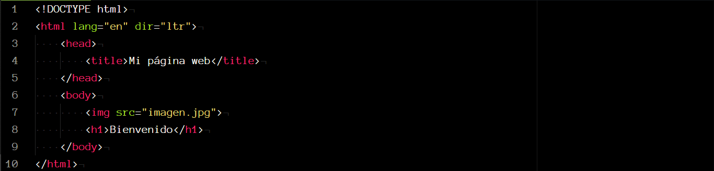
</p>

Podemos ver que la jerarquía se refiere al orden en que las etiquetas se encuentran anidadas en nuestro documento HTML.

Este Árbol de objetos es creado por el navegador cada vez que se carga un sitio web y esto facilita el acceso a los elementos del documento HTML usando Javascript.

Entonces, utilizando Javascript podemos modificar de forma dinámica nuestro documento, esto es:

* Modificar los elementos HTML.
* Cambiar los atributos de los elementos.
* Cambiar el estilo (CSS) de la página.
* Crear o eliminar elementos y atributos.
* Crear y reaccionar a eventos HTML.

### El objeto `document`

El objeto `document` del HTML DOM es el padre de todos los otros objetos en el sitio web. Entonces, para poder acceder a cualquier otro elemento del sitio web, comenzamos por acceder a `document`.

```javascript
document.title; //"Mi primer página web"
```

<p align="center">
    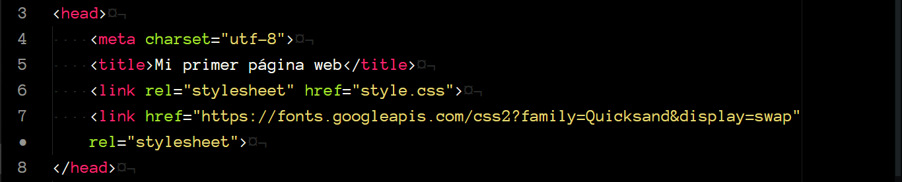
</p>

Aquí, por ejemplo, estamos recuperando el titulo de nuestra página web.

### Interfaz de programación del DOM

Como ya mencionamos arriba, en el DOM todos los elementos HTML se definen como objetos, a los cuales podemos acceder utilizando Javascript.

La *interfaz de programación* del DOM se refiere a las propiedades y métodos de cada objeto.

* **Propiedad** es un valor de objeto que puedes obtener y/o cambiar (por ejemplo cambiar el contenido de un elemento).
* **Método** es una acción que puedes realizar sobre un objeto (por ejemplo eliminar un elemento).

### Obtener elementos

Para acceder o recuperar elementos del documento HTML existen métodos que podemos utilizar en nuestro script. Estos métodos nos permiten recuperar elementos HTML utilizando su *id*, *clase* o *etiqueta*.

##### Por id
El método `getElementById()` nos permite obtener un objeto del DOM utilizando el nombre de su id.

<p align="center">
    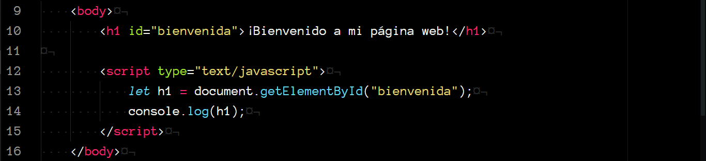
</p>

<p align="center">
    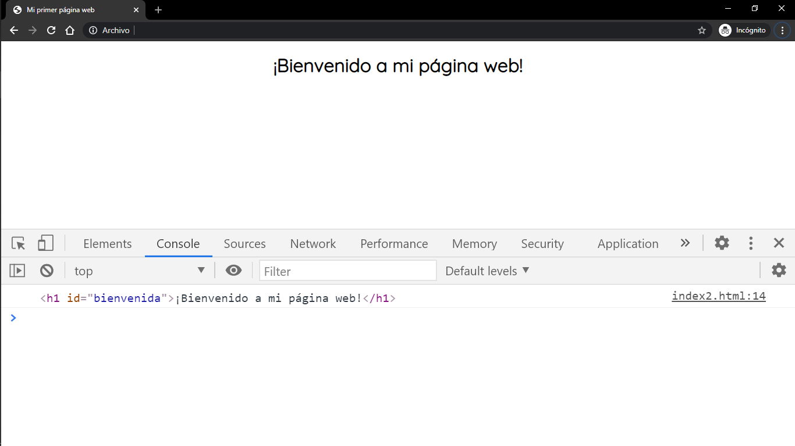
</p>

Como podemos ver al imprimirlo en la consola, obtenemos todo el elemento: la etiqueta de inicio y cierre, los atributos y el contenido.

##### Por clase

Utilizamos el método `getElementsByClassName` para obtener **todos** los elementos con una misma clase asignada.

Los objetos los recuperamos como una `HTMLCollection` que representa una colección genérica y podemos acceder a sus elementos utilizando índices, de la misma forma que a los elementos de un arreglo.

<p align="center">
    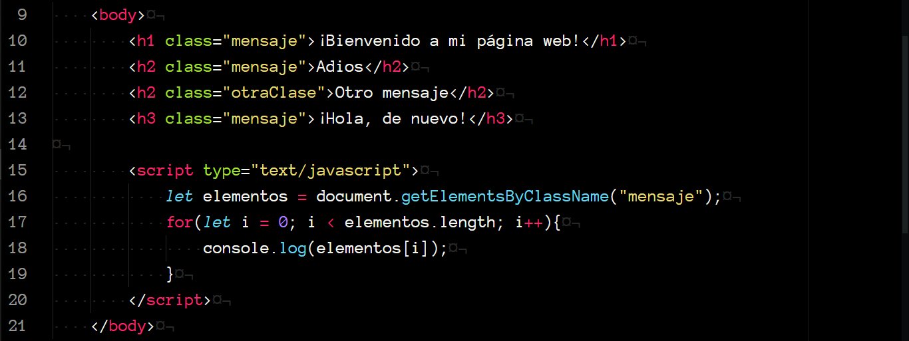
</p>

<p align="center">
    
</p>

Cuando utilizamos `document.getElementsByClassName()` estamos buscando los objetos en todo el documento, sin embargo, podemos llamar al método utilizando otro elemento (que no sea document), con lo que buscaríamos solamente dentro de los objetos hijos de dicho elemento.

Veamos un ejemplo:

<p align="center">
    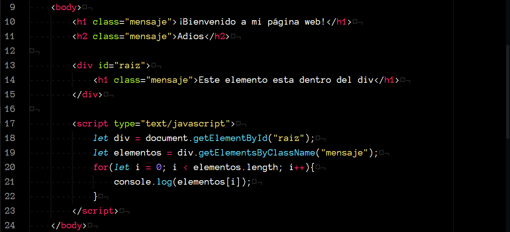
</p>

Aquí primero recuperamos el div con id `raiz`, y después, recuperamos todos los elementos con la clase `mensaje` que se encuentren dentro del div.

<p align="center">
    
</p>

Podemos ver que solo recuperamos el elemento con el mensaje "Este elemento esta dentro del div", a pesar de que hay otros 2 elementos con la misma clase, esto es porque solo recuperamos los elementos con la clase `mensaje` dentro del div.

##### Por etiqueta

Utilizamos el método `getElementsByTagName` para obtener **todos** los elementos con una misma etiqueta sin importar el id o clase que tengan asignados.

Al igual que con `getElementsByClassName`, recuperamos los elementos como una `HTMLCollection`.

<p align="center">
    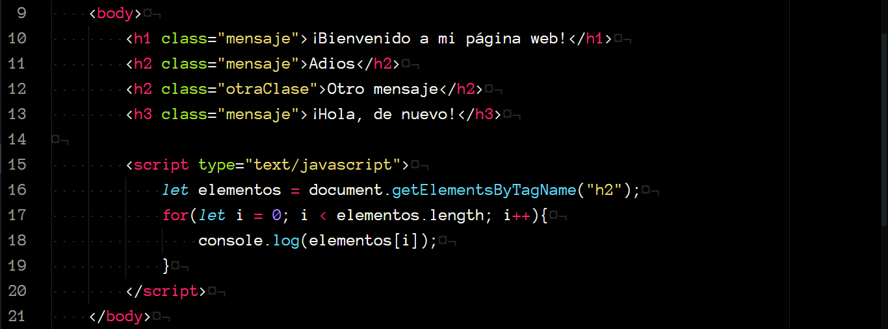
</p>

<p align="center">
    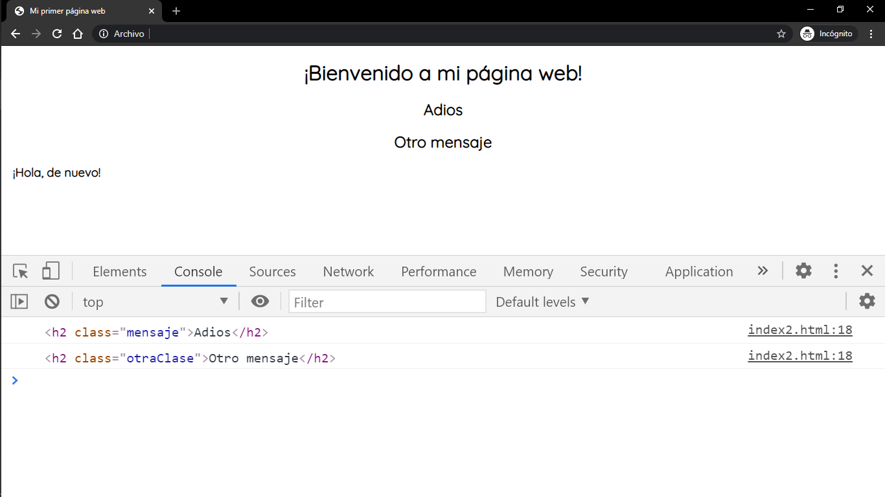
</p>

Al igual que con el caso  anterior, podemos utilizar un elemento en lugar de `document` para buscar todos los objetos con determinada etiqueta únicamente dentro de dicho elemento.


### Modificar elementos

Además de recuperar los elementos HTML, podemos modificar su contenido, sus atributos y su estilo de manera dinámica.

##### innerHTML

Esta propiedad nos permite recuperar o modificar el contenido HTML de un elemento.

Utilizando la sintaxis `elemento.innerHTML` nos devuelve el contenido HTML del elemento representado como una cadena.

<p align="center">
    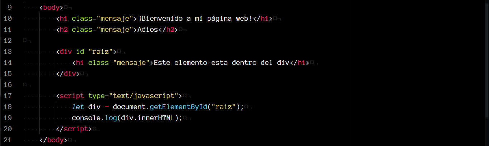
</p>

<p align="center">
    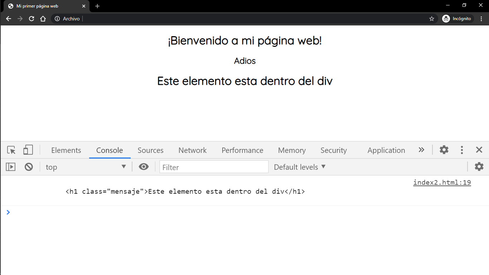
</p>

<br>

Por otro lado, utilizando el operador de asignación, podemos asignarle un nuevo contenido a un elemento HTML.

<p align="center">
    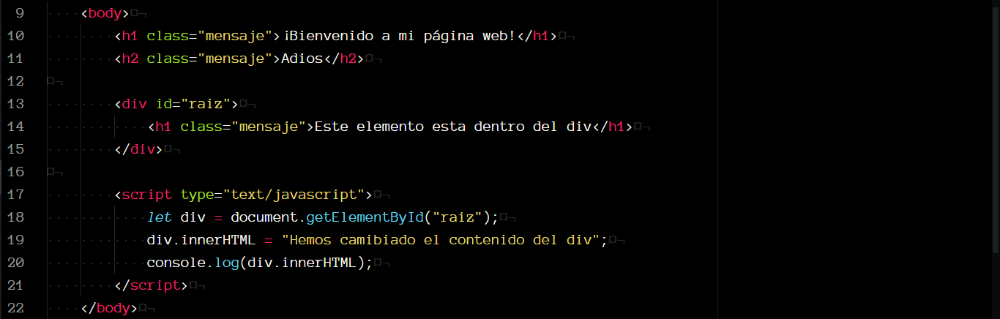
</p>

<p align="center">
    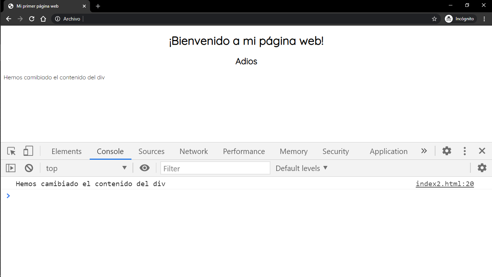
</p>


Como podemos ver al imprimir en la consola el contenido del `div`, el elemento `h1` que había dentro del `div` ha sido sustituido por la cadena `Hemos camibiado el contenido del div`;

Para que la nueva cadena aparezca también como un encabezado, debemos hacer lo siguiente:

<p align="center">
    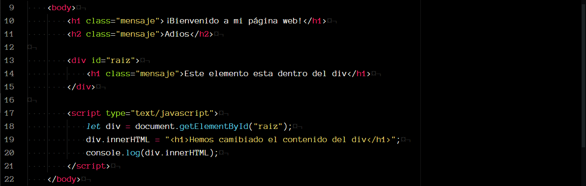
</p>

<p align="center">
    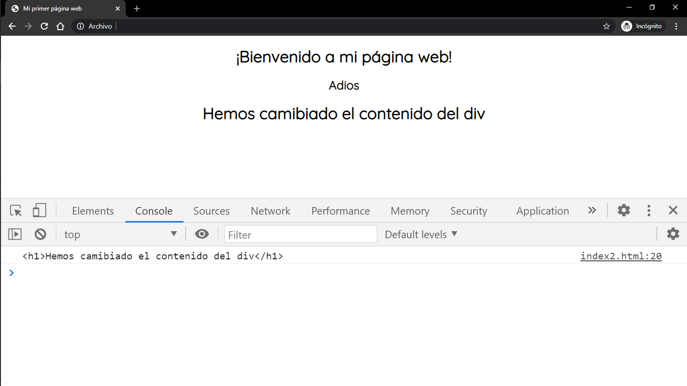
</p>

La propiedad `innerHTML` interpreta la cadena que le pasamos como HTML y no como texto plano, por eso, al agregar por ejemplo, las etiquetas de apertura y cierre para `<h1> </h1>`, el texto aparece en el sitio web como un encabezado.

Así podríamos, entonces, sustituir el contenido de nuestro `div` por una imagen, por ejemplo.

<p align="center">
    
</p>

<p align="center">
    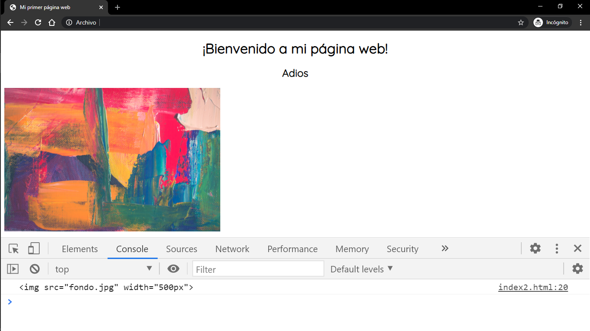
</p>


##### attribute

Utilizamos la propiedad de `atributo` para recuperar y/o modificar un atributo de un elemento HTML.

La sintaxis `elemento.atributo` nos permite recuperar el atributo especificado de un determinado elemento HTML.

<p align="center">
    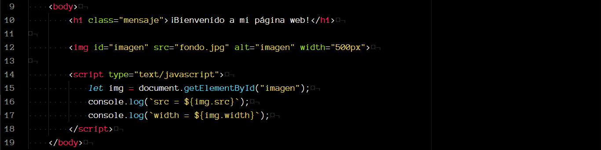
</p>

<p align="center">
    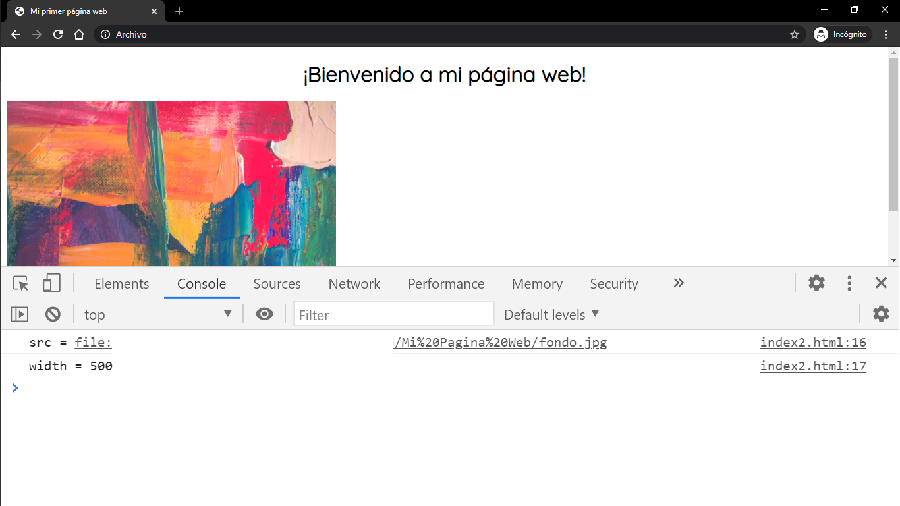
</p>

<br>

Al utilizar el operador de asignación, podemos asignarle un nuevo valor a un atributo.

<p align="center">
    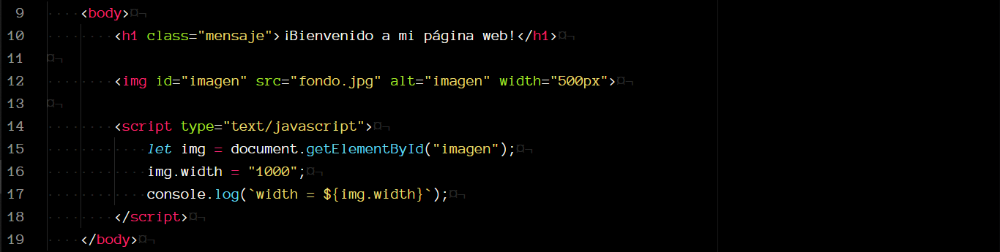
</p>

<p align="center">
    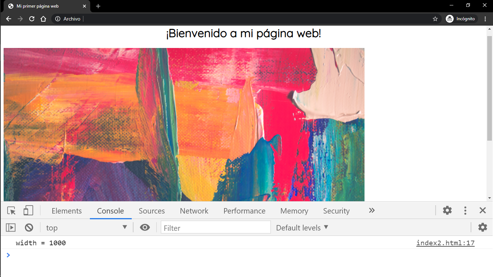
</p>

##### style.property

Utilizamos la propiedad `style.property` para asignar un nuevo estilo a un elemento HTML

<p align="center">
    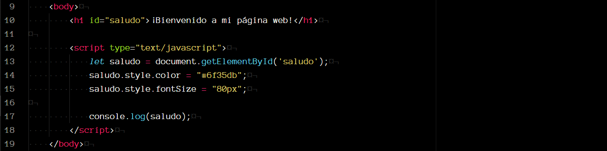
</p>

<p align="center">
    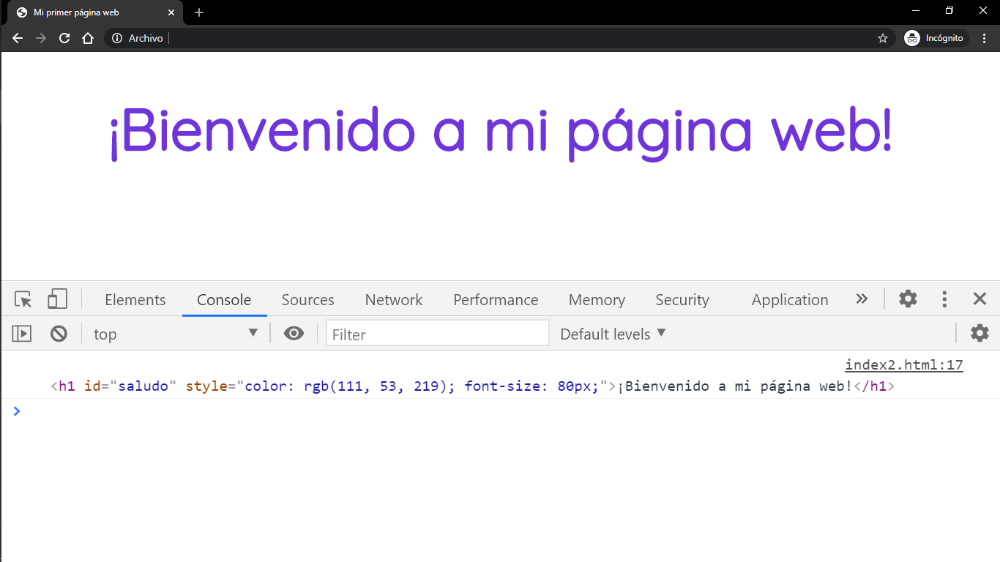
</p>

[Aquí](https://www.w3schools.com/jsref/dom_obj_style.asp) puedes consultar la lista con el nombre de todas las propiedas que puedes utilizar para dar estilo a los elementos HTML utilizando Javascript.
