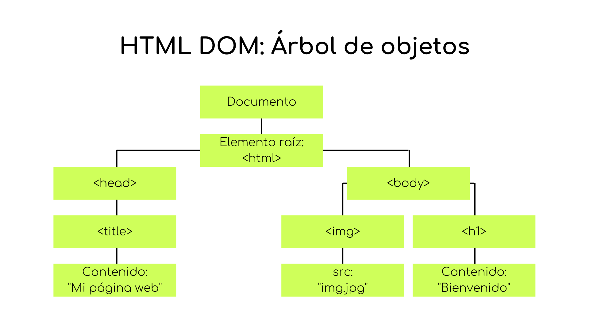

# Manipulación del DOM

Como mencionamos al comienzo del curso, el uso en conjunto de HTML, CSS y Javascript es lo que nos permite diseñar una página web que, no solo luzca bien, pero que también sea funcional. Entonces, ahora que hemos aprendido los conceptos básicos de los tres leguajes, es momento de integrarlos.

    

