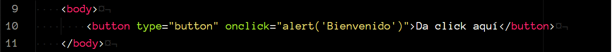
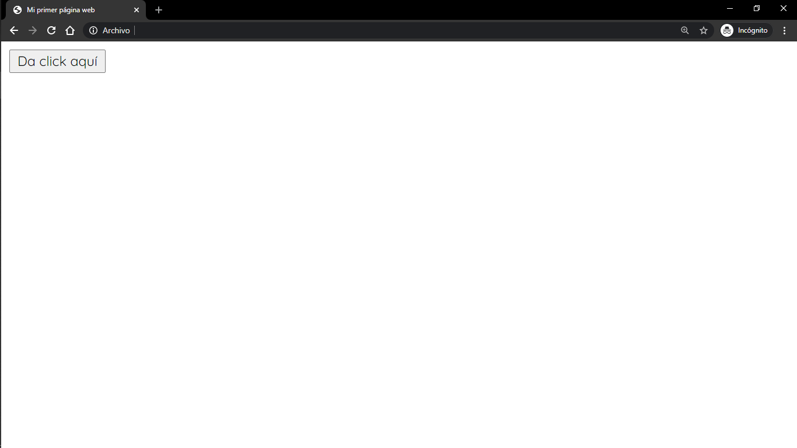
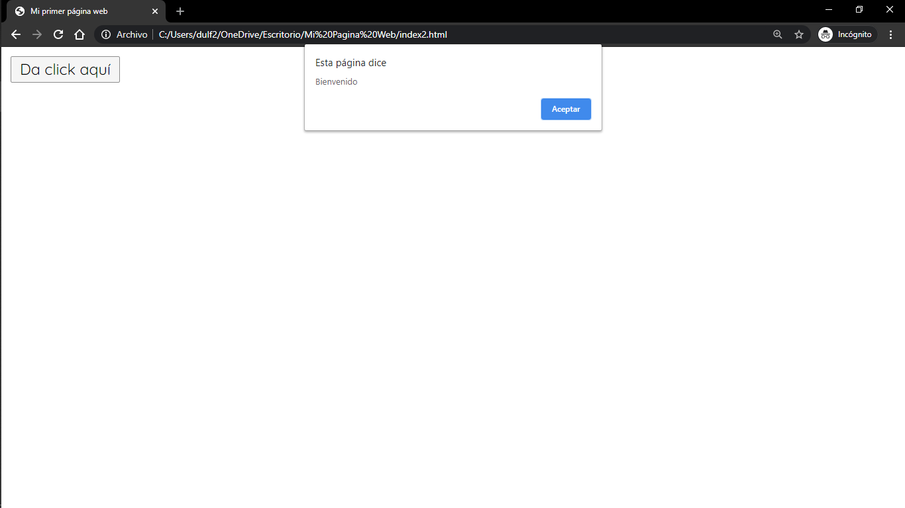
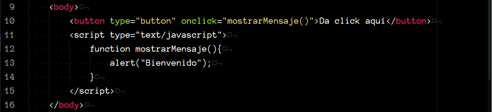
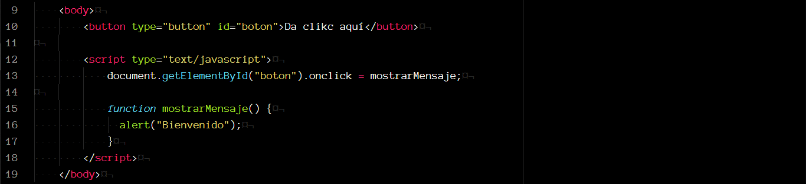
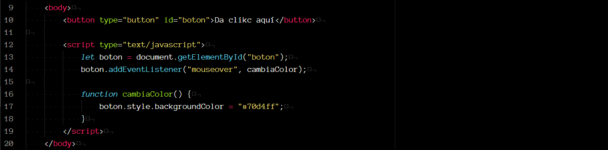

# Eventos

En HTML, un evento es *algo* que le sucede a un elemento y, cuando agregamos Javascript a nuestro sitio web, podemos utilizar funciones para reaccionar a estos eventos.

### Eventos HTML

Un evento en HTML puede ser algo que ocurra en el navegador o algo que haga el usuario, por ejemplo:

* Cuando una página ha terminado de cargarse.
* Cuando escribimos dentro de un campo.
* Cuando damos click a un botón.

Usualmente, cuando un evento sucede, queremos que el sitio web reaccione de alguna forma.

Utilizando Javascript podemos detectar cuado un evento sucede y reaccionar a él.

Comenzado por lo más sencillo, y volviendo a lo que aprendimos en la sección de HTML de este curso, podemos agregar el manejo de eventos como un atributo dentro de una etiqueta, en nuestro documento HTML. En este atributo podemos escribir código Javascript que se encargará de reaccionar a dicho evento.

Veamos un ejemplo:

<p align="center">
    
</p>

Aquí, creamos un botón, y utilizamos el evento `onclick()` para que, cuando el usuario de click sobre el botón, mostremos una alerta con el mensaje "Bienvenido".

<p align="center">
    
</p>

<p align="center">
    
</p>

Este ejemplo es únicamente para ilustrar el funcionamiento de los eventos, pero no se recomienda utilizar esta sintaxis, pues se considera una mala práctica de programación.

Otra forma de hacerlo, es llamando a una función definida en nuestro script.

<p align="center">
    
</p>


La tercera forma de hacerlo es utilizando el HTML DOM. Para esto, utilizamos Javascript.

<p align="center">
    
</p>

Recuperamos el elemento utilizando su `id` y le asignamos el evento como un atributo. Después, creamos la función que se encargará de reaccionar al evento.

#### Eventos HTML más comunes

Evento | Descripción
-------|------------
`onchange`|Cuando un elemento HTML ha cambiado.
`onclick`|Cuando el usuario da click sobre un elemento.
`onmouseover`|Cuando el usuario mueve el mouse sobre un elemento.
`onkeydown`|Cuando el usuario presiona una tecla.
`onload`|Cuando la página termina de cargarse.

[Aquí](https://www.w3schools.com/jsref/dom_obj_event.asp) puedes consultar una lista completa de los eventos HTML.

### Event Listeners

Un `event listener` (manejador de eventos) es un procedimiento en Javascript, que espera a que un evento ocurra para poder reaccionar a él.

#### addEventListener()
La función `addEventListener()` nos permite agregar un `event listener` a cualquier objeto del DOM HTML. Recibe como primer parámetro el evento que espera que ocurra y como segundo parámetro la función con la que reaccionará.

Podemos agregar un número ilimitado de `event listeners` a un mismo elemento. Y podemos agregar un número ilimitado para un mismo evento.

Se considera una mejor práctica de programación utilizar este método, pues así nos permite mantener separado es código Javascript del esqueleto HTML de nuestra página web.

Veamos un ejemplo:

<p align="center">
    
</p>

En este caso obtenemos el botón utilizando su `id`, y con el método `addEventListener()` le indicamos que, *cuando el mouse pase sobre el botón, se ejecutará la función `cambiaColor`*


#### removeEventListener()
El métodod `removeEventListener()` no permite eliminar manejadores de eventos que fueron agregados a un elemento Utilizando el método `addEventListener()`.

El método debe recibir los mismos parámetros que recibió el método que creo el `event listener`.

```javascript
element.removeEventListener("mouseover" cambiaColor);
```


### Event bubbling y capturing

Existen dos formas en que se *propagan* los eventos en el HTML DOM.

La propagación de eventos se refiere al orden en que los eventos ocurren cuando hay varios elementos anidados en el documento HTML. Esto es:

```html
<div id="div1">
    <div id="div2">
        <h1></h1>
    </div>
</div>
```

Supongamos que tenemos este esqueleto y que tanto `div1` como `div2` tienen manejadores de eventos asignados, así como el encabezado `h1`. La propagación de eventos nos permite determinar en que order se manejaran los eventos de estos elementos.

El método `addEventListener()` puede recibir un tercer parámetro, booleano, si es `true` determina que se utilizara `capturing` para propagar el evento, o `bubbling` caso contrario.

#### Bubbling

Determina que el evento más interno será manejado primero.

En nuestro ejemplo, primero se manejaría el evento de `h1`, después el de `div2` y al final el de `div1`.

#### Capturing

Al contario de `bubbling` determina que el evento del elemento más externo será manejado primero; primero se manejaría el evento de `div1`, después el de `div2` y al final el de `h1`.
