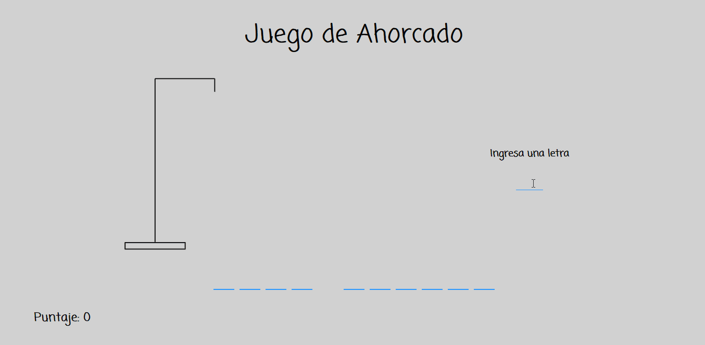
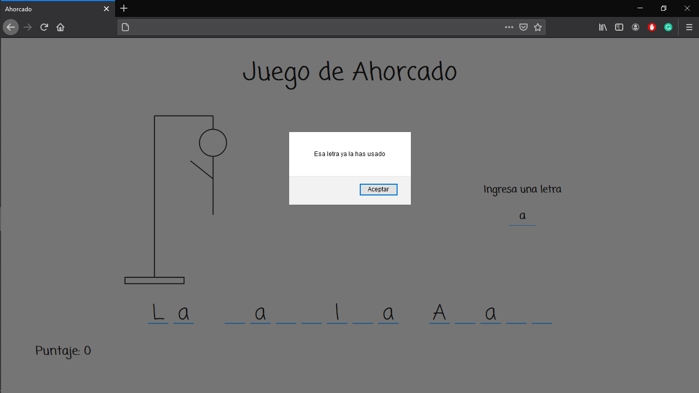
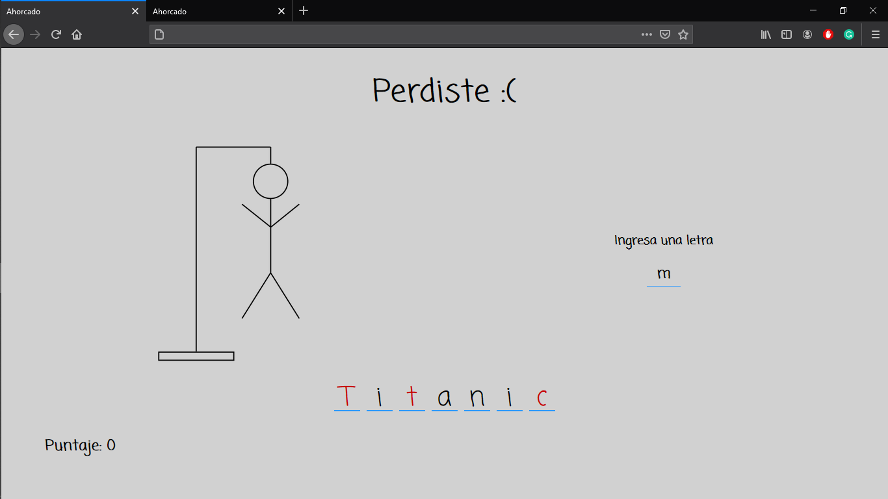
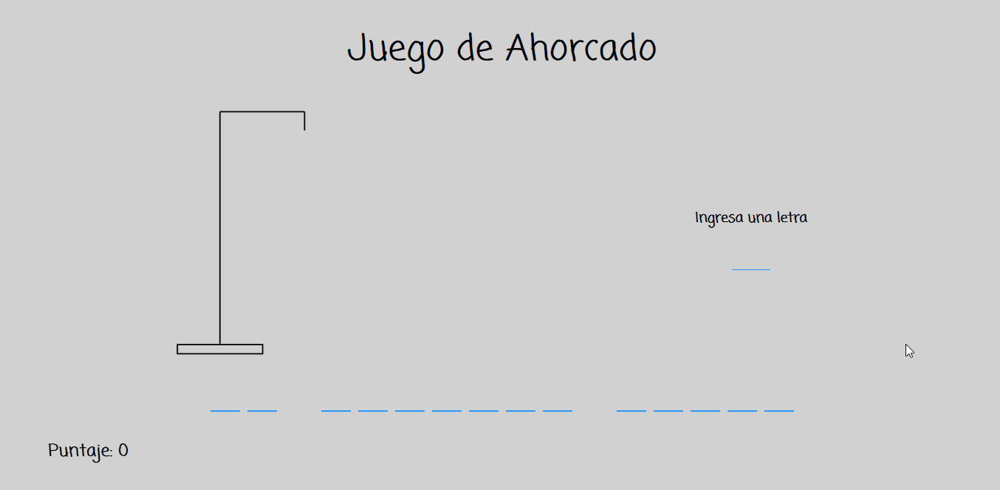

# Ejemplo

Ahora, veremos un ejemplo donde aplicaremos todo lo que hemos aprendido en el curso. Para esto, crearemos un Juego de Ahorcado.

<p align="center">
    
</p>

Veremos el paso a paso para escribir el código HTML, CSS y JS que necesitaremos para nuestro sitio web.

Para que nuestro juego funcione correctamente, hay muchos elementos que crearemos dinámicamente, utilizando Javascript. Sin embargo, para comenzar, debemos crear el documento HTML que contendrá la estructura base de nuestro sitio web. Lo llamaremos `index.html`

```html
<!DOCTYPE html>
<html lang="en" dir="ltr">
    <head>
        <meta charset="utf-8">
        <title></title>
    </head>
    <body>

    </body>
</html>
```

Empezamos por darle un título a nuestro sitio web, por ejemplo; *Ahorcado*.

```html
<title>Ahorcado</title>
```

Para construir el esqueleto de nuestro sitio web, podemos pensarlo de la siguiente forma:

<p align="center">
    
</p>

Podemos pensar que cada rectángulo representa un contenedor, esto nos ayudará a acomodar más fácilmente el contenido del sitio cuando utilicemos la hoja de estilos.

Entonces, nuestro documento HTML se vería así:

```html
<body>
    <h1 id="titulo">Juego de Ahorcado</h1>
    <div class="contenedor-dividido">
        <div class="division contenedor-imagen">

        </div>
        <div class="division contenedor-letras">

        </div>
    </div>
    <div class="contenedor-palabra"></div>
    <div class="contenedor-puntaje"></div>
</body>
```

Recordemos que de esta forma
`<div class="division contenedor-letras">` le asignamos a un mismo `div` dos clases diferentes.

Ya que tenemos el esqueleto del documento, podemos agregar la imagen que aparecerá al comienzo del juego. Para facilitar el código, tendremos una imagen por cada vez que el jugador seleccione una letra incorrecta, y las nombraremos `1`, `2`, `3`, etc.

[Imagenes](Ahorcado/img)

Entonces, agregaremos la primer imagen dentro del div `contenedor-imagen`

```html
<div class="division contenedor-imagen">
    
</div>
```

Podemos agregar también el mensaje *Ingresa una letra* y *Puntaje:  0*; que se mostrará así inicialmente, pero que modificaremos mas adelante utilizando Javascript.

```html
<div class="division contenedor-letras">
    <h3>Ingresa una letra</h3>
</div>
```

```html
<div class="contenedor-puntaje">
    Puntaje: 0
</div>
```

Además de esto, necesitamos crear la entrada de texto, donde el usuario ingresará cada letra. Para esto, utilizaremos la etiqueta `<input>` con `type=text`.

```html
<div class="division contenedor-letras">
    <h3>Ingresa una letra</h3>
    <input type="text" id="entrada-letra">
</div>
```

Hasta ahora, nuestro documento HTML luce de la siguiente forma:

```html
<!DOCTYPE html>
<html lang="en" dir="ltr">
    <head>
        <meta charset="utf-8">
        <title>Ahorcado</title>
    </head>
    <body>
        <h1 id="titulo">Juego de Ahorcado</h1>
        <div class="contenedor-dividido">
            <div class="division contenedor-imagen">
                
            </div>
            <div class="division contenedor-letras">
                <h3>Ingresa una letra</h3>
                <input type="text" id="entrada-letra">
            </div>
        </div>
        <div class="contenedor-palabra"></div>
        <div class="contenedor-puntaje">
            Puntaje: 0
        </div>
    </body>
</html>

```
Para terminar con el archivo HTML, solo nos falta agregar nuestros archivos `.css` y `.js`, que utilizaremos de forma externa. Además, utilizaremos una fuente de [Google fonts](https://fonts.google.com/), para que el sitio luzca mejor.

Entonces, empezamos por agregar el documento `.css` y la liga a la fuente en Google fonts que más nos guste.

```html
<head>
    <meta charset="utf-8">
    <title>Ahorcado</title>
    <link rel="stylesheet" href="css/style.css">
    <link href="https://fonts.googleapis.com/css2?family=Coming+Soon&display=swap" rel="stylesheet">
</head>
```

Por último, agregamos nuestro documento `.js`, justo antes de cerrar la etiqueta `<body>`.

```html
<script type="text/javascript" src="js/script.js"></script>
```

Hasta ahora, nuestro sitio web luce así:

<p align="center">
    
    
</p>

Ahora, vamos a comenzar con la hoja de estilos. Como mencionábamos arriba, muchos de los elementos de nuestro sitio web vamos a agregarlos dinámicamente usando Javascript, pero por ahora, podemos comenzar a escribir nuestro archivo `.css` para los elementos que creamos en el documento `html`.

En nuestro `index.html`, creamos una etiqueta `<link>` para la hoja de estilos externa, donde le dimos el nombre de `style.css`. Entonces, en la carpeta de nuestro proyecto, vamos a crear una nueva carpeta `css`, y dentro de ella, un documento `style.css`.

Para comenzar, vamos a darle a nuestro sitio un color de fondo. Utilizamos el selector `html`, para seleccionar todo el espacio de nuestro navegador.

```css
html{
    background-color: #d1d1d1
}
```

También, vamos a establecer el tipo de fuente. En nuestro caso, vamos a utilizar el mismo tipo de fuente para todo el sitio, por lo que vamos a utilizar un selector especial; `*`. El asterisco nos permite seleccionar todos los elementos de nuestro sitio web.

```css
*{
    font-family: 'Coming Soon', cursive;
}
```

También, vamos a establecer el estilo de los encabezados. Específicamente de `h1`. Como es el título de nuestro sitio, vamos a colocarlo en el centro de la página, y vamos a cambiar su tamaño de fuente, para hacerlo un poco más grande.
```css
h1{
    text-align: center;
    font-size: 3.5vw;
}
```

Recordemos que las unidades `vw`, nos permiten que el tamaño de fuente sea proporcional al tamaño de la ventana del navegador.

Ahora, vamos a distribuir los contenedores dentro de nuestro sitio web.

Vamos a comenzar con el contenedor `contenedor-dividido`. Dentro de este contenedor definimos dos contenedores más, que, como ilustramos en la imagen, queremos acomodar cada uno en una mitad (horizontalmente) de la página. Para esto, vamos a darle al `contenedor-dividido` la propiedad `flexbox`, que recordemos, nos permite distribuir los elementos dentro del contenedor de la siguiente forma:

<p align="center">
    
</p>

Como podemos ver, el contenedor `contenedor-imagen` es mucho más alto que el contenedor `contenedor-letras`, entonces, además, queremos que ambos contenedores estén centrados verticalmente. Para esto, utilizamos la propiedad `align-items: center`.

<p align="center">
    
</p>

```css
.contenedor-dividido{
    display: flex;
    align-items: center;
}
```

<p align="center">
    
</p>

Podemos ver que ambos contenedores se encuentran alineados lado a lados y centrados verticalmente, sin embargo, la imagen aún es demasiado grande.

Entonces, vamos a modificar el estilo del contenedor `contenedor-imagen`.

Para empezar, vamos a cambiar sus dimensiones, pues, como mencionamos arriba, queremos que cada contenedor ocupe la mitad del la página.

```css
.contenedor-imagen{
    width: 50%;
}
```

Ahora que definimos las dimensiones del contenedores, queremos centar la imagen en su interior, para esto tambien utilizaremos `flexbox`.

```css
.contenedor-imagen{
    width: 50%;
    display: flex;
    justify-content: center;
}
```

Por último, vamos a modificar las dimensiones de la imagen, pues aún es demasiado grande para nuestro sitio.


```css
#imagen{
    width: 40%;
}
```

Hasta ahora, nuestra página web luce así:

<p align="center">
    
</p>

Ahora, debemos acomodar el contenedor `contenedor-letras`. De la misma forma, queremos que el contenedor ocupe la mitad del página. Además, y a diferencia del `contenedor-imagen` que solo contiene el elemento `img`, aquí tenemos dos elementos, un `h3` y un `input`. Queremos centrar ambos elementos dentro del contenedor y que además, se muestre cada uno en una línea independiente. Para esto también usaremos `flexbox`.

```css
.contenedor-letras{
    width: 50%;
    display: flex;
}
```

Recordemos que, al asignarle al contenedor la propiedad `display: flex`, sus elementos automáticamente se muestran uno al lado del otro. Para cambiar esto utilizamos `flex-direction: column`, que hace que los elementos se muestren uno sobre otro.

```css
.contenedor-letras{
    width: 50%;
    display: flex;
    flex-direction: column;
    align-items: center;
}
```

Al encabezado `h3` vamos a cambiarle el tamaño de fuente para hacerlo más grande.

```css
h3{
    font-size: 1.7vw;
}
```

Vamos a modificar también el elemento `input`, que utilizaremos para que el jugador pueda ingresar una letra para adivinar. Entonces, queremos en la caja de texto sea más pequeña, del tamaño suficiente para una letra, y además, vamos a darle un estilo similar al del resto de la página.

```css
#entrada-letra{
    border: none;
    border-bottom: 1px solid #2b99ff;
    outline: none;
    width: 50px;
    text-align: center;
    font-size: 1.6vw;
    background-color: inherit;
    font-weight: bold;
}
```

Los estilos para el contenedor `contenedor-palabra` los dejaremos para más adelante, cuando tengamos el código de Javascript.

Entonces, solo nos falta el contenedor `contenedor-puntaje`. Para este contenedor, solamente vamos a modificar la fuente; vamos a hacerla más grade y negrita. Además, vamos a darle un margen, para que el mensaje no aparezca tan pagado al borde la página.

```css
.contenedor-puntaje{
    font-size: 1.7vw;
    font-weight: bold;
    margin: 30px 60px;
}
```

Así luce nuestra página hasta ahora:

<p align="center">
    
</p>

Aún debemos agregar las casillas donde irán las palabras que el jugador deberá adivinar, así como todo el funcionamiento del juego, y para esto vamos a utilizar Javascript.

Entonces, en la carpeta de nuestro proyecto, vamos a crear una nueva carpeta `js`, y dentro, vamos a crear el documento `script.js`, que es el nombre que le dimos a nuestro archivo en la etiqueta `<script>` en le documento `html`.

Para comenzar, vamos a crear un arreglo como una variable global, que es donde almacenaremos todas las palabras que el jugador podría adivinar durante el juego. En una implementación más avanzada podríamos utilizar un método diferente, como una base de datos pequeña, sin embargo por ahora y para no salirnos del alcance de este curso, utilizaremos arreglos.

En este ejemplo nuestro juego de ahorcado consistirá en adivinar películas, por lo que nuestro arreglo contendrá nombres de películas, cada uno representado como una cadena.

```javascript
const peliculas = ["Titanic", "Cenicienta", "Avatar", "Joker", "Toy Story", "Avengers", "Cars", "Batman Inicia", "Baby Driver", "Shrek", "Lalaland", "Monsters Inc", "El Padrino", "Mulan", "Megamente", "Iron Man", "Enredados", "La Familia Adams", "Interestelar"];
```

Crearemos además 5 variable globales que necesitaremos más adelante.

```javascript
let letras = [];
let intentos = 1;
let letrasUsadas = [];
let letrasFaltantes = 0;
let puntaje = 0;
```

Nuestra primera función será la función que iniciará el juego. Para comenzar el juego debemos seleccionar, aleatoriamente, un título de nuestro arreglo, para el que después crearemos las casillas correspondientes a cada letra.

Lo que haremos será crear una variable, donde almacenaremos un número aleatorio, correspondiente a un índice de nuestro arreglo.

```javascript
function comenzarJuego(){
    const indice = Math.floor(Math.random() * peliculas.length);
}
```
La función [`Math.random`](https://developer.mozilla.org/es/docs/Web/JavaScript/Referencia/Objetos_globales/Math/random) genera un número aleatorio en rango `[0, 1)`. Y la función [`Math.floor`](https://developer.mozilla.org/es/docs/Web/JavaScript/Referencia/Objetos_globales/Math/floor) nos permite obtener solamente números enteros, pues devuelve el entero inmediato que sea menor o igual al valor que recibe.

Después vamos a llamar a una función que se encargará de crear las casillas correspondientes a cada letra. Para hacer esto, la función necesita conocer el título de la película, por lo que vamos a pasarle el valor del arreglo almacenado en `indice` como un parámetro. A esta función la llamaremos `nuevaPalabra`.

```javascript
function comenzarJuego(){
    const indice = Math.floor(Math.random() * peliculas.length);
    nuevaPalabra(peliculas[indice]);
}
```

Vamos, entonces, a crear la función `nuevaPalabra`. Para empezar, vamos a separar la cadena que recibimos como parámetro en letras (y espacios, si es que la cadena está formada por más de dos palabras), así nos será más fácil crear una casilla para cada letra. Este arreglo será nuestra variable global `letras`.

```javascript
function nuevaPalabra(cadena){
    letras = Array.from(cadena).
}
```

El método [`Array.from`](https://developer.mozilla.org/es/docs/Web/JavaScript/Referencia/Objetos_globales/Array/from) nos permite crear un arreglo a partir de una cadena, por ejemplo, iterando sobre está creando una entrada en el arreglo con cada uno de sus elementos, en nuestro caso, con cada letra y espacio en la cadena.

Entonces, si tenemos por ejemplo la cadena *Titanic*, nuestro arreglo quedaría:

```javascript
letras = ["T", "i", "t", "a", "n", "i", "c"];
```

Y si nuestra cadena tuviera más de una palabra, por ejemplo *El gran Gatsby*:

```javascript
letras = ["E", "l", " ", "g", "r", "a", "n", " ", "G", "a", "t", "s", "b", "y"];
```

Ahora, para saber cuales son las letras que el jugador ha adivinado, usaremos el contador auxiliar, `letrasFaltantes`, que contara el total de letras que faltan por adivinar. Al inicio del juego `letrasFaltantes` será igual al número de letras en la cadena (sin contar espacios), y, cada vez que el jugador adivine una letras correctamente, le restaremos a `letrasFaltantes` el número de veces que dicha letra aparece en la cadena.

Entonces, ahora que tenemos nuestra cadena separada en letras en el arreglo `letras`, vamos a incrementar en 1 `letrasFaltantes` por cada letra en el arreglo.

```javascript
function nuevaPalabra(cadena){
    letras = Array.from(cadena);

    //Para cada letra en el arreglo letras, si letra es distinta de " ", incrementamos en 1 letrasFaltantes.
    letras.forEach(letra => {
        if(letra !== " ")
            letrasFaltantes++;
    });
}
```

Hasta este momento, sabemos que letras componen la cadena y cuantas letras debe adivinar el jugador. Entonces, vamos a colocar en el sitio las casillas correspondientes a dichas letras.

Recordemos que, para agregar elementos utilizando el DOM, necesitamos obtener el elemento que será el *padre* de estos elementos. En nuestro caso será el div `contenedor-palabra`.

```javascript
function nuevaPalabra(cadena){
    letras = Array.from(cadena);

    //Para cada letra en el arreglo letras, si letra es distinta de " ", incrementamos en 1 letrasFaltantes.
    letras.forEach(letra => {
        if(letra !== " ")
            letrasFaltantes++;
    });

    //Obtenemos el contenedor donde irán las casillas.
    let contenedor = document.getElementsByClassName("contenedor-palabra");

    //Por cada letra en el arreglo creamos una casilla con la clase "palabra".
    letras.forEach(letra => {
        let casilla = document.createElement("div");
        //Si hay un espacio creamos un div con la clase "espacio".
        if(letra === " ")
            //Le asignamos dos clases al elemento.
            casilla.setAttribute("class", "palabra espacio");

        //En otro caso creamos el div con la clase "letra".
        else
            //Le asignamos dos clases al elemento.
            casilla.setAttribute("class", "palabra letra");
        contenedor[0].appendChild(casilla);
    });
}
```

Para comprobar que las funciones que hemos escrito hasta ahora funcionan correctamente, podemos agregar una llamada a la función `comenzarJuego()` al final de nuestro archivo `script.js`, y abrir nuestro sitio web, `index.html` en el navegador.

<p align="center">
    
</p>

Aparentemente nuestro sitio luce exactamente igual.

Vamos a acceder a las *Herramientas del desarrollador* (`ctrl + shift + i`).

<p align="center">
    
</p>

Podemos ver que en la sección superior de la ventana aparece el código en nuestro documento `html`. Pero, si seleccionamos el div `contenedor-palabra` para mostrar su contenido, veremos que ya no está vacío; ahora, aparecen los div `espacio` y `letra` que creamos en la función `nuevaPalabra()`.

<p align="center">
    
</p>

Sin embargo, como todos estos nuevos contenedores están vacíos, por defecto no son visibles en nuestro sitio web. Entonces, vamos a volver a nuestra hoja de estilos para cambiar eso.

Cuando creamos los contenedores en la función `nuevaPalabra()`, creamos dos tipos distintos, uno para las letras y otro para los espacios, cuando tenemos más de dos palabras. Queremos que ambos tipos de contenedores sean del mismo tamaño, y, para los contenedores `letra`, resaltaremos el borde inferior, así aparecerán como una raya por cada letra que el jugador debe adivinar; y cuando adivine una letra correctamente, esta aparecerá sobre la raya correspondiente (realmente estará dentro del contenedor). Por otro lado los contenedores `espacio` no serán visibles en la página, pero servirán para separa equitativamente las palabras.

Para empezar, queremos que la palabra, o palabras a adivinar aparezcan centradas en la pantalla. Para esto, vamos a utilizar `flexbox` en el contenedor `contenedor-palabra`, que es el que contiene a todos los contenedores `letra` y `espacio`.

```css
.contenedor-palabra{
    display: flex;
    flex-wrap: wrap;
    justify-content: center;
    margin-top: 25px;
}

```


Le asignamos un margen superior de 25px para darle un poco de espacio con respecto a la imagen.

Ahora, vamos darle a los dos tipos de contenedores el mismo tamaño.

```css
.letra, .espacio{
    width: 40px;
    height: 30px;
    margin: 5px;
}
```

En las hojas de estilo, si utilizamos más de dos selectores, separados por una coma, las propiedades que les asignemos se aplicarán a todos los elementos correspondientes a ambos selectores.

Ahora, vamos a cambiar el estilo únicamente de los contenedores `letra`. Como mencionamos, vamos a resaltar el borde inferior, además vamos a cambiar el tamaño de fuente y vamos a centrar su contenido, para que, cuando el jugador adivine una letra, esta aparezca alineada sobre la raya correspondiente.

```css
.letra{
    border-bottom: 2px solid #2b99ff;
    padding-bottom: 3px;
    font-size: 3vw;
    display: flex;
    justify-content: center;
    align-items: center;
}
```

Así es como luce nuestra página web ahora.

<p align="center">
    
</p>

Ahora, necesitamos escribir una función que detecte cuando el jugador ingresa una letra en el campo `input`, y además, debemos validar que sea una letra, no aceptaremos números o símbolos.

Llamaremos a nuestra función `letraSeleccionada()`.

Antes de comenzar a escribir nuestra función, vamos a agregar una llamada a la misma dentro de la función `comenzar()`, pues además de crear las casillas para la palabra a adivinar en cuento comience el juego, también queremos que nuestro sitio este listo para recibir las letras que desee ingresar el usuario.

```javascript
function comenzarJuego(){
    const indice = Math.floor(Math.random() * peliculas.length);
    nuevaPalabra(peliculas[indice]);
    letraSeleccionada();
}
```

Utilizaremos una expresión regular para validar que el usuario ingrese una letra válida, ya sea mayúscula o minúscula, si el usuario ingresa un número u otro carácter especial simplemente vamos a ignorarlo.

```javascript
function letraSeleccionada(){
    //Esta expresión regular acepta letras mayúsculas, minúsculas y con acentos.
    let letraValida = /^[A-Za-zÁ-ú]+$/;

    //Obtenemos el elemento input
    let input = document.getElementById("entrada-letra");
}
```

Después de obtener el elemento `input`, vamos a agregarle un `event listener` que reaccionara cuando el usuario ingrese una letra en el campo. La función del evento se encargara de obtener la entrada del usuario y compararla con la expresión regular, para validarla. Si la entrada es una letra, llamará a otra función que se encargará de comprobar si la letra es parte de la palabra que el jugador debe adivinar o no.

```javascript
function letraSeleccionada(){
    //Esta expresión regular acepta letras mayúsculas, minúsculas y con acentos.
    let letraValida = /^[A-Za-zÁ-ú]+$/;

    //Obtenemos el elemento input
    let input = document.getElementById("entrada-letra");

    input.addEventListener("input", (e) => {
        //El atributo e.data nos permite obtener el texto ingresado por el usuario.
        let letra = e.data;
        //Verificamos que la entrada del usuario sea aceptada por la expresión regular.
        if(letra.match(letraValida)){
            //Si es así, llamamos a la función encargada de continuar con el juego
            letraIngresada(letra);
        }
        //Si no es una letra válida, no hacemos nada.
    });
}
```

Después de ingresar una letra, ya sea correcta o incorrecta, queremos que el jugador pueda seguir ingresado letras nuevas hasta que termine el juego. Para esto necesitamos borrar del campo `input` la letra ingresada previamente. Utilizaremos el atributo `value` que nos permite acceder al valor en el campo, y le asignaremos una cadena vacía `""`.

Sin embargo, si hiciéramos solo esto, la entrada del usuario desaparecería inmediatamente. Eso no esta mal, pues la función haría su trabajo; obtendría la entrada, validaría que sea una letra y continuaría con el juego, sin embargo, para que luzca un poco más estético, vamos a dejar que la letra ingresada por el usuario aparezca por un momento antes de limpiar el campo de entrada. Para lograr esto, vamos a usar el método [`setTimeout()`](https://www.w3schools.com/jsref/met_win_settimeout.asp), que recibe como parámetro una función y la cantidad de tiempo (en milisengundos), que deberá esperar para ejecutar dicha función.

```javascript
function letraSeleccionada(){
    //Esta expresión regular acepta letras mayúsculas, minúsculas y con acentos.
    let letraValida = /^[A-Za-zÁ-ú]+$/;

    //Obtenemos el elemento input
    let input = document.getElementById("entrada-letra");

    input.addEventListener("input", (e) => {
        //El atributo e.data nos permite obtener el texto ingresado por el usuario.
        let letra = e.data;
        //Verificamos que la entrada del usuario sea aceptada por la expresión regular.
        if(letra.match(letraValida)){
            //Si es así, llamamos a la función encargada de continuar con el juego
            letraIngresada(letra);
        }
        //Si no es una letra válida, no hacemos nada.

        //Vamos a limpiar el campo de entrada después de 300 milisengundos.
        setTimeout(() => {input.value="";},300);
    });
}
```

Ahora, vamos a escribir la función `letraIngresada()` que, como mencionamos, se encargará de verificar si la letra ingresada por el usuario está o no en la palabra de debe adivinar.

Al inicio del documento creamos 5 variables globales, una de ellas fue el arreglo `letrasUsadas`; vamos a utilizarlo ahora. Lo primero que hara nuestra función será verificar que la letra que recibe como parámetro no este en el arreglo, `letrasUsadas`, si está significa que el usuario ya ha usado esa letra antes, por lo que mostraremos una alerta, y si no, agregaremos la letra al arreglo y verificamos si es o no una letra correcta.

```javascript
function letraIngresada(letra){
    //Si la letra ya fue utilizada muestra una alerta.
    if(letrasUsadas.includes(letra))
        alert("Esa letra ya la has usado");
    //En otro caso verifica si la letra ingresada es correcta.
    else{
        if(incluyeLetra(letra))
            letraCorrecta(letra);
        else
            letraIncorrecta();
        //Agregamos la letra utilizada al arreglo.
        letrasUsadas.push(letra);
    }
}
```

Aquí, hemos utilizado 3 nuevas funciones. Vamos a comenzar con `incluyeLetra()`.

Podríamos utilizar el método `includes()` de arreglos para verificar si `letra` está en el arreglo `letras` (donde tenemos dividida en letras la palabra a adivinar), sin embargo, para hacer más amigable el juego, queremos que, si el jugador ingresa una letra minúscula, el programa busque coincidencias tanto para letras mayúsculas como minúsculas, y viceversa. Entonces, vamos a crear nuestro propia modificación del método `includes()`.

```javascript
function incluyeLetra(letra){
    //En cuanto encuentra la primer ocurrencia de letra en el arreglo letras (ya sea mayúscula o minúscula) devuelve true.
    let n = 0;
    while(n < letras.length){
        if(letras[n] == letra || letras[n] == letra.toUpperCase())
            return true;

        n++;
    }
    //Si no encontró ninguna, devuelve false.
    return false;
}
```

Si la letra ingresada por el usuario si es una letra correcta se ejecutará la función `letraCorrecta()`.

Si la letra es correcta, necesitamos encontrar en el arreglo `letras` todas la veces que esta aparece, y recuperar sus posiciones. Para esto, vamos a crear un arreglo donde guardaremos los índices del arreglo `letras` donde aparezca la letra.

```javascript
function letraCorrecta(letra){
    let indices = getIndices(letra)
}

function getIndices(letra){
    let indices = [];

    for(let i = 0; i < letras.length; i++){
        //Para la letra en la posición i, si es igual a la letra ingresada por el usuario, agregamos el índice a i al arreglo.
        if(letras[i] === letra || letras[i] === letra.toUpperCase())
            indices.push(i);
    }

    return indices;
}
```

Ahora, debemos restar a la variable `letrasFaltantes` el número de veces que aparece la letra en la palabra.

```javascript
function letraCorrecta(letra){
    let indices = getIndices(letra)
    letrasFaltantes -= indices.length;
}
```

Ahora, recordemos que al recuperar un elemento del DOM utilizando su clase, obtenemos una colección iterable de objetos. Así, que, al recuperar los elementos de la clase `palabra` (las casillas que representan cada letra de la palabra), obtendremos una colección iterable, que es precisamente de la misma longitud que nuestro arreglo `letras`.

```javascript
function letraCorrecta(letra){
    let indices = getIndices(letra)
    letrasFaltantes -= indices.length;
    let casillas = document.getElementsByClassName("palabra");
}
```

Ahora, utilizando los índices en nustro arreglo `indices`, vamos a acceder a cada posición en la colección `casillas`, y vamos a crear un elemento que contenga a la letra, de modo que aparezca en nuestro sitio web.

```javascript
function letraCorrecta(letra){
    let indices = getIndices(letra)
    letrasFaltantes -= indices.length;
    let casillas = document.getElementsByClassName("palabra");
    for(let i = 0; i < indices.length; i++){
        let casilla = casillas[indices[i]];
        let texto = document.createTextNode(letras[indices[i]]);
        casilla.appendChild(texto);
    }
}
```

Por último, debemos checar si la variable letras faltantes es igual a 0, si es así, esto significa que no hay más letras por adivinar y el jugador ha ganado el juego.

```javascript
function letraCorrecta(letra){
    let indices = getIndices(letra)
    letrasFaltantes -= indices.length;
    let casillas = document.getElementsByClassName("palabra");
    for(let i = 0; i < indices.length; i++){
        let casilla = casillas[indices[i]];
        let texto = document.createTextNode(letras[indices[i]]);
        casilla.appendChild(texto);
    }

    if(letrasFaltantes == 0)
        ganar();
}
```

Si accedemos a nuestro sitio web podremos ver que, al seleccionar una letra correcta, está se mostrara en las posiciones correctas en la palabra a adivinar.

<p align="center">
    
</p>

Ahora, vamos a crear la función para el caso contrario; cuando el jugador ingresa una letra incorrecta.

Para comenzar, definimos al inicio de nuestro código una variable intentos. Además de utilizarla como un contador de los intentos del jugador, la usaremos para saber que imagen mostrar (recordemos que nombramos nuestras imágenes con números del 1 al 7, y estas irán cambiando cada vez que el jugador seleccione una letra incorrecta).

Para sustituir la imagen vamos a recuperar la imagen actual utilizando su id, y vamos a cambiar el atributo de `src`, por la dirección de la nueva imagen.

```javascript
function letraIncorrecta(){
    intentos++;
    //Escribimos como una cadena la dirección de la nueva imagen.
    let imagenString = "img/" + intentos + ".png";
    //Recuperamos el elemento de la imagen actual y le asignamos la nueva dirección.
    document.getElementById("imagen").src = imagenString;
}
```

Por último vamos a verificar el número de intentos pues, el jugador solo cuenta con 6 intentos para adivinar, por lo que si la variable `intentos` es igual a 7, el jugador perderá el juego.

```javascript
function letraIncorrecta(){
    intentos++;
    //Escribimos como una cadena la dirección de la nueva imagen.
    let imagenString = "img/" + intentos + ".png";
    //Recuperamos el elemento de la imagen actual y le asignamos la nueva dirección.
    document.getElementById("imagen").src = imagenString;

    //Después del sexto intento termina el juego.
    if(intentos === 7)
        perder();
}
```

<p align="center">
    
</p>

Podemos ver que ahora, al ingresar una letra incorrecta, la imagen va cambiando. Además, si ingresamos una letra que ya usamos antes, ya sea correcta o incorrecta, se muestra una alerta.

<p align="center">
    
</p>

Ahora, vamos a escribir las función `ganar()`, que, como su nombre lo dice, se ejecutar cuando el jugador gana el juego.

Para empezar, la última variable global que nos queda por utilizar es `puntaje`. Entonces, cada vez que el jugador gane un juego, incrementaremos en 1 su valor, lo mostraremos en el sitio web.

```javascript
function ganar(){
    // Incrementamos el puntaje en 1.
    let score = document.getElementById("score-container");
    puntaje++;
    score.innerHTML = "Puntaje: " + puntaje;
}
```

Además vamos a cambiar el título del sitio por un mensaje que diga que el jugador gano el juego.

```javascript
function ganar(){
    // Incrementamos el puntaje en 1.
    //Recuperamos el contenedor por su nombre de clase, lo que nos devuelve una colección. Entonces, debemos obtener el primer elemento de la colección.
    let score = document.getElementsByClassName("contenedor-puntaje")[0];
    puntaje++;
    score.innerHTML = "Puntaje: " + puntaje;

    //Creamos un nuevo elemento <h1>
    let fin = document.createElement("h1")
    fin.id = "titulo";
    fin.innerHTML = "¡Ganaste! :)"

    //Sustituimos el elemento existente.
    let body = document.getElementsByTagName("body");
    let titulo = document.getElementById("titulo");
    body[0].replaceChild(fin, titulo);

    crearBoton();
}
```

Por último, vamos a mostrar un botón, que le permita al jugador volver a jugar.

Ahora, vamos a escribir la función `perder()`, de manera similar a la función anterior.

Mostraremos también un mensaje para indicarle al jugador que ha perdido.

```javascript
function perder(){
    //Creamos un nuevo elemento <h1>
    let fin = document.createElement("h1")
    fin.id = "titulo";
    fin.innerHTML = "Perdiste :("

    //Sustituimos el elemento existente.
    let body = document.getElementsByTagName("body");
    let titulo = document.getElementById("titulo");
    body[0].replaceChild(fin, titulo);
}
```

Además, vamos a mostrarle al jugador cuales fueron las letras que le faltaron por adivinar. Para esto, vamos a volver a obtener la colección de elementos de la clase `palabra` y, por cada casilla que haya quedado vacía, vamos a buscar en nuestro arreglo `letras` la letra correspondiente. Vamos a mostrarlas en un color distinto, para distinguirlas; para poder hacer esto les vamos a asignar también una nueva clase.

```javascript
function perder(){
    //Creamos un nuevo elemento <h1>
    let fin = document.createElement("h1")
    fin.id = "titulo";
    fin.innerHTML = "Perdiste :("

    //Sustituimos el elemento existente.
    let body = document.getElementsByTagName("body");
    let titulo = document.getElementById("titulo");
    body[0].replaceChild(fin, titulo);

    //Obtenemos la colección de casillas.
    let casillas = document.getElementsByClassName("palabra");
    for(let i = 0; i < letras.length; i++){
        //Si la posición i en casillas está vacía buscamos su valor correspondiente el arreglo letras.
        if(casillas[i].innerHTML == ""){
            let casilla = casillas[i];
            let clase = casilla.className;
            casilla.className = clase + " faltante";
            //Mostramos la letra correcta en la casilla.
            let texto = document.createTextNode(letras[i]);
            casilla.appendChild(texto);
        }
    }

    crearBoton();
}
```

Vamos a agregar el estilo para la clase `faltante` en nuestra hoja de estilos.

```css
.faltante{
    color: #c70000;
}
```

Ahora, cuando perdemos un juego, nuestra página luce así:

<p align="center">
    
</p>


La función `crearBoton()` se encargará de reemplazar el elemento input y el mensaje que se muestra sobre este por un botón que le permitirá al jugador volver a comenzar el juego.

```javascript
function crearBoton(){
    let contenedor = document.getElementsByClassName("contenedor-letras")[0];
    //Eliminamos el mensaje
    let mensaje = contenedor.getElementsByTagName("h3")[0];
    contenedor.removeChild(mensaje);
    //Creamos un botón
    let boton = document.createElement("button");
    boton.innerHTML = "Volver a jugar";
    //Agregamos un event listener, que ejecutara la función reiniciar() cuando se presione el botón
    boton.addEventListener("click", reiniciar);
    //Obtenemos el elementos input
    let input = document.getElementById("entrada-letra");
    //Lo reemplazamos por el boton
    contenedor.replaceChild(boton, input);
}
```

Ahora que hemos creado nuestro botón, volvamos a la hoja de estilos.

```css
button{
    width: 150px;
    height: 40px;
    font-size: 18px;
    font-weight: bold;
    border: 1px solid #2b99ff;
    border-radius: 25px;
    outline: none;
}
```

Vamos a utilizar, también, un nuevo selector; `:hover`. Este selector nos permite aplicar un estilo a un elemento únicamente cuando el cursor pasa sobre dicho elemento. Para este ejemplo, vamos a camibar el color de fondo del botón y a cambiar el cursor por una mano.

```css
button:hover{
    cursor: pointer;
    background-color: #2b99ff;
}
```

Ahora solo nos queda por escribir la función `reiniciar()`.

Para empezar vamos a reiniciar los valores de todas nuestras variable globales (exceptuando el puntaje, pues ese ira incrementando cada vez que el jugador gane un juego).

```javascript
function reiniciar(){
    let letras = [];
    let intentos = 1;
    let letrasUsadas = [];
    let letrasFaltantes = 0;
}
```

Ahora vamos a eliminar todas las casillas de la palabra actual.

```javascript
function reiniciar(){
    let letras = [];
    let intentos = 1;
    let letrasUsadas = [];
    let letrasFaltantes = 0;

    let contenedor = document.getElementsByClassName("contenedor-palabra").[0];
    contenedor.innerHTML = "";    
}
```

Ahora, reemplazamos el botón por el encabezado `h3` y el `input`.

```javascript
function reiniciar(){
    letras = [];
    intentos = 1;
    letrasUsadas = [];
    letrasFaltantes = 0;

    //Eliminamos las casillas.
    let contenedorPalabra = document.getElementsByClassName("contenedor-palabra").[0];
    contenedorPalabra.innerHTML = "";    

    //Reemplazamos el botón por el header y el input.
    let contenedorLetras = document.getElementsByClassName("contenedor-letras")[0];
    //Creamos el elemento h3
    let h3 = document.createElement("h3");
    h3.innerHTML = "Ingresa una letra";
    //Creamos el elemento input
    let input = document.createElement("input");
    input.id = "entrada-letra";
    //Limpiamos el contenedor
    contenedorLetras.innerHTML = "";
    //Agregamos los nuevos elementos.
    contenedorLetras.appendChild(h3);
    contenedorLetras.appendChild(input);

    //Reemplazamos el título del sitio.
    let mensaje = document.createElement("h1");
    mensaje.id = "titulo";
    mensaje.innerHTML = "Juego de Ahorcado";
    let body = document.getElementsByTagName("body")[0];
    let titulo = document.getElementById("titulo");
    body.replaceChild(mensaje, titulo);

    //Empezamos un nuevo juego.
    comenzarJuego();
}
```

Y con esto, terminamos nuestro sito web.

<p align="center">
    
</p>

[Aquí](Ahorcado) puedes encontar los archivos e imagenes que usamos para este ejemplo.

Aquí puedes jugar: <a href="https://dulceamaya.github.io/JuegoAhorcado/">Juego de ahorcado</a>

[<- Volver](README.md)
