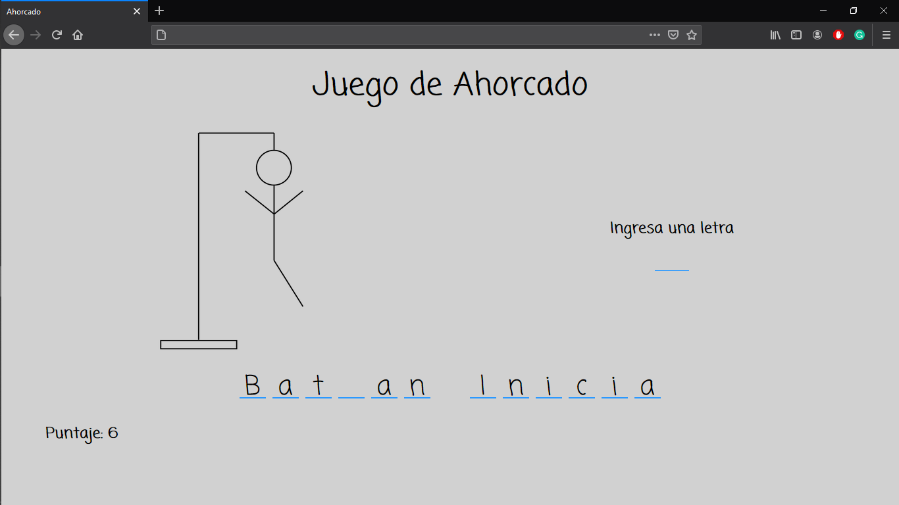
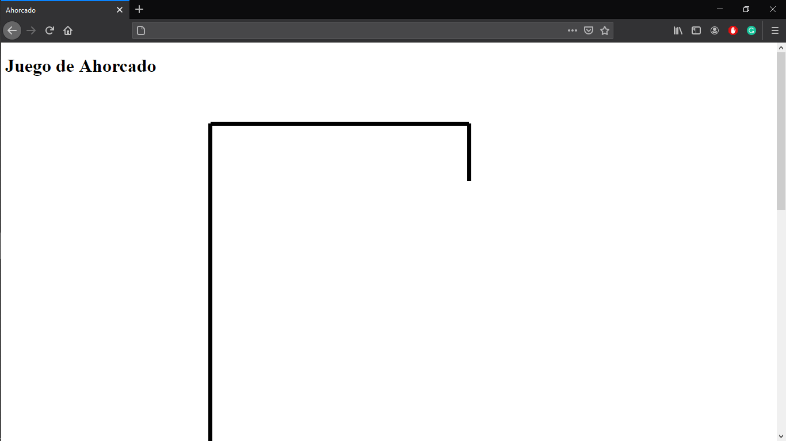
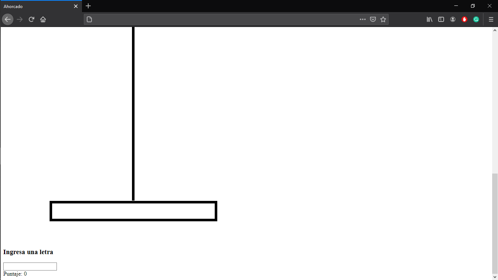
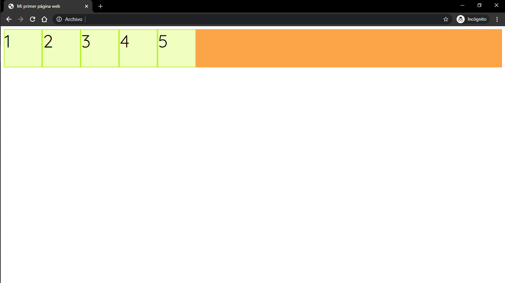
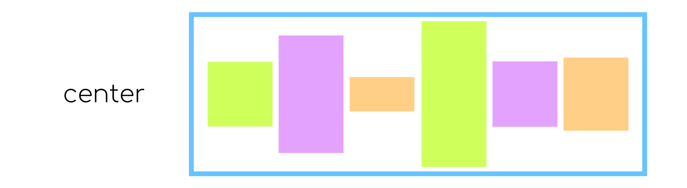
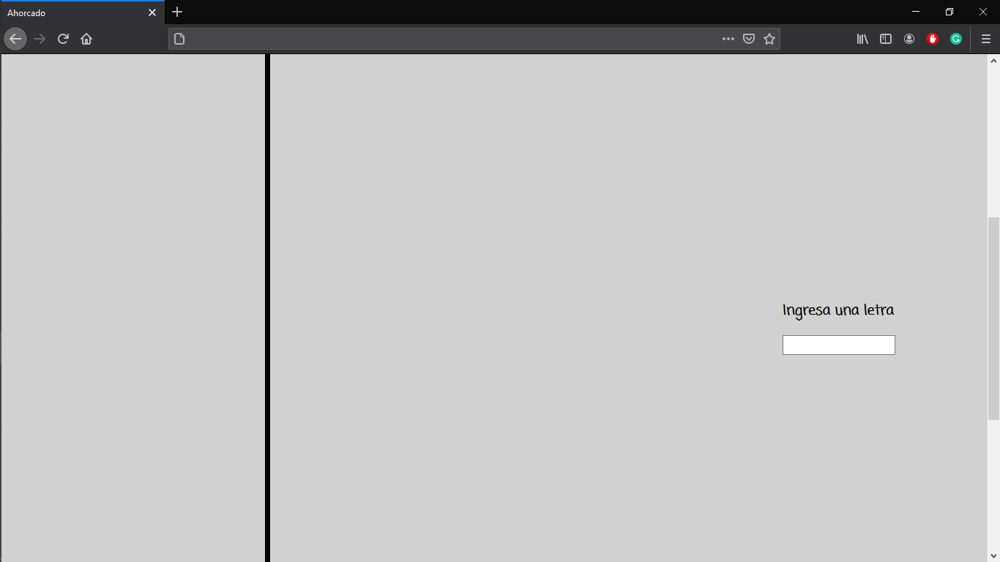
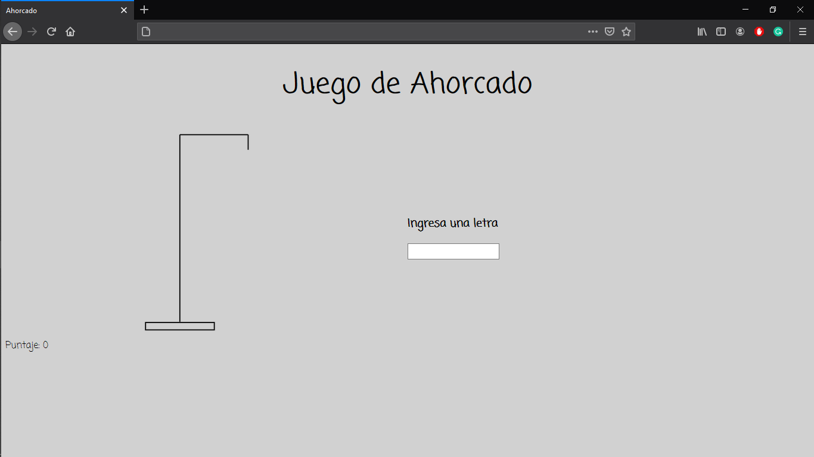
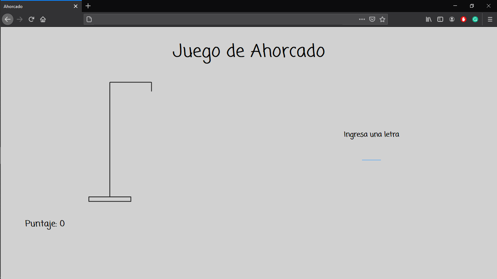

# Ejemplo

Ahora, veremos un ejemplo donde aplicaremos todo lo que hemos aprendido en el curso. Para esto, crearemos un Juego de Ahorcado.

<p align="center">
    
</p>

Veremos el paso a paso para escribir el código HTML, CSS y JS que necesitaremos para nuestro sitio web.

Para que nuestro juego funcione correctamente, hay muchos elementos que crearemos dinámicamente, utilizando Javascript. Sin embargo, para comenzar, debemos crear el documento HTML que contendrá la estructura base de nuestro sitio web. Lo llamaremos `index.html`

```html
<!DOCTYPE html>
<html lang="en" dir="ltr">
    <head>
        <meta charset="utf-8">
        <title></title>
    </head>
    <body>

    </body>
</html>
```

Empezamos por darle un título a nuestro sitio web, por ejemplo; *Ahorcado*.

```html
<title>Ahorcado</title>
```

Para construir el esqueleto de nuestro sitio web, podemos pensarlo de la siguiente forma:

<p align="center">
    
</p>

Podemos pensar que cada rectángulo representa un contenedor, esto nos ayudará a acomodar más fácilmente el contenido del sitio cuando utilicemos la hoja de estilos.

Entonces, nuestro documento HTML se vería así:

```html
<body>
    <h1 id="titulo">Juego de Ahorcado</h1>
    <div class="contenedor-dividido">
        <div class="division contenedor-imagen">

        </div>
        <div class="division contenedor-letras">

        </div>
    </div>
    <div class="contenedor-palabra"></div>
    <div class="contenedor-puntaje"></div>
</body>
```

Recordemos que de esta forma
`<div class="division contenedor-letras">` le asignamos a un mismo `div` dos clases diferentes.

Ya que tenemos el esqueleto del documento, podemos agregar la imagen que aparecerá al comienzo del juego. Para facilitar el código, tendremos una imagen por cada vez que el jugador seleccione una letra incorrecta, y las nombraremos `1`, `2`, `3`, etc.

[Imagenes](Ahorcado/img)

Entonces, agregaremos la primer imagen dentro del div `contenedor-imagen`

```html
<div class="division contenedor-imagen">
    
</div>
```

Podemos agregar también el mensaje *Ingresa una letra* y *Puntaje 0*; que se mostrará así inicialmente, pero que modificaremos mas adelante utilizando Javascript.

```html
<div class="division contenedor-letras">
    <h3>Ingresa una letra</h3>
</div>
```

```html
<div class="contenedor-puntaje">
    Puntaje: 0
</div>
```

Además de esto, necesitamos crear la entrada de texto, donde el usuario ingresará cada letra. Para esto, utilizaremos la etiqueta `<input>` con `type=text`.

```html
<div class="division contenedor-letras">
    <h3>Ingresa una letra</h3>
    <input type="text" id="entrada-letra">
</div>
```

Hasta ahora, nuestro documento HTML luce de la siguiente forma:

```html
<!DOCTYPE html>
<html lang="en" dir="ltr">
    <head>
        <meta charset="utf-8">
        <title>Ahorcado</title>
    </head>
    <body>
        <h1 id="titulo">Juego de Ahorcado</h1>
        <div class="contenedor-dividido">
            <div class="division contenedor-imagen">
                
            </div>
            <div class="division contenedor-letras">
                <h3>Ingresa una letra</h3>
                <input type="text" id="entrada-letra">
            </div>
        </div>
        <div class="contenedor-palabra"></div>
        <div class="contenedor-puntaje">
            Puntaje: 0
        </div>
    </body>
</html>

```
Para terminar con el archivo HTML, solo nos falta agregar nuestros archivos `.css` y `.js`, que utilizaremos de forma externa. Además, utilizaremos una fuente de [Google fonts](https://fonts.google.com/), para que el sitio luzca mejor.

Entonces, empezamos por agregar el documento `.css` y la liga a la fuente en Google fonts que más nos guste.

```html
<head>
    <meta charset="utf-8">
    <title>Ahorcado</title>
    <link rel="stylesheet" href="css/style.css">
    <link href="https://fonts.googleapis.com/css2?family=Coming+Soon&display=swap" rel="stylesheet">
</head>
```

Por último, agregamos nuestro documento `.js`, justo antes de cerrar la etiqueta `<body>`.

```html
<script type="text/javascript" src="js/script.js"></script>
```

Hasta ahora, nuestro sitio web luce así:

<p align="center">
    
    
</p>

Ahora, vamos a comenzar con la hoja de estilos. Como mencionábamos arriba, muchos de los elementos de nuestro sitio web vamos a agregarlos dinámicamente usando Javascript, pero por ahora, podemos comenzar a escribir nuestro archivo `.css` para los elementos que creamos en el documento `.html`.

En nuestro `index.html`, creamos una etiqueta `<link>` para la hoja de estilos externa, donde le dimos el nombre de `style.css`. Entonces, en la carpeta de nuestro proyecto, vamos a crear una nueva carpeta `css`, y dentro de ella, un documento `style.css`.

Para comenzar, vamos a darle a nuestro sitio un color de fondo. Utilizamos el selector `html`, para seleccionar todo el espacio de nuestro navegador.

```css
html{
    background-color: #d1d1d1
}
```

También, vamos a establecer el tipo de fuente. En nuestro caso, vamos a utilizar el mismo tipo de fuente para todo el sitio, por lo que vamos a utilizar un selectro especial; `*`. El asterisco nos permite seleccionar todos los elementos de nuestro sitio web.

```css
*{
    font-family: 'Coming Soon', cursive;
}
```

También, vamos a establecer el estilo de los encabezados. Específicamente de `h1`. Como es el título de nuestro sitio, vamos a colocarlo en el centro de la página, y vamos a cambiar su tamaño de fuente, para hacerlo un poco más grande.
```css
h1{
    text-align: center;
    font-size: 3.5vw;
}
```

Recordemos que las unidades `vw`, nos permiten que el tamaño de fuente sea proporcional al tamaño de la ventana del navegador.

Ahora, vamos a distribuir los contenedores dentro de nuestro sitio web.

Vamos a comenzar con el contenedor `contenedor-dividido`. Dentro de este contenedor definimos dos contenedores más, que, como ilustramos en la imagen, queremos acomodar cada uno en una mitad (horizontalmente) de la página. Para esto, vamos a darle al `contenedor-dividido` la propiedad flexbox, que recordemos, nos permite distribuir los elementos dentro del contenedor de la siguiente forma:

<p align="center">
    
</p>

Como podemos ver, el contenedor `contenedor-imagen` es mucho más alto que el contenedor `contenedor-letras`, entonces, además, queremos que ambos contenedores estén centrados verticalmente. Para esto, utilizamos la propiedad `align-items: center`.

<p align="center">
    
</p>

```css
.contenedor-dividido{
    display: flex;
    align-items: center;
}
```

<p align="center">
    
</p>

Podemos ver que ambos contenedores se encuentran alineados lado a lados y centrados verticalmente, sin embargo, la imagen aún es demasiado grande.

Entonces, vamos a modificar el estilo del contenedor `contenedor-imagen`.

Para empezar, vamos a cambiar sus dimensiones, pues, como mencionamos arriba, queremos que cada contenedor ocupe la mitad del la página.

```css
.contenedor-imagen{
    width: 50%;
}
```

Ahora que definimos las dimensiones del contenedores, queremos centar la imagen en su interior, para esto tambien utilizaremos `flexbox`.

```css
.contenedor-imagen{
    width: 50%;
    display: flex;
    justify-content: center;
}
```

Por último, vamos a modificar las dimensiones de la imagen, pues aún es demasiado grande para nuestro sitio.


```css
#imagen{
    width: 40%;
}
```

Hasta ahora, nuestra página web luce así:

<p align="center">
    
</p>

Ahora, debemos acomodar el contenedor `contenedor-letras`. De la misma forma, queremos que el contenedor ocupe la mitad del página. Además, y a diferencia del `contenedor-imagen` que solo contiene el elemento `img`, aquí tenemos dos elementos, un `h3` y un `input`. Queremos centrar ambos elementos dentro del contenedor y que además, se muestre cada uno en una línea independiente. Para esto también usaremos `flexbox`.

```css
.contenedor-letras{
    width: 50%;
    display: flex;
}
```

Recordemos que, al asignarle al contenedor la propiedad `display: flex`, sus elementos automáticamente se muestran uno al lado del otro. Para cambiar esto utilizamos `flex-direction: column`, que hace que los elementos se muestren uno sobre otro.

```css
.contenedor-letras{
    width: 50%;
    display: flex;
    flex-direction: column;
    align-items: center;
}
```

Al encabezado `h3` vamos a cambiarle el tamaño de fuente para hacerlo más grande.

```css
h3{
    font-size: 1.7vw;
}
```

Los estilos para el contenedor `contenedor-palabra` los dejaremos para más adelante, cuando tengamos el código de Javascript.

Entonces, solo nos falta el contenedor `contenedor-puntaje`. Para este contenedor, solamente vamos a modificar la fuente; vamos a hacerla más grade y negrita. Además, vamos a darle un margen, para que el mensaje no aparezca tan pagado al borde la página.

```css
.contenedor-puntaje{
    font-size: 1.7vw;
    font-weight: bold;
    margin: 30px 60px;
}
```

Hasta ahora nuestra página luce así:

<p align="center">
    
</p>
